# RVoIP Library Architecture

Date: 2026-05-05

This document explains the current RVoIP library architecture and the intended
platform layering for B2BUA, CPaaS, QSRP, voice-ai, and contact-center work.
It is a companion to `PLATFORM_LAYER_ROADMAP.md`: the roadmap says what to
build next; this document explains why the layers exist, how they depend on
each other, and what complexity each layer adds.

The main architectural decision is deliberately conservative:

- Keep `session-core` unified for now.
- Use `session-core::UnifiedCoordinator` as the internal multi-session SIP and
  media coordination API.
- Build `rvoip-b2bua` as the reusable SIP two-leg topology engine.
- Delay `platform-core` until the B2BUA contract is stable enough to extract.
- Delay `call-control` until more than one front door needs the same runtime
  command executor.

Older removed architecture notes are not normative for this document. The
current B2BUA direction is built on `session-core` and uses
`UnifiedCoordinator::bridge()` for transparent RTP relay.

## Architecture At A Glance

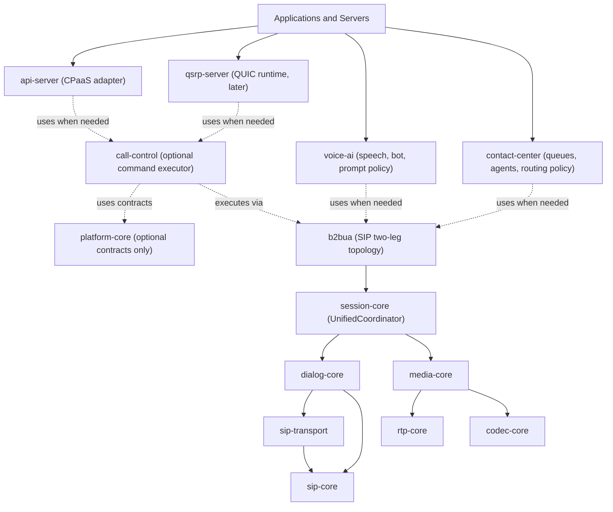

Read this diagram carefully: `platform-core` is not a runtime layer above
B2BUA. It is a shared language. If it exists, runtime crates may use its types,
but it should not control calls.

## Current Concrete Stack

The concrete stack that exists today is centered on `session-core`.

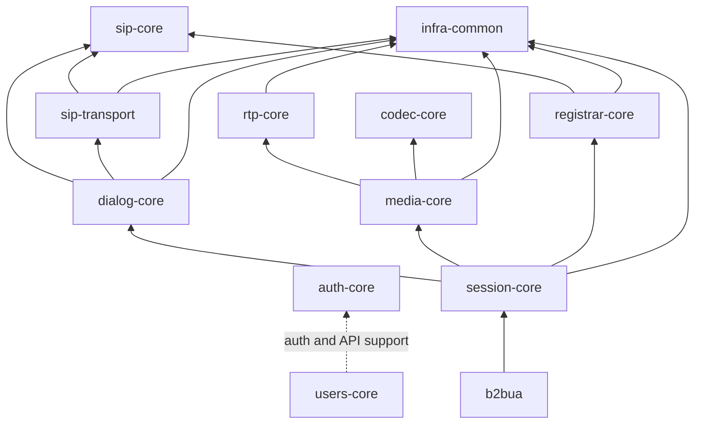

### Existing Crate Roles

| Crate | Current Role |
| --- | --- |
| `sip-core` | SIP message, URI, header, and SDP-related protocol types. |
| `sip-transport` | SIP network transport over UDP/TCP/TLS/WebSocket where supported. |
| `dialog-core` | SIP dialog behavior and dialog-to-session integration. |
| `rtp-core` | RTP/SRTP transport primitives and RTP session behavior. |
| `codec-core` | Codec primitives such as G.711. |
| `media-core` | Media session control, audio source handling, RTP bridge primitive. |
| `registrar-core` | Registrar service primitives. |
| `auth-core` | OAuth/JWT/token-oriented authentication primitives. |
| `users-core` | User, API key, JWT, and management API facilities. |
| `infra-common` | Shared infrastructure utilities and event machinery. |
| `session-core` | Unified SIP session and media coordination engine. |
| `b2bua` | SIP two-leg call topology built on `session-core`. |

## Why Session-Core Stays Unified

`session-core` currently coordinates SIP dialog state, session state, and media
state tightly enough that splitting it now would create more migration work than
clarity. The current implementation already exposes the primitives required by
server layers:

- `UnifiedCoordinator::events()`
- `UnifiedCoordinator::events_for_session()`
- `UnifiedCoordinator::make_call()`
- `UnifiedCoordinator::accept_call()`
- `UnifiedCoordinator::reject_call()`
- `UnifiedCoordinator::redirect_call()`
- `UnifiedCoordinator::bridge()`
- `UnifiedCoordinator::hangup()`
- DTMF, transfer, recording, audio subscription, and control helpers

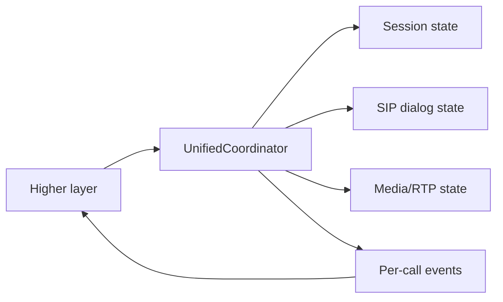

### Tradeoff

| Choice | Pros | Cons | Current Decision |
| --- | --- | --- | --- |
| Keep `session-core` unified | Fewer moving pieces; real code already works; B2BUA can be built now. | SIP and media coordination remain coupled. | Chosen now. |
| Split into `dial-core` and media orchestration now | Cleaner conceptual boundaries eventually. | High churn before QSRP, voice-ai, and contact-center have proven requirements. | Defer. |

## Where B2BUA Fits

`b2bua` is the first platform crate above `session-core`. It exists because
some telco use cases are not just "an endpoint receives a call." They need a
reusable two-leg call topology.

The direct TELCO use case it fills is B2BUA/SIP Gateway. It also supports the
call-topology part of contact-center, voice-ai handoff, CPaaS call control, and
QSRP-to-SIP/PSTN gateway work.

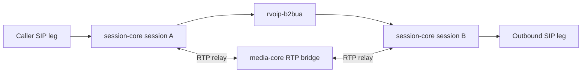

### B2BUA Responsibilities

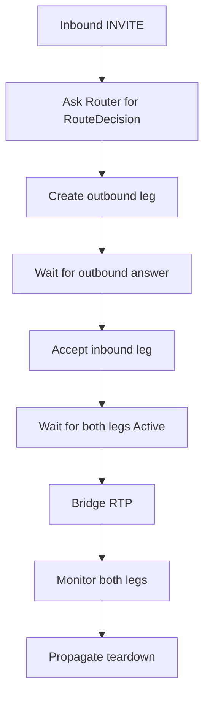

B2BUA owns this behavior:

- caller leg and target leg correlation
- outbound answer timeout policy
- inbound accept after outbound answer
- inbound reject on outbound failure
- RTP bridge lifetime
- DTMF and transfer event correlation
- hangup propagation in both directions

B2BUA should not own:

- contact-center queues
- voice-ai prompt or bot state
- CPaaS HTTP endpoints
- QSRP wire protocol
- general platform command dispatch
- arbitrary product policy

### Why Not Put This In Call-Control?

`call-control`, if created, would receive and execute platform commands. It
should not become the engine that knows how SIP legs behave. Otherwise it turns
into a mixed platform facade plus telephony runtime.

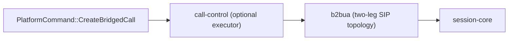

Without `b2bua`, the B2BUA logic would move into `call-control`, `api-server`,
`qsrp-server`, `contact-center`, and `voice-ai` in slightly different forms.
That is worse than one focused B2BUA crate.

### B2BUA Tradeoff

| Pros | Cons | Defense |
| --- | --- | --- |
| Reusable two-leg topology. | Another crate. | TELCO B2BUA/gateway and contact-center flows need leg-pair orchestration. |
| Central bridge lifecycle and teardown propagation. | More IDs and events. | Stable IDs/events are exactly what server layers need. |
| Gateway foundation for SIP/PSTN and QSRP. | Risk of becoming a mini command platform. | Keep it scoped to SIP two-leg behavior and route hooks. |
| Prevents duplicated leg-pair logic in future crates. | More tests required. | A single hard-tested topology engine is cheaper than many partial implementations. |

## Platform-Core: Contracts, Not Runtime

`platform-core` is optional and should be created only after B2BUA hardening
reveals the stable vocabulary. It should be a pure contract crate.

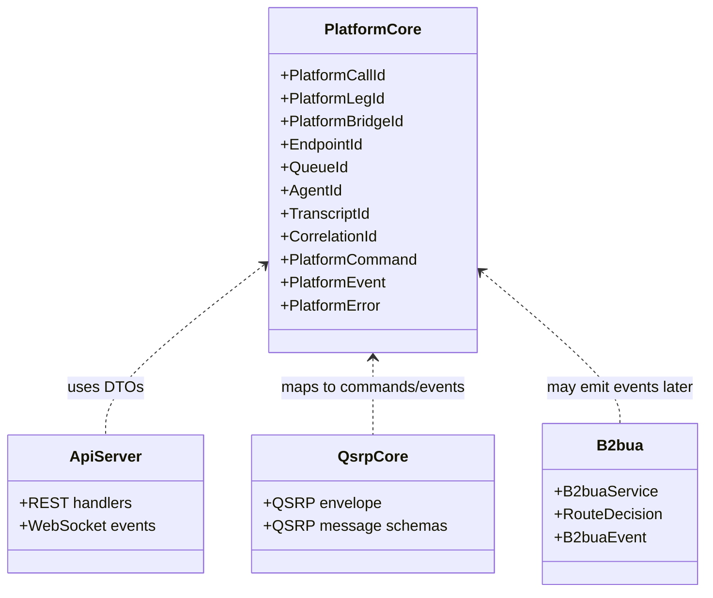

`platform-core` owns shared language:

```rust
pub struct PlatformCallId;
pub struct PlatformLegId;
pub struct PlatformBridgeId;
pub struct EndpointId;
pub struct AgentId;
pub struct QueueId;
pub struct TranscriptId;
pub struct CorrelationId;

pub enum PlatformCommand {
    CreateCall(CreateCall),
    AnswerCall(AnswerCall),
    RejectCall(RejectCall),
    HangupCall(HangupCall),
    TransferCall(TransferCall),
    SendDtmf(SendDtmf),
    StartRecording(StartRecording),
    StopRecording(StopRecording),
    PlayAudio(PlayAudio),
}

pub enum PlatformEvent {
    CallCreated(CallCreated),
    CallRinging(CallRinging),
    CallAnswered(CallAnswered),
    BridgeEstablished(BridgeEstablished),
    DtmfReceived(DtmfReceived),
    TransferRequested(TransferRequested),
    TranscriptFinal(TranscriptFinal),
    AgentStateChanged(AgentStateChanged),
    CallEnded(CallEnded),
    CallFailed(CallFailed),
}
```

`platform-core` must not:

- depend on `b2bua`
- depend on `session-core`
- open sockets
- spawn tasks
- own call state machines
- route calls
- bridge media

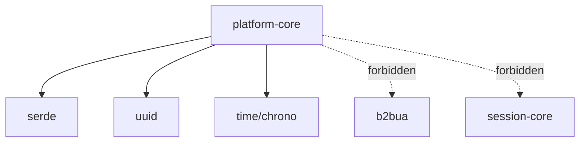

### Platform-Core Tradeoff

| Pros | Cons | Defense |
| --- | --- | --- |
| Shared command/event language. | Can overfit if created too early. | Extract after B2BUA hardening, not before. |
| Stable CPaaS, QSRP, and webhook shapes. | Another crate and versioned API surface. | Keep it pure DTOs and IDs, no runtime behavior. |
| Prevents duplicated external DTOs. | Requires discipline about dependency direction. | Enforce no dependency on `b2bua` or `session-core`. |
| Makes protocol adapters speak one language. | May require migration from B2BUA-native events. | B2BUA MVP gives real event names before extraction. |

## Call-Control: Optional Runtime Facade

`call-control` is not needed immediately. It becomes useful only when multiple
front doors need to execute the same command path.

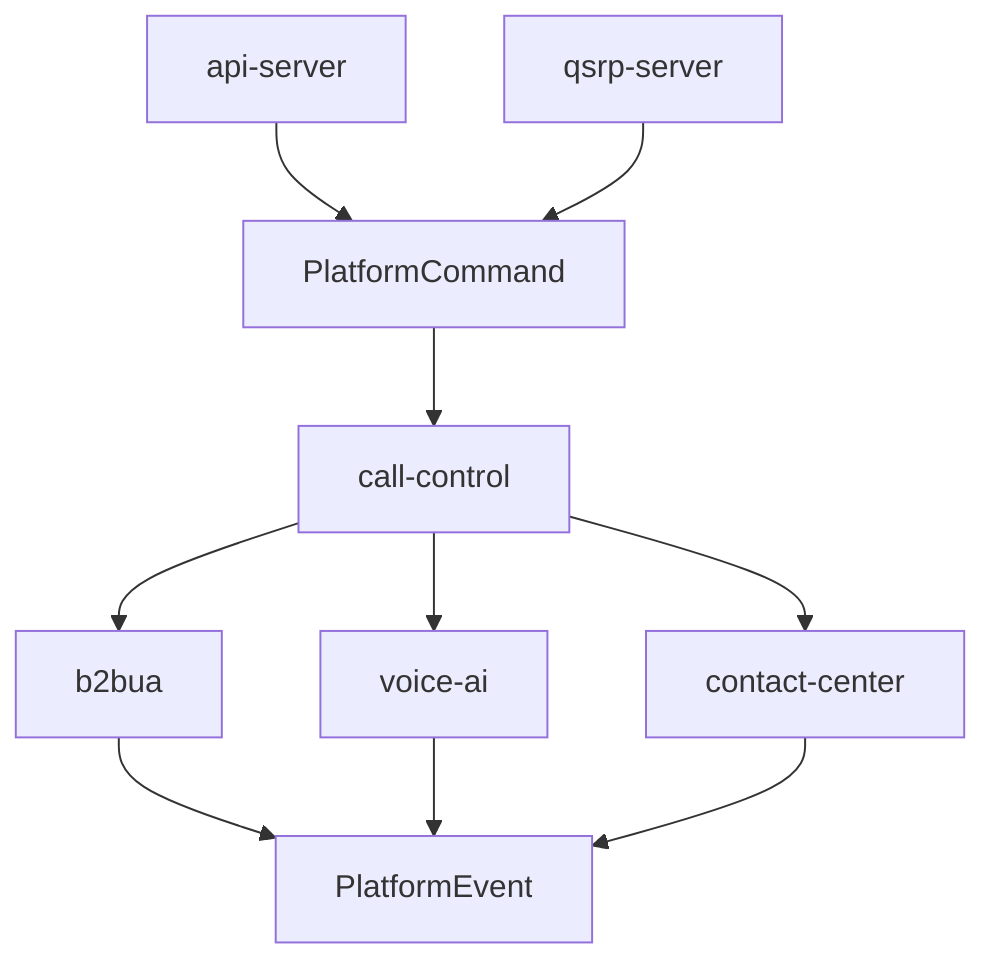

The purpose of `call-control` would be:

- receive `PlatformCommand`
- validate command intent and target
- dispatch to the right runtime service
- normalize results into `PlatformEvent`
- expose one command execution path to CPaaS and QSRP

It should not:

- know SIP dialog mechanics
- duplicate B2BUA leg pairing
- own contact-center queue algorithms
- own voice-ai bot state
- become the only place where all product logic accumulates

### Call-Control Decision Gate

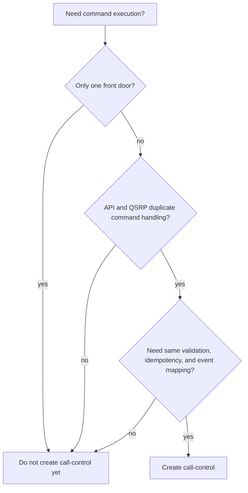

### Call-Control Tradeoff

| Pros | Cons | Defense |
| --- | --- | --- |
| One command execution path for API and QSRP. | Can become a god service. | Create only after duplication appears. |
| Central idempotency and command validation. | Another layer to debug. | Keep runtime dispatch thin and explicit. |
| Normalized `PlatformEvent` output. | May be unnecessary for a single API server. | Delay until at least two front doors need it. |

## Future Platform Stack

The future stack has three categories:

- implemented now
- planned soon
- conditional, only if pressure appears

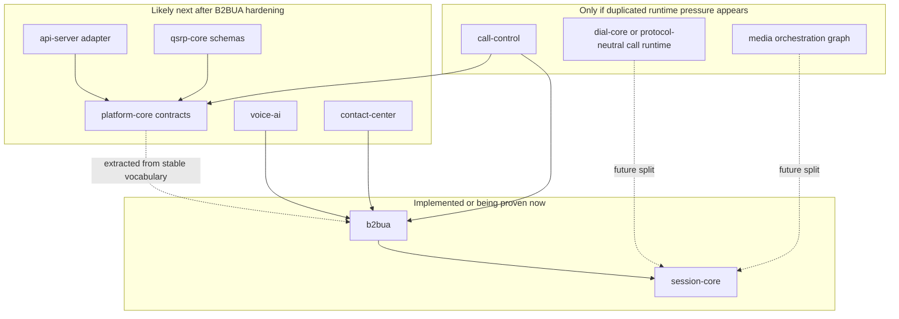

## API-Server: CPaaS Adapter

`api-server` should be an adapter, not the call engine. It should expose REST
and WebSocket/SSE surfaces and translate external requests into platform
commands or direct service calls.

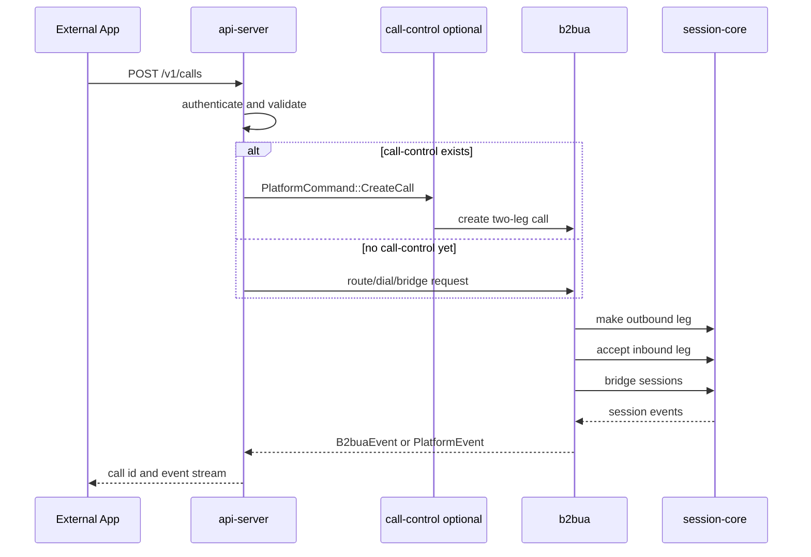

### API-Server Tradeoff

| Pros | Cons | Defense |
| --- | --- | --- |
| External CPaaS control plane. | Auth, rate limits, versioning, and operational surface. | Use existing `users-core` where practical and keep API as adapter. |
| Lets applications control calls without linking Rust crates. | Public API shapes become compatibility commitments. | Back requests/responses with platform contracts. |
| Event streams support dashboards and automation. | Event replay and delivery semantics add complexity later. | Start with simple live streams; add durable webhooks later. |

## QSRP-Core And QSRP-Server

QSRP is an edge protocol, not a REST feature. Split it into schema/mapping and
runtime.

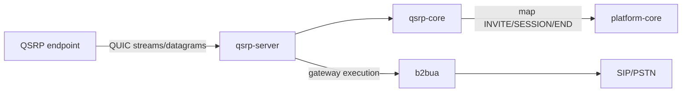

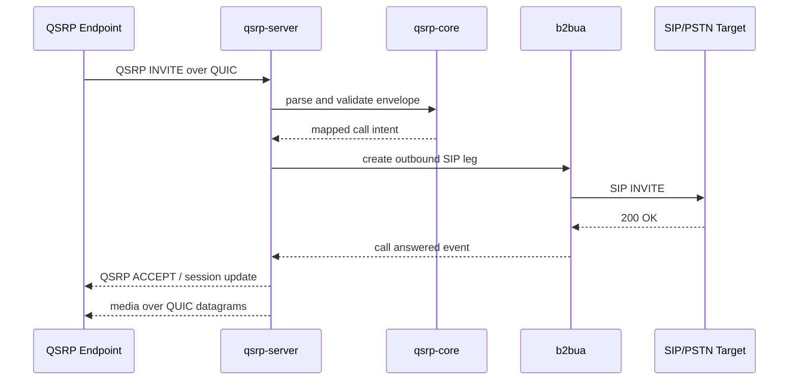

### QSRP Tradeoff

| Pros | Cons | Defense |
| --- | --- | --- |
| Clean protocol support for voice-first apps. | QUIC runtime and media datagrams are non-trivial. | Split schema/mapping from runtime. |
| Gateway path to SIP/PSTN through B2BUA. | New protocol surface to validate and version. | Keep QSRP native JSON; optional SDP only for gateway interop. |
| Built-in concepts for transcripts, bots, commands, scheduling. | Risk of mixing app features with telephony runtime. | Map protocol features to platform events and application crates. |

## Voice-AI Layer

`voice-ai` owns speech automation policy. It should not own SIP leg-pairing.

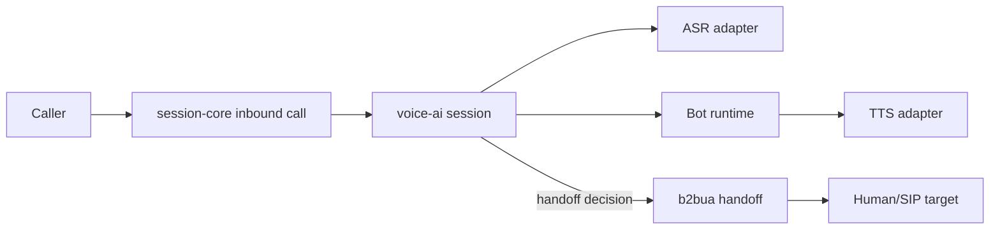

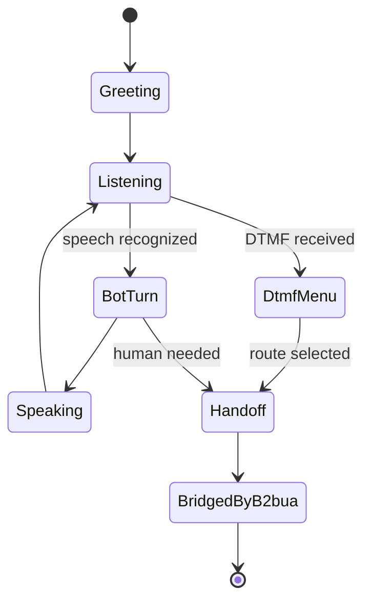

### Voice-AI Tradeoff

| Pros | Cons | Defense |
| --- | --- | --- |
| Isolates prompt, speech, bot, and transcript logic from telephony. | ASR/TTS/bot state adds async complexity. | Keep it above B2BUA and platform events. |
| Can work with SIP today and QSRP later. | Needs careful audio boundaries. | Use session-core audio primitives and B2BUA only for handoff/bridging. |
| Avoids embedding bot policy in API server. | Another domain crate. | Speech automation is a distinct product concern. |

## Contact-Center Layer

`contact-center` owns queues, agents, skills, routing, and escalation. It uses
B2BUA when it decides a caller should be connected to an agent or external SIP
destination.

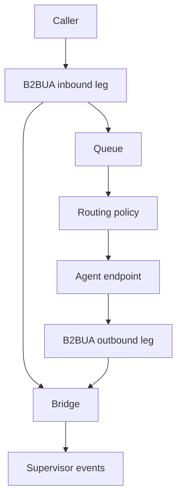

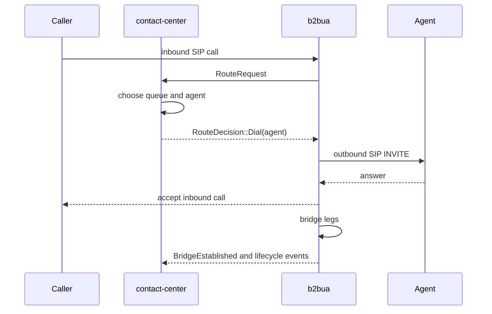

### Contact-Center Tradeoff

| Pros | Cons | Defense |
| --- | --- | --- |
| Isolates queues, agents, skills, routing, escalation. | Another domain state machine. | The domain rules are not SIP rules and should not live in B2BUA. |
| Can evolve routing without touching SIP call mechanics. | Requires event consistency from B2BUA. | B2BUA emits correlated call/leg/bridge events. |
| Supports supervisors and dashboards cleanly. | Needs persistence later. | Start in-memory; add storage when product workflows require it. |

## Dependency Direction Rules

These rules keep layers from collapsing into each other.

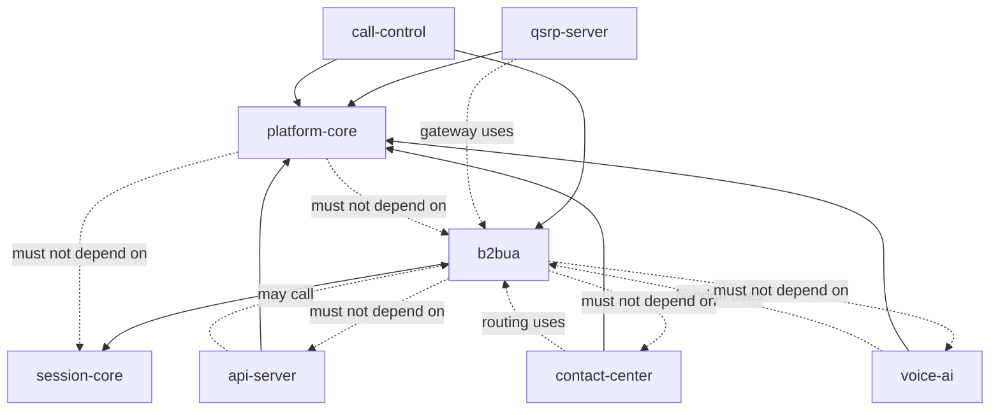

### Allowed Dependencies

| From | May Depend On | Why |
| --- | --- | --- |
| `b2bua` | `session-core` | It implements SIP two-leg behavior using the unified coordinator. |
| `platform-core` | neutral utility crates | It is only IDs, commands, events, errors, and serialization. |
| `api-server` | `platform-core`, runtime services | It adapts external HTTP/WebSocket calls to platform behavior. |
| `qsrp-core` | `platform-core` | It maps QSRP messages to platform commands/events. |
| `qsrp-server` | `qsrp-core`, `platform-core`, `b2bua` | It terminates QSRP and gateways to SIP/PSTN. |
| `voice-ai` | `platform-core`, `session-core`, `b2bua` as needed | It handles speech sessions and handoff. |
| `contact-center` | `platform-core`, `b2bua` | It handles queues and agent routing. |
| `call-control` | `platform-core`, runtime services | It executes platform commands when shared dispatch is needed. |

## Forbidden Boundaries

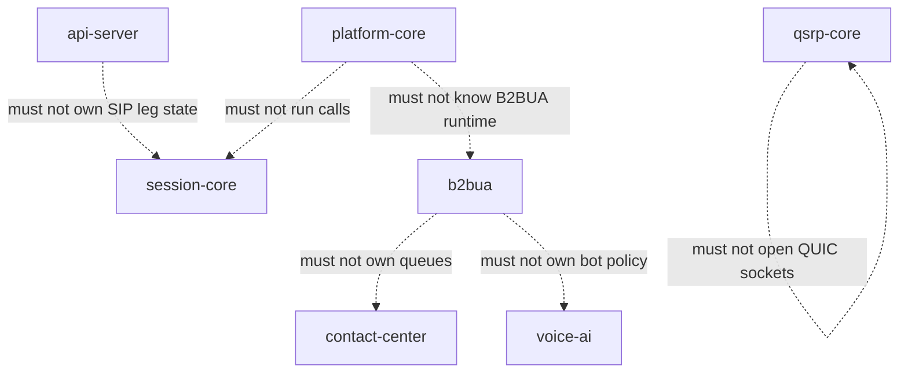

The last edge is intentionally self-referential: it means `qsrp-core` remains
schema and mapping only. Runtime belongs in `qsrp-server`.

## Complexity Budget

More layers are not automatically better. Each layer must earn its existence.

```mermaid
flowchart LR
    subgraph Low["Low complexity, already justified"]
        Session["session-core"]
        B2bua["b2bua"]
    end

    subgraph Medium["Medium complexity, likely justified soon"]
        Platform["platform-core"]
        Api["api-server"]
        QsrpCore["qsrp-core"]
        VoiceAi["voice-ai"]
        Contact["contact-center"]
    end

    subgraph High["Higher complexity, only if forced"]
        CallControl["call-control"]
        DialCore["dial-core split"]
        MediaGraph["media orchestration graph"]
    end

    Session --> B2bua
    B2bua --> Platform
    Platform --> Api
    Platform --> QsrpCore
    B2bua --> VoiceAi
    B2bua --> Contact
    Platform --> CallControl
    B2bua --> CallControl
    Session --> DialCore
    Session --> MediaGraph
```

### Layering Discipline

- Each layer must have one reason to exist.
- No layer should be created only because it sounds architecturally clean.
- `platform-core` is contract-only.
- `call-control` is delayed until proven.
- B2BUA remains SIP two-leg topology only.
- `contact-center` and `voice-ai` own product policy, not SIP primitives.
- `api-server` is an adapter, not the telephony engine.
- `qsrp-core` is schema/mapping, not transport runtime.
- `qsrp-server` is protocol runtime and gateway, not product policy.

## Pros And Cons Of The Proposed Layering

### Pros

- B2BUA leg-pair behavior is implemented once.
- Contact-center and voice-ai do not duplicate SIP leg mechanics.
- CPaaS and QSRP can eventually share command/event vocabulary.
- Public APIs avoid leaking `UnifiedCoordinator`.
- QSRP stays a first-class protocol instead of being bolted onto REST.
- `platform-core` can give stable IDs and event shapes to every front door.
- `call-control` is delayed until it solves duplication rather than creating it.

### Cons

- More crates means more boundaries to document.
- More IDs and event types must be kept consistent.
- Delayed extraction means some B2BUA-native types may later migrate.
- If discipline slips, `call-control` can become a god service.
- If `platform-core` is created too early, it can freeze the wrong model.
- Debugging across adapters can be harder than debugging a monolith.

### Defense

The layering is justified only because the use cases are genuinely different:

- B2BUA/Gateway needs SIP two-leg topology.
- CPaaS needs an external control plane.
- QSRP needs a QUIC protocol adapter and gateway.
- Voice-ai needs prompt/speech/bot policy.
- Contact-center needs queues, agents, and routing policy.
- Platform contracts prevent every front door from inventing incompatible IDs
  and events.

The architecture avoids the biggest failure mode by delaying optional layers.
`platform-core` and `call-control` are not created up front as abstract purity
projects. They are created only after B2BUA and at least one or two front doors
prove the shared shape.

## Use-Case Mapping

```mermaid
flowchart TD
    Telco["TELCO use cases"]
    Gateway["B2BUA / SIP Gateway"]
    AdvancedContact["Advanced contact-center"]
    Pbx["PBX / routing"]
    Speech["Speech automation / voice-ai"]
    Recording["Call recording"]
    Emergency["Emergency routing"]

    B2bua["b2bua"]
    Contact["contact-center"]
    VoiceAi["voice-ai"]
    Api["api-server"]
    Qsrp["qsrp-server"]

    Telco --> Gateway
    Telco --> AdvancedContact
    Telco --> Pbx
    Telco --> Speech
    Telco --> Recording
    Telco --> Emergency

    Gateway --> B2bua
    AdvancedContact --> Contact
    Contact --> B2bua
    Pbx --> B2bua
    Speech --> VoiceAi
    VoiceAi --> B2bua
    Recording --> B2bua
    Emergency --> B2bua
    Api --> B2bua
    Qsrp --> B2bua
```

### Why B2BUA Is First

The TELCO analysis identifies per-call isolation as the critical feature for
multi-call systems. B2BUA needs to monitor two legs independently and make
teardown decisions based on whichever leg ends first.

```mermaid
sequenceDiagram
    participant A as Inbound leg
    participant B2 as b2bua
    participant B as Outbound leg

    A->>B2: Incoming call
    B2->>B: Make outbound call
    B-->>B2: Answered
    B2-->>A: Accept inbound
    B2->>B2: Bridge RTP
    par Monitor inbound
        A-->>B2: BYE or failure
    and Monitor outbound
        B-->>B2: BYE or failure
    end
    B2->>A: Hangup if outbound ended first
    B2->>B: Hangup if inbound ended first
```

That behavior is foundational enough to deserve its own crate.

## When To Revisit Dial-Core Or Media Orchestration

Do not split `session-core` yet. Revisit only when real pressure appears.

```mermaid
flowchart TD
    Start["Should we split session-core?"]
    Q1{"Second signaling protocol needs shared non-SIP call runtime?"}
    Q2{"Voice-ai/media graph needs mixing, injection, recording, or transcoding beyond current bridge?"}
    Q3{"CPaaS and QSRP duplicate call-control translation?"}
    Q4{"B2BUA needs advanced media policy beyond transparent RTP relay?"}
    Keep["Keep session-core unified"]
    Split["Design split from proven pressure"]

    Start --> Q1
    Q1 -- yes --> Split
    Q1 -- no --> Q2
    Q2 -- yes --> Split
    Q2 -- no --> Q3
    Q3 -- yes --> Split
    Q3 -- no --> Q4
    Q4 -- yes --> Split
    Q4 -- no --> Keep
```

Possible future split, if forced:

```mermaid
flowchart TD
    Dial["dial-core or protocol-neutral call runtime"]
    SipSession["session-core as SIP implementation"]
    QsrpRuntime["qsrp-server as QSRP implementation"]
    MediaGraph["media orchestration graph"]
    MediaCore["media-core"]

    Dial --> SipSession
    Dial --> QsrpRuntime
    Dial --> MediaGraph
    MediaGraph --> MediaCore
```

This is intentionally not the current design. It is a future option if the
second protocol and media graph requirements become concrete.

## Concrete Flow Examples

### Contact-Center Call

```mermaid
flowchart LR
    Caller["Caller"]
    B2In["B2BUA inbound leg"]
    Contact["contact-center routing"]
    Agent["Selected agent"]
    B2Out["B2BUA outbound leg"]
    Bridge["RTP bridge"]

    Caller --> B2In
    B2In --> Contact
    Contact --> Agent
    Agent --> B2Out
    B2In --> Bridge
    B2Out --> Bridge
```

### Voice-AI Handoff

```mermaid
flowchart LR
    Caller["Caller"]
    Voice["voice-ai session"]
    Transcript["Transcript events"]
    Decision["Handoff decision"]
    B2bua["b2bua"]
    Human["Human or SIP target"]

    Caller --> Voice
    Voice --> Transcript
    Voice --> Decision
    Decision --> B2bua
    B2bua --> Human
```

### CPaaS Call Control

```mermaid
flowchart TD
    Client["External app"]
    Api["api-server"]
    Auth["users-core auth/API key"]
    Command["PlatformCommand"]
    Control["call-control optional"]
    B2bua["b2bua"]
    Event["PlatformEvent / B2buaEvent"]

    Client --> Api
    Api --> Auth
    Api --> Command
    Command --> Control
    Control --> B2bua
    B2bua --> Event
    Event --> Api
    Api --> Client
```

### QSRP To SIP/PSTN

```mermaid
flowchart LR
    Device["QSRP device"]
    Server["qsrp-server"]
    Core["qsrp-core"]
    B2bua["b2bua"]
    Sip["SIP trunk/PSTN"]

    Device -->|"QUIC"| Server
    Server --> Core
    Core -->|"mapped call intent"| Server
    Server --> B2bua
    B2bua --> Sip
```

## Practical Implementation Order

```mermaid
flowchart TD
    A["1. Harden b2bua"]
    B["2. Extract stable contract vocabulary"]
    C["3. Add platform-core if vocabulary repeats"]
    D["4. Add qsrp-core schemas and mappings"]
    E["5. Add api-server adapter"]
    F["6. Add voice-ai and contact-center"]
    G["7. Add qsrp-server runtime"]
    H["8. Add call-control only if API and QSRP duplicate execution"]

    A --> B
    B --> C
    C --> D
    C --> E
    C --> F
    D --> G
    E --> H
    G --> H
```

## Reference Rules

If a future implementation is uncertain, use these rules:

1. If it is SIP two-leg behavior, put it in `b2bua`.
2. If it is a stable external ID, command, event, or error, put it in
   `platform-core` after the shape is proven.
3. If it executes platform commands across multiple runtime services, consider
   `call-control`, but only after duplication exists.
4. If it is HTTP/WebSocket/SSE, put it in `api-server`.
5. If it is QSRP JSON schema or message mapping, put it in `qsrp-core`.
6. If it is QSRP QUIC transport or gateway runtime, put it in `qsrp-server`.
7. If it is prompt, speech, transcript, bot, or handoff policy, put it in
   `voice-ai`.
8. If it is queue, agent, skill, routing, or escalation policy, put it in
   `contact-center`.
9. If it is SIP dialog/session/media implementation detail, keep it in
   `session-core` or lower.

## Related Documents

- `PLATFORM_LAYER_ROADMAP.md`
- `crates/session-core/docs/TELCO_USE_CASE_ANALYSIS.md`
- `crates/session-core/docs/PRE_B2BUA_ROADMAP.md`
- `crates/session-core/docs/AUDIO_MODES.md`
- `crates/b2bua/README.md`
