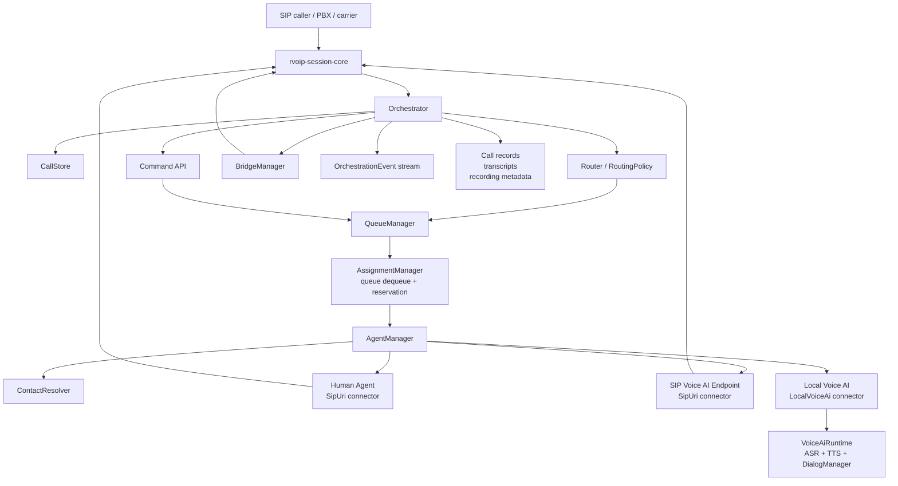

# rvoip-orchestration-core Specification

## 1. Purpose

`rvoip-orchestration-core` is a proposed SIP-focused library crate for
building voice orchestration systems on top of `rvoip-session-core`, including
call centers, speech IVRs, and voice-AI workflows.

The crate provides SIP voice orchestration primitives, not a general
omnichannel contact-center platform. Everything in this crate is centered on
SIP calls:

- inbound customer calls
- outbound calls to agents
- human agents
- voice AI agents
- queues
- routing
- agent offers
- call bridging
- call transfer
- call recording hooks
- speech IVR and voice-AI workflows

The central business object is a `Call`. A `Call` represents the full customer
call journey and owns one or more `CallLeg`s. Each `CallLeg` maps to an
underlying `rvoip-session-core` SIP session.

## 2. Scope

### In Scope

- SIP inbound call handling through `rvoip-session-core`
- SIP outbound dialing through `rvoip-session-core`
- voice routing and queueing primitives
- human agents and voice AI agents as first-class routable agents
- agent lifecycle, reservation, and wrap-up primitives
- atomic queue dequeue and agent assignment primitives
- SIP contact resolution for registered or static SIP agents
- local voice AI participation through provider traits
- SIP-based AI endpoints through normal agent dialing
- caller-to-agent bridging
- caller-to-voice-AI media workflows
- AI-to-human escalation
- agent transfer and consult-call scaffolding
- call recording lifecycle hooks
- transcript storage hooks
- call outcome, timing, and disposition primitives
- in-memory runtime stores with durable-store traits
- typed voice orchestration events for observability and application integration

### Out of Scope

- SMS
- web chat
- email
- QSRP
- browser or mobile login protocols
- WebRTC signaling
- non-SIP contact-center channels
- built-in vendor integrations for ASR, TTS, or LLM providers
- durable database implementation in the first version
- dependency on `rvoip-b2bua`

Those capabilities can be built in higher-level crates or applications once
the SIP voice orchestration primitives are stable.

## 3. Design Principles

1. `rvoip-session-core` is the only telephony foundation.

   The crate uses `UnifiedCoordinator`, `SessionHandle`, session events, audio
   streams, call control, and bridge APIs from `session-core`. It should not
   introduce a separate SIP state machine.

2. `rvoip-b2bua` is not a dependency or conceptual foundation.

   Call-center behavior needs queueing, agent reservation, voice AI, handoff,
   consult calls, and policy-driven routing. Those concepts should sit directly
   above `session-core`, not behind a fixed B2BUA topology.

3. `Call` is the business-level unit.

   A customer journey may start with one inbound SIP leg, then move through AI,
   a queue, a human agent, a transfer target, and a consult leg. All of those
   legs are part of one `Call`.

4. Human agents and voice AI agents are first-class `Agent`s.

   Queues and routing policies operate on `Agent`, not on separate human and AI
   systems. An AI agent may have skills, capacity, state, and assignment
   rules just like a human agent.

5. Queue routing must not special-case humans and AI.

   A queue selects an eligible available agent. The selected agent's connector
   determines how that agent joins the call.

6. Voice AI providers are pluggable.

   ASR, TTS, dialog management, and recording are represented by traits. The
   crate should ship test fakes and examples, not hard-code provider SDKs.

7. Storage starts in memory, behind traits.

   The first implementation should be easy to test and embed. Durable storage
   can be added later by implementing store traits.

8. Assignment is a lease, not just a lookup.

   Queue dequeue, agent reservation, offer creation, timeout, and capacity
   release must be modeled as one coherent assignment attempt. This prevents
   double-assignment when multiple queues, agents, or workers are active.

9. Operational state is explicit.

   Calls, call legs, agents, queued calls, bridges, and voice AI sessions should
   expose their own lifecycle states. `session-core` owns SIP state; this crate
   owns voice orchestration workflow state.

10. Applications need commands as well as policies.

   A router is useful for default inbound flow, but developers must also be able
   to enqueue, reserve, transfer, hold, resume, end, and update agent state
   through a stable voice orchestration API.

## 4. High-Level Architecture



## 5. Core Abstractions

### 5.1 `Orchestrator`

`Orchestrator` owns the runtime voice orchestration system.

Responsibilities:

- owns or wraps `session-core::UnifiedCoordinator`
- receives inbound SIP calls
- creates `Call` records
- invokes routing policy
- places calls into queues
- reserves and offers agents
- connects calls to human or AI agents
- bridges SIP call legs
- keeps bridge handles alive for the bridge lifetime
- manages handoff and transfer workflows
- tracks agent lifecycle and wrap-up
- resolves agent contacts before SIP dialing
- emits typed `OrchestrationEvent`s
- exposes a command API for applications and higher-level crates
- coordinates shutdown

Sketch:

```rust
pub struct Orchestrator {
    coordinator: Arc<UnifiedCoordinator>,
    calls: Arc<dyn CallStore>,
    agents: Arc<dyn AgentStore>,
    queues: Arc<dyn QueueStore>,
    offers: Arc<dyn AgentOfferStore>,
    router: Arc<dyn Router>,
    contact_resolver: Arc<dyn ContactResolver>,
    bridge_manager: BridgeManager,
    voice_ai: VoiceAiRegistry,
    events: OrchestrationEventBus,
}
```

Builder shape:

```rust
let orchestrator = Orchestrator::builder()
    .with_session_config(session_config)
    .with_router(router)
    .with_agent_store(agent_store)
    .with_queue_store(queue_store)
    .with_voice_ai_runtime("triage-ai", voice_ai_runtime)
    .build()
    .await?;

orchestrator.run().await?;
```

The builder should support either constructing a coordinator from
`session-core::Config` or accepting an injected `Arc<UnifiedCoordinator>` for
applications that already own their SIP runtime:

```rust
let orchestrator = Orchestrator::builder()
    .with_coordinator(existing_coordinator)
    .with_router(router)
    .build()
    .await?;
```

`Orchestrator` should expose a cloneable handle for application commands.
The orchestrator may continue running background intake and assignment tasks while
the handle is used by an admin API, voice AI workflow, or higher-level
contact-center library.

```rust
pub struct OrchestrationHandle { /* cloneable */ }

impl OrchestrationHandle {
    pub async fn enqueue_call(&self, call_id: CallId, target: QueueTarget) -> Result<()>;
    pub async fn offer_agent(&self, call_id: CallId, agent_id: AgentId) -> Result<AgentOfferId>;
    pub async fn transfer_call(&self, call_id: CallId, target: TransferTarget) -> Result<()>;
    pub async fn hold_call(&self, call_id: CallId) -> Result<()>;
    pub async fn resume_call(&self, call_id: CallId) -> Result<()>;
    pub async fn end_call(&self, call_id: CallId, reason: String) -> Result<()>;
    pub async fn update_agent_state(&self, agent_id: AgentId, state: AgentState) -> Result<()>;
    pub async fn complete_wrap_up(&self, agent_id: AgentId, call_id: CallId) -> Result<()>;
    pub async fn get_call(&self, call_id: &CallId) -> Result<Option<Call>>;
    pub async fn get_queue_stats(&self, queue_id: &QueueId) -> Result<QueueStats>;
}
```

### 5.2 `Call`

`Call` is the stable customer call journey.

It is not the same as a SIP `Call-ID` header and not the same as a
`session-core::SessionId`. It is a voice orchestration id that correlates all SIP legs,
queue events, agent assignments, AI sessions, transfer attempts, transcripts,
and call records.

Sketch:

```rust
pub struct Call {
    pub id: CallId,
    pub status: CallStatus,
    pub direction: CallDirection,
    pub caller: CallerIdentity,
    pub dialed_uri: String,
    pub sip_call_id: Option<String>,
    pub created_at: DateTime<Utc>,
    pub answered_at: Option<DateTime<Utc>>,
    pub ended_at: Option<DateTime<Utc>>,
    pub legs: Vec<CallLeg>,
    pub queue_id: Option<QueueId>,
    pub assigned_agent_id: Option<AgentId>,
    pub active_bridge_id: Option<BridgeId>,
    pub priority: CallPriority,
    pub context: CallContext,
    pub metrics: CallMetrics,
    pub disposition: Option<CallDisposition>,
    pub recording_ids: Vec<RecordingId>,
    pub transcript_id: Option<TranscriptId>,
}
```

Suggested statuses:

```rust
pub enum CallStatus {
    Incoming,
    Routing,
    Queued,
    OfferingAgent,
    ConnectingAgent,
    Connected,
    InVoiceAi,
    OnHold,
    Transferring,
    WrapUp,
    Ending,
    Ended,
    Failed,
    Abandoned,
}
```

Call records should contain enough timing and outcome data for higher-level
reporting without turning this crate into a reporting product:

```rust
pub struct CallMetrics {
    pub queue_time: Duration,
    pub talk_time: Duration,
    pub hold_time: Duration,
    pub voice_ai_time: Duration,
    pub transfer_count: u32,
    pub hold_count: u32,
}

pub enum CallDisposition {
    Completed,
    Abandoned { phase: AbandonPhase },
    Rejected { status: u16, reason: String },
    Failed { reason: String },
    Transferred { target: TransferTarget },
}
```

The voice orchestration state machine should define legal transitions and emit an event
for each transition. The minimum v1 transitions are:

- `Incoming -> Routing -> Queued`
- `Incoming -> Routing -> OfferingAgent`
- `Queued -> OfferingAgent -> ConnectingAgent -> Connected`
- `Connected -> OnHold -> Connected`
- `Connected -> Transferring -> Queued`
- `Connected -> Transferring -> ConnectingAgent -> Connected`
- `Connected -> WrapUp -> Ended`
- any non-terminal state -> `Ending -> Ended`
- any non-terminal state -> `Failed` or `Abandoned`

### 5.3 `CallLeg`

`CallLeg` maps voice orchestration intent to a `session-core` SIP session.

Examples:

- customer inbound leg
- human agent outbound leg
- SIP AI endpoint outbound leg
- consult leg
- transfer target leg

Sketch:

```rust
pub struct CallLeg {
    pub id: CallLegId,
    pub role: CallLegRole,
    pub session_id: SessionId,
    pub sip_call_id: Option<String>,
    pub uri: String,
    pub status: CallLegStatus,
    pub agent_id: Option<AgentId>,
    pub created_at: DateTime<Utc>,
    pub answered_at: Option<DateTime<Utc>>,
    pub ended_at: Option<DateTime<Utc>>,
}

pub enum CallLegRole {
    Caller,
    HumanAgent,
    VoiceAiAgent,
    Consult,
    TransferTarget,
}

pub enum CallLegStatus {
    Created,
    Dialing,
    Ringing,
    EarlyMedia,
    Answered,
    Bridged,
    Held,
    Ended,
    Failed,
}
```

`CallLegRole` describes why the leg exists inside the voice orchestration workflow.
Actual SIP lifecycle remains owned by `session-core`.

Local voice AI agents do not create a second SIP leg. They create a
`VoiceAiSession` associated with the caller leg and the assigned `AgentId`.
`CallLegRole::VoiceAiAgent` is for SIP AI endpoints that are dialed as normal
SIP agents.

### 5.4 `Agent`

`Agent` is the first-class routable worker abstraction. Human agents and voice
AI agents share the same routing and queue model.

Sketch:

```rust
pub struct Agent {
    pub id: AgentId,
    pub kind: AgentKind,
    pub display_name: String,
    pub skills: Vec<Skill>,
    pub state: AgentState,
    pub capacity: AgentCapacity,
    pub connector: AgentConnector,
    pub last_state_change_at: DateTime<Utc>,
    pub metadata: HashMap<String, String>,
}

pub enum AgentKind {
    Human,
    VoiceAi,
}

#[non_exhaustive]
pub enum AgentConnector {
    SipUri(String),
    RegisteredSipUser { aor: String },
    LocalVoiceAi(VoiceAiId),
}
```

Connector behavior:

- `AgentConnector::SipUri`
  - dial the configured SIP URI with `session-core`
  - wait for answer
  - bridge caller leg to agent leg
  - applies to human agents, SIP desk phones, SIP softphones, and external SIP
    voice AI endpoints

- `AgentConnector::RegisteredSipUser`
  - resolve a registered user's current contact before dialing
  - uses `ContactResolver`, which can be backed by `registrar-core`
  - lets the voice orchestration crate route to dynamic SIP agents without owning a full
    login or user-management protocol

- `AgentConnector::LocalVoiceAi`
  - do not dial a SIP endpoint
  - attach local voice AI runtime to the caller leg's audio stream
  - use ASR, TTS, and dialog manager provider traits
  - can complete the call, transfer, or return the call to a queue

### 5.5 Agent State and Capacity

Agent state describes whether an agent can receive work and where it is in the
assignment lifecycle. Capacity describes how many calls the agent can handle.

Sketch:

```rust
pub enum AgentState {
    Offline,
    Available,
    Reserved,
    Offering,
    Ringing,
    OnCall,
    WrapUp,
    Break,
    Away,
    DoNotDisturb,
}

pub struct AgentCapacity {
    pub max_active_calls: usize,
    pub active_calls: usize,
    pub reserved_calls: usize,
    pub wrap_up_until: Option<DateTime<Utc>>,
}
```

AI agents should use the same capacity model as human agents. For example, one
AI agent may handle one call at a time for deterministic behavior, while another
may handle many concurrent calls.

Minimum lifecycle rules:

- only `Available` agents with free capacity are eligible for automatic routing
- `Reserved`, `Offering`, and `Ringing` consume reserved capacity
- `OnCall` consumes active capacity
- `WrapUp`, `Break`, `Away`, `DoNotDisturb`, and `Offline` are not routable
- ending a call moves a human agent to `WrapUp` unless configured otherwise
- ending a local AI session releases capacity immediately unless the AI agent has
  a configured cooldown
- missed heartbeats or failed contact resolution should move SIP agents to
  `Offline` or `Away` according to policy

```rust
#[async_trait]
pub trait ContactResolver: Send + Sync {
    async fn resolve_contact(&self, agent: &Agent) -> Result<ResolvedContact>;
}

pub struct ResolvedContact {
    pub uri: String,
    pub expires_at: Option<DateTime<Utc>>,
    pub source: ContactSource,
}
```

### 5.6 `Queue`

`Queue` is a routing target that contains waiting calls and a policy for
selecting eligible agents.

Sketch:

```rust
pub struct Queue {
    pub id: QueueId,
    pub name: String,
    pub required_skills: Vec<Skill>,
    pub policy: QueuePolicy,
    pub max_size: Option<usize>,
    pub max_wait: Option<Duration>,
    pub overflow: Option<OverflowPolicy>,
}
```

Queued calls must carry enough routing context to support retries, escalation,
and fair assignment:

```rust
pub struct QueuedCall {
    pub call_id: CallId,
    pub queue_id: QueueId,
    pub priority: CallPriority,
    pub required_skills: Vec<Skill>,
    pub enqueued_at: DateTime<Utc>,
    pub expires_at: Option<DateTime<Utc>>,
    pub previous_agent_ids: Vec<AgentId>,
    pub attempt_count: u32,
    pub escalation_reason: Option<String>,
    pub metadata: HashMap<String, String>,
}

pub struct QueueTarget {
    pub queue_id: QueueId,
    pub priority: Option<CallPriority>,
    pub required_skills: Vec<Skill>,
    pub metadata: HashMap<String, String>,
}
```

Built-in queue policies:

```rust
#[non_exhaustive]
pub enum QueuePolicy {
    Fifo,
    Priority,
    LeastBusy,
    LongestIdle,
    SkillBased,
    AiFirstThenHuman,
    HumanFirstThenAi,
}
```

`AiFirstThenHuman` and `HumanFirstThenAi` are still policies over a single
`Agent` population. They should not require a separate queue implementation.

Applications should also be able to provide custom selection logic without
forking the crate:

```rust
#[async_trait]
pub trait QueueSelector: Send + Sync {
    async fn select_agent(
        &self,
        queued_call: &QueuedCall,
        candidates: Vec<Agent>,
    ) -> Result<Option<AgentId>>;
}
```

Queue stores must support atomic assignment, not only `next_for_agent`. The
minimum durable-store contract is "claim one eligible queued call for one
reserved agent, or claim nothing" so multiple workers cannot assign the same
call.

```rust
pub struct QueueStats {
    pub queue_id: QueueId,
    pub queued_calls: usize,
    pub oldest_wait: Option<Duration>,
    pub average_wait: Option<Duration>,
    pub available_agents: usize,
}
```

### 5.7 `AgentOffer`

An `AgentOffer` is a reservation and assignment attempt.

For human agents this usually means dialing the agent's SIP URI and waiting for
answer. For local AI agents this means reserving capacity and starting a local
voice AI session.

Sketch:

```rust
pub struct AgentOffer {
    pub id: AgentOfferId,
    pub call_id: CallId,
    pub queue_id: Option<QueueId>,
    pub agent_id: AgentId,
    pub status: AgentOfferStatus,
    pub created_at: DateTime<Utc>,
    pub expires_at: DateTime<Utc>,
    pub agent_leg_id: Option<CallLegId>,
    pub failure_reason: Option<String>,
}

pub enum AgentOfferStatus {
    Reserved,
    Pending,
    Accepted,
    Rejected,
    TimedOut,
    Cancelled,
    Failed,
}
```

Offer behavior:

- reserve agent capacity before dequeuing a call for that agent
- create one `AgentOffer` per assignment attempt
- transition SIP agents through `Reserved -> Pending -> Accepted` once the
  outbound leg answers
- transition local AI agents through `Reserved -> Accepted` once the runtime
  starts successfully
- release capacity on reject, timeout, failed dial, AI startup failure, or caller
  hangup
- convert accepted SIP offers into agent call legs
- convert accepted local AI offers into `VoiceAiSession`s
- keep an attempt history so routing can avoid immediately re-offering the same
  call to the same failed agent

### 5.8 `VoiceAiRuntime`

`VoiceAiRuntime` adapts ASR, TTS, and dialog management to a live SIP call leg.
It is used by agents with `AgentConnector::LocalVoiceAi`.

Sketch:

```rust
pub struct VoiceAiRuntime {
    pub asr: Arc<dyn AsrProvider>,
    pub tts: Arc<dyn TtsProvider>,
    pub dialog: Arc<dyn DialogManager>,
    pub recording: Option<Arc<dyn RecordingSink>>,
    pub config: VoiceAiRuntimeConfig,
}

pub struct VoiceAiSession {
    pub id: VoiceAiSessionId,
    pub call_id: CallId,
    pub caller_leg_id: CallLegId,
    pub agent_id: AgentId,
    pub status: VoiceAiSessionStatus,
    pub started_at: DateTime<Utc>,
    pub ended_at: Option<DateTime<Utc>>,
}

pub enum VoiceAiSessionStatus {
    Starting,
    Greeting,
    Listening,
    Thinking,
    Speaking,
    Transferring,
    Ending,
    Ended,
    Failed,
}
```

The runtime should support:

- answering an inbound call, or using reliable early media when explicitly
  configured and supported by `session-core`
- sending an initial greeting
- streaming caller audio to ASR
- receiving partial and final transcript events
- sending transcript turns to a dialog manager
- streaming synthesized TTS audio back into the call
- cancelling TTS playback on caller barge-in
- detecting end-of-utterance or accepting provider VAD events
- reacting to DTMF
- returning a `VoiceAiAction`
- escalating to another queue or target agent
- ending the call

The core crate should define the media contract used by provider traits:

- audio frame format and sample rate are explicit in `AsrConfig` and
  `TtsRequest`
- providers may stream incrementally or return a finite stream
- sessions must support cancellation/shutdown so transfers and caller hangups do
  not leave provider tasks running
- transcript events distinguish partial, final, endpointed, and error states
- dialog turns may include text to say, metadata to persist, and a
  `VoiceAiAction`

Suggested actions:

```rust
pub enum VoiceAiAction {
    Continue,
    Say { text: String },
    TransferToQueue { queue_id: QueueId },
    TransferToAgent { agent_id: AgentId },
    TransferToSipUri { uri: String },
    Hangup { reason: String },
}
```

## 6. Provider Traits

Provider traits keep vendor-specific implementation outside the core crate.

### 6.1 ASR

```rust
#[async_trait]
pub trait AsrProvider: Send + Sync {
    async fn start_session(&self, config: AsrConfig) -> Result<Box<dyn AsrSession>>;
}

#[async_trait]
pub trait AsrSession: Send + Sync {
    async fn push_audio(&mut self, frame: AudioFrame) -> Result<()>;
    async fn next_transcript(&mut self) -> Result<Option<TranscriptEvent>>;
    async fn finish(&mut self) -> Result<()>;
    async fn cancel(&mut self) -> Result<()>;
}

pub struct AsrConfig {
    pub format: AudioFormat,
    pub language: Option<String>,
    pub enable_partials: bool,
    pub enable_endpointing: bool,
}

pub enum TranscriptEvent {
    Partial { text: String, confidence: Option<f32> },
    Final { text: String, confidence: Option<f32> },
    EndOfUtterance,
    Error { reason: String },
}
```

### 6.2 TTS

```rust
#[async_trait]
pub trait TtsProvider: Send + Sync {
    async fn synthesize(&self, request: TtsRequest) -> Result<TtsStream>;
}

pub struct TtsRequest {
    pub text: String,
    pub format: AudioFormat,
    pub voice: Option<String>,
    pub can_be_interrupted: bool,
}

#[async_trait]
pub trait TtsStream: Send + Sync {
    async fn next_audio(&mut self) -> Result<Option<AudioFrame>>;
    async fn cancel(&mut self) -> Result<()>;
}
```

### 6.3 Dialog Manager

```rust
#[async_trait]
pub trait DialogManager: Send + Sync {
    async fn start_call(&self, context: DialogCallContext) -> Result<DialogSessionId>;
    async fn on_transcript(
        &self,
        session_id: &DialogSessionId,
        transcript: TranscriptEvent,
    ) -> Result<DialogTurn>;
    async fn on_dtmf(
        &self,
        session_id: &DialogSessionId,
        digit: char,
    ) -> Result<DialogTurn>;
    async fn end_call(&self, session_id: &DialogSessionId) -> Result<()>;
}

pub struct DialogTurn {
    pub say: Vec<String>,
    pub action: VoiceAiAction,
    pub metadata: HashMap<String, String>,
}
```

### 6.4 Recording

```rust
#[async_trait]
pub trait RecordingSink: Send + Sync {
    async fn start_recording(&self, call_id: &CallId, leg_id: &CallLegId) -> Result<RecordingId>;
    async fn write_audio(&self, recording_id: &RecordingId, frame: AudioFrame) -> Result<()>;
    async fn stop_recording(&self, recording_id: &RecordingId) -> Result<()>;
}
```

## 7. Routing Model

Routing converts an inbound call into the next action.

```rust
#[async_trait]
pub trait Router: Send + Sync {
    async fn route(&self, request: RouteRequest) -> Result<RouteDecision>;
}

pub struct RouteRequest {
    pub call_id: CallId,
    pub from: String,
    pub to: String,
    pub sip_call_id: Option<String>,
    pub caller_identity: CallerIdentity,
    pub priority: CallPriority,
    pub metadata: HashMap<String, String>,
}

pub enum RouteDecision {
    Reject {
        status: u16,
        reason: String,
    },
    Queue {
        queue_id: QueueId,
    },
    OfferAgent {
        agent_id: AgentId,
    },
    DialSipUri {
        uri: String,
    },
}
```

Most applications should route to queues. Direct agent and direct SIP URI
routing exist for simple IVRs, tests, and custom business logic.

`OfferAgent` is used for both human and voice AI agents. The selected agent's
connector determines whether the assignment dials SIP, resolves a registered SIP
contact, or starts a local AI runtime. `DialSipUri` should be implemented as an
ephemeral SIP assignment attempt without requiring the application to persist a
synthetic agent.

### 7.1 Assignment Workflow

The orchestrator should implement one deterministic workflow for all queue-to-agent
assignments:

1. find eligible agents from queue requirements, agent state, capacity, skills,
   and attempt history
2. reserve exactly one agent capacity slot
3. atomically claim exactly one queued call for that agent
4. create an `AgentOffer`
5. connect according to the agent connector
6. on answer or AI runtime start, mark the offer accepted and update call state
7. on timeout, reject, caller hangup, dial failure, or AI startup failure, release
   capacity and either requeue or fail according to policy

The v1 implementation should keep this workflow in a dedicated assignment
manager so future durable stores can replace the in-memory implementation
without changing routing behavior.

### 7.2 Failure and Overflow Policy

Failures should be explicit policy decisions, not hidden defaults:

```rust
pub enum AssignmentFailureAction {
    Requeue { priority_boost: Option<i16> },
    TryNextAgent,
    OverflowToQueue { queue_id: QueueId },
    TransferToSipUri { uri: String },
    Reject { status: u16, reason: String },
    Hangup { reason: String },
}
```

The first implementation should provide conservative defaults:

- caller hangup ends the call and releases all reservations
- agent no-answer tries the next eligible agent, then requeues
- agent busy or dial failure tries the next eligible agent
- local AI startup failure follows the queue's overflow policy
- queue max wait uses `OverflowPolicy` when configured, otherwise hangs up with a
  typed `Abandoned` disposition
- transfer failure returns the caller to the previous stable state when possible

## 8. Workflow Examples

### 8.1 Speech IVR

Goal: answer a call with a local voice AI agent, collect intent, and either
complete the call or transfer.

```rust
let triage_ai = Agent::voice_ai("triage-ai")
    .display_name("Triage AI")
    .skill("triage")
    .capacity(100)
    .connector(AgentConnector::LocalVoiceAi("triage-runtime".into()))
    .build();

let orchestrator = Orchestrator::builder()
    .with_session_config(session_config)
    .with_voice_ai_runtime("triage-runtime", runtime)
    .with_agent(triage_ai)
    .with_router(static_route(RouteDecision::OfferAgent {
        agent_id: "triage-ai".into(),
    }))
    .build()
    .await?;
```

Flow:

1. inbound SIP call arrives
2. `Call` is created
3. router selects the local voice AI agent
4. orchestrator accepts the caller leg
5. voice AI runtime attaches to caller audio
6. ASR, TTS, and dialog manager drive the conversation
7. AI returns `Hangup`, `TransferToQueue`, `TransferToAgent`, or `TransferToSipUri`

### 8.2 Human-Only Call Center

Goal: queue callers and bridge them to available human SIP agents.

```rust
let support = Queue::builder("support")
    .required_skill("support")
    .policy(QueuePolicy::LongestIdle)
    .build();

let alice = Agent::human("alice")
    .display_name("Alice")
    .skill("support")
    .capacity(1)
    .connector(AgentConnector::SipUri("sip:alice@pbx.example.com".into()))
    .build();

let orchestrator = Orchestrator::builder()
    .with_session_config(session_config)
    .with_queue(support)
    .with_agent(alice)
    .with_router(static_route(RouteDecision::Queue {
        queue_id: "support".into(),
    }))
    .build()
    .await?;
```

Flow:

1. inbound SIP call arrives
2. call is placed into `support`
3. queue selects an available human agent
4. orchestrator reserves agent capacity
5. orchestrator dials the agent SIP URI
6. when the agent answers, orchestrator accepts the caller leg if needed
7. caller and agent legs are bridged with `session-core::bridge`
8. hangup from either side ends or tears down the other leg according to policy

### 8.3 AI-Only Call Handling

Goal: all calls are handled by one or more AI agents.

```rust
let ai_queue = Queue::builder("ai-support")
    .required_skill("support")
    .policy(QueuePolicy::LeastBusy)
    .build();

let ai_agent = Agent::voice_ai("support-ai-1")
    .display_name("Support AI")
    .skill("support")
    .capacity(250)
    .connector(AgentConnector::LocalVoiceAi("support-ai-runtime".into()))
    .build();
```

This uses the same queue and routing model as a human call center.

### 8.4 AI-First Queue

Goal: prefer AI, but use humans when AI is unavailable or escalates.

```rust
let queue = Queue::builder("support")
    .required_skill("support")
    .policy(QueuePolicy::AiFirstThenHuman)
    .build();
```

Flow:

1. queue first selects eligible `AgentKind::VoiceAi` agents
2. if no AI capacity exists, queue selects eligible humans
3. if AI starts the call and escalates, the call returns to the same queue with
   metadata such as `previous_agent_id` and `escalation_reason`
4. routing policy can avoid sending escalated calls back to the same AI agent

### 8.5 Mixed AI/Human Queue

Goal: AI and humans are in the same queue and selected by policy.

```rust
let queue = Queue::builder("billing")
    .required_skill("billing")
    .policy(QueuePolicy::LeastBusy)
    .build();
```

The queue sees both humans and AI agents as `Agent`s. The connector controls
how the assignment is executed.

### 8.6 AI Triage Then Human Handoff

Goal: AI answers first, collects context, and transfers to a human queue.

Flow:

1. inbound call is offered to `triage-ai`
2. AI asks questions and writes transcript/context
3. dialog manager returns `TransferToQueue { queue_id: "support" }`
4. orchestrator releases AI capacity
5. orchestrator places the same `Call` into `support`
6. queue selects a human agent
7. human agent is dialed and bridged to caller
8. human agent receives call context through events or store lookup

### 8.7 Caller Hangup While Queued

Flow:

1. inbound caller is queued
2. orchestrator monitors caller leg events
3. caller hangs up before assignment
4. orchestrator removes `QueuedCall`
5. orchestrator marks `CallStatus::Ended`
6. no agent offer is created
7. `OrchestrationEvent::CallEnded` is emitted

### 8.8 Agent Transfer

Goal: agent transfers caller to another queue, agent, or SIP URI.

Supported transfer targets:

```rust
pub enum TransferTarget {
    Queue(QueueId),
    Agent(AgentId),
    SipUri(String),
}
```

Initial implementation should support blind-transfer style orchestration using
`session-core` primitives. Warm transfer and consult transfer can be added by
creating a `CallLegRole::Consult` leg and then bridging or replacing legs once
the target accepts.

## 9. Module Layout

Recommended crate layout:

```text
crates/orchestration-core/
  Cargo.toml
  src/
    lib.rs
    error.rs
    config.rs
    orchestrator.rs
    handle.rs
    call.rs
    leg.rs
    assignment.rs
    contact.rs
    agents/
      mod.rs
      manager.rs
      types.rs
      offer.rs
    queue/
      mod.rs
      manager.rs
      policy.rs
      types.rs
    routing/
      mod.rs
      router.rs
      policy.rs
    bridge.rs
    voice_ai/
      mod.rs
      runtime.rs
      traits.rs
      transcript.rs
    records/
      mod.rs
      metrics.rs
    store/
      mod.rs
      memory.rs
      traits.rs
    events.rs
```

Public re-exports in `lib.rs` should make the common API easy to import:

```rust
pub mod prelude {
    pub use crate::{
        Agent, AgentConnector, AgentKind, AgentState, AgentOffer, Call,
        OrchestrationHandle, Orchestrator, OrchestratorBuilder, CallId,
        CallLeg, CallLegRole, ContactResolver, Queue, QueuedCall, QueuePolicy,
        QueueTarget, RouteDecision, Router, TransferTarget, VoiceAiRuntime,
    };
}
```

## 10. Store Traits

The first version should provide in-memory stores and define traits for durable
implementations.

```rust
#[async_trait]
pub trait CallStore: Send + Sync {
    async fn insert_call(&self, call: Call) -> Result<()>;
    async fn update_call(&self, call: Call) -> Result<()>;
    async fn get_call(&self, id: &CallId) -> Result<Option<Call>>;
    async fn get_call_by_session(&self, session_id: &SessionId) -> Result<Option<Call>>;
    async fn list_active_calls(&self) -> Result<Vec<Call>>;
}

#[async_trait]
pub trait AgentStore: Send + Sync {
    async fn upsert_agent(&self, agent: Agent) -> Result<()>;
    async fn get_agent(&self, id: &AgentId) -> Result<Option<Agent>>;
    async fn list_agents(&self) -> Result<Vec<Agent>>;
    async fn list_eligible_agents(&self, request: AgentEligibilityRequest) -> Result<Vec<Agent>>;
    async fn reserve_capacity(&self, id: &AgentId, call_id: &CallId) -> Result<Option<ReservationId>>;
    async fn activate_capacity(&self, reservation_id: &ReservationId) -> Result<()>;
    async fn release_capacity(&self, reservation_id: &ReservationId) -> Result<()>;
    async fn update_state(&self, id: &AgentId, state: AgentState) -> Result<()>;
}

#[async_trait]
pub trait QueueStore: Send + Sync {
    async fn enqueue(&self, queued_call: QueuedCall) -> Result<()>;
    async fn remove_call(&self, call_id: &CallId) -> Result<Option<QueuedCall>>;
    async fn claim_for_agent(
        &self,
        queue_id: &QueueId,
        agent: &Agent,
        reservation_id: &ReservationId,
    ) -> Result<Option<QueuedCall>>;
    async fn stats(&self, queue_id: &QueueId) -> Result<QueueStats>;
}

#[async_trait]
pub trait AgentOfferStore: Send + Sync {
    async fn insert_offer(&self, offer: AgentOffer) -> Result<()>;
    async fn update_offer(&self, offer: AgentOffer) -> Result<()>;
    async fn get_offer(&self, id: &AgentOfferId) -> Result<Option<AgentOffer>>;
    async fn list_offers_for_call(&self, call_id: &CallId) -> Result<Vec<AgentOffer>>;
}
```

Additional traits:

- `CallRecordStore`
- `TranscriptStore`
- `RecordingStore`, if recording metadata is separated from audio storage
- `BridgeStore`, if active bridge metadata is stored outside `BridgeManager`

Store implementations should maintain indexes by `CallId`, `CallLegId`,
`SessionId`, `QueueId`, and `AgentId`. In-memory stores may use locks or
`DashMap`; durable implementations should make reservation and claim operations
atomic.

## 11. Events

The crate should expose a typed event stream. Events should be emitted in an
envelope so consumers can order, correlate, and deduplicate them:

```rust
pub struct OrchestrationEventEnvelope {
    pub event_id: EventId,
    pub sequence: u64,
    pub occurred_at: DateTime<Utc>,
    pub call_id: Option<CallId>,
    pub correlation_id: Option<String>,
    pub event: OrchestrationEvent,
}
```

Event delivery should be best-effort over bounded channels by default. If a
consumer needs durable event delivery, it should subscribe and persist events in
a higher-level crate or provide a custom event sink.

```rust
pub enum OrchestrationEvent {
    InboundCallReceived {
        call_id: CallId,
        caller: CallerIdentity,
        to: String,
    },
    CallCreated {
        call: Call,
    },
    CallQueued {
        call_id: CallId,
        queue_id: QueueId,
    },
    CallDequeued {
        call_id: CallId,
        queue_id: QueueId,
    },
    QueueOverflowed {
        call_id: CallId,
        from_queue_id: QueueId,
        target: OverflowTarget,
        reason: String,
    },
    CallStatusChanged {
        call_id: CallId,
        from: CallStatus,
        to: CallStatus,
    },
    AgentStateChanged {
        agent_id: AgentId,
        from: AgentState,
        to: AgentState,
    },
    AgentReserved {
        call_id: CallId,
        agent_id: AgentId,
        offer_id: AgentOfferId,
    },
    AgentOfferAccepted {
        call_id: CallId,
        agent_id: AgentId,
        offer_id: AgentOfferId,
    },
    AgentOfferRejected {
        call_id: CallId,
        agent_id: AgentId,
        offer_id: AgentOfferId,
        reason: String,
    },
    AgentOfferTimedOut {
        call_id: CallId,
        agent_id: AgentId,
        offer_id: AgentOfferId,
    },
    AgentOfferFailed {
        call_id: CallId,
        agent_id: AgentId,
        offer_id: AgentOfferId,
        reason: String,
    },
    VoiceAiStarted {
        call_id: CallId,
        agent_id: AgentId,
    },
    VoiceAiTranscript {
        call_id: CallId,
        agent_id: AgentId,
        transcript: TranscriptEvent,
    },
    VoiceAiBargeIn {
        call_id: CallId,
        agent_id: AgentId,
    },
    VoiceAiEnded {
        call_id: CallId,
        agent_id: AgentId,
        reason: String,
    },
    BridgeStarted {
        call_id: CallId,
        bridge_id: BridgeId,
        caller_leg_id: CallLegId,
        agent_leg_id: CallLegId,
    },
    BridgeEnded {
        call_id: CallId,
        bridge_id: BridgeId,
        reason: String,
    },
    RecordingStarted {
        call_id: CallId,
        recording_id: RecordingId,
    },
    RecordingStopped {
        call_id: CallId,
        recording_id: RecordingId,
    },
    TransferRequested {
        call_id: CallId,
        from_agent_id: AgentId,
        target: TransferTarget,
    },
    TransferCompleted {
        call_id: CallId,
        target: TransferTarget,
    },
    CallEnded {
        call_id: CallId,
        reason: String,
    },
    CallFailed {
        call_id: CallId,
        reason: String,
    },
}
```

Events should be correlated by `CallId`, and leg-specific events should include
`CallLegId` plus the underlying `session-core::SessionId` when useful.

## 12. `session-core` Integration

The voice orchestration crate should call `session-core` directly.

Required `UnifiedCoordinator` capabilities:

- `get_incoming_call`
- `events_for_session`
- `make_call`
- `accept_call`
- `accept_call_with_sdp`
- `reject_call`
- `redirect_call`
- `hangup`
- `hangup_with_reason`
- `bridge`
- `send_early_media`
- `hold`
- `resume`
- `send_dtmf`
- `send_refer`
- `start_recording`
- `stop_recording`
- `subscribe_to_audio`
- `send_audio`
- `get_state`
- `get_session_info`

The voice orchestration crate should not expose `UnifiedCoordinator` as the primary API,
but it may expose an advanced accessor for applications that need lower-level
control.

`session-core::bridge` returns a `BridgeHandle`; `BridgeManager` must retain the
handle until the voice orchestration bridge ends. Dropping the handle should be treated
as ending the media bridge and should emit `BridgeEnded`.

Incoming-call handling should subscribe to events before accepting, rejecting,
or starting early media so relevant `session-core` events are not missed.

## 13. Error Handling

Use a crate-local error type:

```rust
pub enum OrchestrationError {
    SessionCore(rvoip_session_core::SessionError),
    CallNotFound(CallId),
    AgentNotFound(AgentId),
    QueueNotFound(QueueId),
    AgentUnavailable(AgentId),
    AgentReservationFailed(AgentId),
    OfferTimedOut(AgentOfferId),
    AssignmentConflict(String),
    ContactResolutionFailed(AgentId, String),
    BridgeFailed(String),
    RoutingFailed(String),
    VoiceAiFailed(String),
    RecordingFailed(String),
    Store(String),
    InvalidState(String),
}
```

The public result alias should be:

```rust
pub type Result<T> = std::result::Result<T, OrchestrationError>;
```

## 14. Configuration

Suggested configuration:

```rust
pub struct OrchestrationConfig {
    pub session: rvoip_session_core::Config,
    pub inbound: InboundCallConfig,
    pub routing: RoutingConfig,
    pub queues: QueueConfig,
    pub agents: AgentConfig,
    pub assignment: AssignmentConfig,
    pub contacts: ContactConfig,
    pub voice_ai: VoiceAiConfig,
    pub recording: RecordingConfig,
    pub events: EventConfig,
}
```

Important defaults:

- inbound call route timeout: 5 seconds
- agent offer timeout: 30 seconds
- outbound agent answer timeout: 30 seconds
- default human wrap-up timeout: 10 seconds
- agent heartbeat timeout: 90 seconds when heartbeat tracking is enabled
- queue max wait: unset by default
- local voice AI early media: disabled by default
- local voice AI barge-in: enabled by default
- event channel capacity: 1024
- in-memory stores enabled by default
- no built-in ASR, TTS, or dialog manager providers

## 15. Testing Strategy

### Unit Tests

- queue FIFO ordering
- queue priority ordering
- skill-based agent eligibility
- AI-first and human-first routing policies
- agent capacity reservation and release
- atomic queue claim plus reservation behavior
- duplicate assignment prevention under concurrent workers
- offer timeout releases capacity
- wrap-up transition and completion
- caller hangup removes queued call
- contact resolution for registered SIP agents
- local voice AI action handling
- TTS cancellation on barge-in
- transfer target resolution
- event envelope sequencing and correlation

### Mock Workflow Tests

Use a mock session adapter or mock coordinator boundary for deterministic
workflow tests:

- inbound call to reject
- inbound call to queue
- inbound call to human agent bridge
- inbound call to local voice AI
- AI escalation to human queue
- agent dial failure returns call to queue or fails call based on policy
- caller hangup while agent offer is pending
- agent hangup tears down caller leg
- agent no-answer tries next eligible agent
- local AI startup failure releases capacity and applies overflow policy
- transfer failure returns call to previous stable state when possible

### Real `session-core` Integration Tests

Use actual `session-core` where practical:

- accept inbound SIP call
- reject inbound SIP call
- dial outbound SIP agent
- bridge caller and agent
- retain `BridgeHandle` for the full bridge lifetime
- receive DTMF and route it to voice AI/dialog manager
- send reliable early media when configured and supported
- call hold/resume passthrough
- blind transfer
- recording start/stop lifecycle
- teardown propagation from caller side
- teardown propagation from agent side

### Interop Scenario Tests

Later, reuse Asterisk and FreeSWITCH environments after the crate has runnable
example orchestrators:

- Asterisk inbound call to AI
- Asterisk inbound call to human queue
- FreeSWITCH inbound call to AI
- FreeSWITCH inbound call to human queue
- AI escalation to human agent
- transfer from human agent to another queue

## 16. Example Deliverables

The first implementation should include examples:

```text
examples/
  speech_ivr.rs
  human_queue.rs
  ai_only_queue.rs
  mixed_ai_human_queue.rs
  ai_then_human_handoff.rs
```

Each example should use fake ASR/TTS/dialog providers by default so it can run
without external credentials.

## 17. Initial Implementation Milestones

### Milestone 1: Crate Skeleton and Types

- add `crates/orchestration-core`
- add workspace membership
- define ids, `Call`, `CallLeg`, `Agent`, `Queue`, route decisions, events
- add in-memory stores
- add event envelope, call metrics, and indexes by call/session/agent/queue
- add builder and config skeleton
- add cloneable `OrchestrationHandle` command API

### Milestone 2: Assignment Engine and Human Agent Queue

- inbound call intake
- queue placement
- agent eligibility
- agent reservation
- atomic queue claim and assignment attempt history
- SIP agent dialing
- contact resolution for `SipUri` and registered SIP users
- bridge on answer
- bridge handle retention
- wrap-up state
- teardown propagation

### Milestone 3: Local Voice AI Agent

- `AgentConnector::LocalVoiceAi`
- ASR/TTS/dialog traits
- fake providers
- local voice AI runtime
- DTMF, barge-in, and transcript events
- partial/final transcript handling
- TTS cancellation
- AI action handling

### Milestone 4: Mixed AI/Human Routing

- AI-first and human-first policies
- pluggable `QueueSelector`
- AI escalation to queue
- human handoff with call context
- transcript store integration

### Milestone 5: Transfer and Recording

- queue transfer
- agent transfer
- SIP URI transfer
- consult-leg scaffolding
- recording lifecycle hooks

## 18. Implementation Status

This section tracks current repository progress against the specification. It
is descriptive, not a replacement for the normative design above.

### Implemented

- `crates/orchestration-core` crate added and wired into the workspace
- public ids, `Call`, `CallLeg`, `Agent`, `Queue`, `QueuedCall`,
  `AgentOffer`, routing, transfer, event, and voice-AI provider types
- `OrchestrationConfig`, crate-local error type, and public prelude
- bounded `OrchestrationEventBus` with event envelopes, sequence numbers, and
  call correlation
- in-memory `CallStore`, `AgentStore`, `QueueStore`, and `AgentOfferStore`
- `Orchestrator` builder with optional injected `UnifiedCoordinator`
- cloneable `OrchestrationHandle` with basic call, queue, transfer, hold/resume,
  agent-state, and assignment entry points
- long-running `Orchestrator::run()` intake loop backed by
  `UnifiedCoordinator::get_incoming_call`
- factored inbound-call handling that creates a `Call` and caller `CallLeg`
  and applies `Reject`, `Queue`, `OfferAgent`, and explicit unsupported
  `DialSipUri` route decisions
- `AssignmentManager` for queue-to-agent assignment:
  - lists queued calls
  - finds eligible agents
  - reserves agent capacity
  - atomically claims a queued call
  - creates `AgentOffer`
  - updates call and agent state
  - accepts or fails offers and releases capacity
- AI-first and human-first routing policies fall back to the other agent kind
- outbound SIP agent offer connection scaffolding:
  - resolves SIP agent contacts
  - resolves `RegisteredSipUser` agents through a `registrar-core` backed
    contact resolver
  - chooses the highest-priority live registered contact for an agent AOR
  - dials agents through `session-core::make_call`
  - records agent `CallLeg`s
  - moves offers to `Pending`
  - waits for agent answer/failure events
  - starts caller-to-agent bridge through `session-core::bridge` when both legs
    are active
  - retains live `BridgeHandle`s in `BridgeManager`
  - requeues failed queue assignments while excluding the failed agent
  - optionally retries the next eligible queued agent immediately on
    no-answer/busy/failure
  - fails and releases retry offers whose outbound SIP leg cannot be created
- bridge teardown watcher for connected human calls:
  - caller hangup tears down the agent leg and bridge
  - agent hangup tears down the caller leg and bridge
  - active capacity is released
  - human agent moves to `WrapUp` and can be returned to `Available`
- local voice-AI action handling for `Say`, queue/agent/SIP transfer, and hangup
- crate-local examples under `crates/orchestration-core/examples/`
- unit and integration tests for assignment, offer accept/failure, reservation
  release, queue priority claiming, event sequencing, inbound route handling,
  voice-AI actions, AI/human handoff, outbound agent leg creation, failed
  connection requeue, immediate retry to the next eligible agent, bridge
  precondition validation, real three-party `session-core` bridge flows for
  caller-side and agent-side teardown, and live busy/reject and no-answer retry
  coverage that bridges to the second agent
- registrar-core registration writes populate lookup locations, and tests cover
  registered contact lookup, unregister cleanup, resolver failure for
  unregistered agents, and a live registered SIP agent bridge
- registrar-core now uses a full-AOR authoritative binding store:
  - preserves `sip:user@domain` / `sips:user@domain`
  - supports explicit domain aliases
  - stores q-values, expiry, transport, received address, Path route set,
    methods, `+sip.instance`, `reg-id`, flow id, and reachability
  - supports single-binding refresh/unregister, all-binding unregister, max
    contact policy, `remove_existing`, and `remove_unavailable`
  - exposes `lookup_live_contacts(aor, method)` ordered by reachability,
    q-value, expiry, and URI tie-breaker
  - includes interface-first identity and credential provider seams with an
    in-memory fake provider for tests
- orchestration-core resolves registered SIP agents by full AOR through
  `lookup_live_contacts(aor, "INVITE")` and carries registrar contact metadata
  into `ResolvedContact`
- session-core REGISTER handling now writes full AOR registrations instead of
  collapsing to username-only registration keys

### Next

- local voice AI runtime loop using ASR/TTS/dialog traits
- live SIP REGISTER parser extraction for Contact params (`expires`, `q`,
  `+sip.instance`, `reg-id`), Path headers, received address, and supported
  methods
- active SIP OPTIONS qualify driver from session/dialog-core into registrar
  reachability state
- outbound alternate-flow retry using RFC 5626 flow metadata

### Not Yet Implemented

- local voice AI runtime loop using ASR/TTS/dialog traits
- live SIP OPTIONS qualification transport
- concrete Okta/Auth0/Azure/Google identity adapters
- transfer workflows beyond state/event scaffolding
- recording and transcript persistence beyond provider/store traits
- interop tests

## 19. Open Design Questions

These should be resolved during implementation:

- how much call recording should use `session-core` recording APIs versus a
  voice-orchestration-level `RecordingSink`
- whether supervisor features such as monitor, whisper, and barge belong in the
  first crate version or a later milestone
- whether the first durable-store examples should target SQLite, Postgres, or
  only document the required atomic operations
- whether queue music and announcements should be v1 primitives or examples

## 20. Non-Goals for Version 1

- no QSRP implementation
- no web client protocol
- no SMS or chat abstractions
- no supervisor dashboard or analytics UI
- no durable database implementation
- no external ASR/TTS/LLM vendor SDK
- no replacement SIP stack
- no dependency on `rvoip-b2bua`
- no full omnichannel contact-center object model

## 21. Summary

`rvoip-orchestration-core` should be the SIP voice orchestration layer above
`rvoip-session-core`. It should make it easy to build:

- a speech IVR
- a voice-AI call handling system
- a human call center
- an AI-only call center
- a mixed AI/human call center
- AI triage followed by human handoff

The key design choice is that human agents and voice AI agents are both
first-class `Agent`s. Queues route to agents, and connectors decide how an
assigned agent joins the call. The other core requirement is that assignment,
agent lifecycle, bridge lifetime, and voice AI media behavior are explicit
voice orchestration primitives rather than ad hoc application code.
