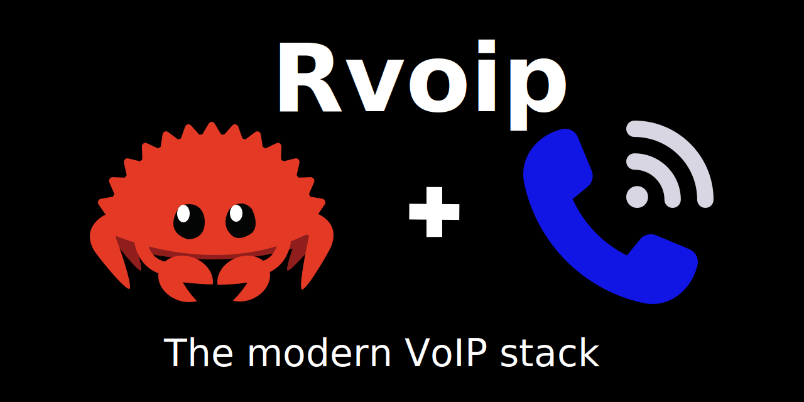

<div align="center">
  
</div>

<div align="center">

[](https://www.rust-lang.org)
[](https://github.com/openprx/rvoip#license)
[](https://github.com/openprx/rvoip)

**A comprehensive, pure Rust SIP/VoIP stack -- 15 crates, ~397,000 lines of Rust, 3,183 tests**

[Quick Start](#quick-start) | [Architecture](#architecture) | [Examples](examples/) | [API Docs](https://docs.rs/rvoip)

</div>

---

rvoip is a pure Rust SIP/VoIP stack built from the ground up for building softphones, SIP servers, and enterprise call centers. All 14 SIP methods have production handlers. Four transport protocols, eight security modules, and four audio codecs ship complete. Seven production library adapters (webrtc-rs, stun-rs) back the security and NAT traversal layers.

## Quick Start

Add rvoip to your `Cargo.toml`:

```toml
[dependencies]
rvoip = { version = "0.1", features = ["full"] }
tokio = { version = "1.0", features = ["full"] }
```

### SIP Server

```rust
use rvoip::session_core::prelude::*;

#[tokio::main]
async fn main() -> Result<()> {
    let session_manager = SessionManagerBuilder::new()
        .with_sip_port(5060)
        .build().await?;

    println!("SIP server running on port 5060");
    tokio::signal::ctrl_c().await?;
    Ok(())
}
```

### Make a Call

```rust
use rvoip::client_core::{ClientConfig, ClientManager, MediaConfig};

#[tokio::main]
async fn main() -> Result<(), Box<dyn std::error::Error>> {
    let config = ClientConfig::new()
        .with_sip_addr("127.0.0.1:5060".parse()?)
        .with_media_addr("127.0.0.1:20000".parse()?)
        .with_user_agent("MyApp/1.0".to_string())
        .with_media(MediaConfig {
            preferred_codecs: vec!["PCMU".to_string(), "PCMA".to_string()],
            ..Default::default()
        });

    let client = ClientManager::new(config).await?;
    client.start().await?;

    let call_id = client.make_call(
        "sip:alice@127.0.0.1".to_string(),
        "sip:bob@example.com".to_string(),
        None
    ).await?;

    println!("Call initiated to bob@example.com");
    Ok(())
}
```

### Call Center

```rust
use rvoip::call_engine::{prelude::*, CallCenterServerBuilder};

#[tokio::main]
async fn main() -> Result<(), Box<dyn std::error::Error>> {
    let mut config = CallCenterConfig::default();
    config.general.local_signaling_addr = "0.0.0.0:5060".parse()?;
    config.general.domain = "127.0.0.1".to_string();

    let mut server = CallCenterServerBuilder::new()
        .with_config(config)
        .with_database_path(":memory:".to_string())
        .build()
        .await?;

    server.start().await?;
    server.run().await?;
    Ok(())
}
```

See the [examples/](examples/) directory for complete working applications.

## Architecture

```
┌─────────────────────────────────────────────────────────────┐
│                    Application Layer                        │
│  ┌──────────────┐  ┌──────────────┐  ┌──────────────┐      │
│  │ call-engine  │  │ client-core  │  │  sip-client  │      │
│  │(Call Center) │  │ (SIP Client) │  │(Simple API)  │      │
│  └──────────────┘  └──────────────┘  └──────────────┘      │
├─────────────────────────────────────────────────────────────┤
│               Session & Coordination Layer                  │
│                   ┌─────────────────┐                       │
│                   │  session-core   │                       │
│                   │ (Session Mgmt)  │                       │
│                   └─────────────────┘                       │
├─────────────────────────────────────────────────────────────┤
│               Protocol & Processing Layer                   │
│  ┌─────────────────┐  ┌─────────────────┐                   │
│  │   dialog-core   │  │   media-core    │                   │
│  │  (SIP Dialogs   │  │ (Audio Process) │                   │
│  │  + Transactions) │  └─────────────────┘                   │
│  └─────────────────┘                                        │
├─────────────────────────────────────────────────────────────┤
│               Transport & Media Layer                       │
│  ┌─────────────────┐  ┌─────────────────┐                   │
│  │ sip-transport   │  │   rtp-core      │                   │
│  │ (SIP Transport) │  │ (RTP/SRTP)      │                   │
│  └─────────────────┘  └─────────────────┘                   │
├─────────────────────────────────────────────────────────────┤
│                    Foundation Layer                         │
│  ┌─────────────────┐  ┌──────────────┐  ┌──────────────┐   │
│  │    sip-core     │  │  codec-core  │  │  audio-core  │   │
│  │ (SIP Protocol)  │  │  (Codecs)    │  │  (Audio DSP) │   │
│  └─────────────────┘  └──────────────┘  └──────────────┘   │
├─────────────────────────────────────────────────────────────┤
│                    Support Crates                           │
│  ┌───────────────┐ ┌────────────────┐ ┌──────────────────┐ │
│  │ infra-common  │ │ registrar-core │ │ intermediary-core│ │
│  └───────────────┘ └────────────────┘ └──────────────────┘ │
│  ┌───────────────┐                    ┌──────────────────┐ │
│  │  users-core   │                    │      rvoip       │ │
│  └───────────────┘                    │    (facade)      │ │
│                                       └──────────────────┘ │
└─────────────────────────────────────────────────────────────┘
```

## Core Crates

| Crate | LOC | Tests | Description |
|-------|----:|------:|-------------|
| **sip-core** | 120,829 | 2,002 | SIP protocol foundation -- RFC 3261 parsing, serialization, 60+ headers, SDP |
| **rtp-core** | 64,931 | 377 | RTP/RTCP/SRTP/DTLS-SRTP, ICE/STUN/TURN, ZRTP, MIKEY |
| **dialog-core** | 43,864 | 173 | SIP dialog state machine + transaction layer |
| **session-core** | 42,214 | 82 | Session lifecycle management, SIP-media coordination |
| **media-core** | 34,603 | 245 | Audio processing -- AEC, AGC, VAD, noise suppression |
| **call-engine** | 28,204 | 6 | Call center orchestration -- B2BUA, queuing, routing |
| **client-core** | 19,918 | 27 | High-level SIP client API |
| **infra-common** | 9,547 | 26 | Shared infrastructure utilities |
| **codec-core** | 7,043 | 106 | G.711, G.722, G.729A (pure Rust), Opus (feature-gated) |
| **audio-core** | 6,526 | 56 | Audio DSP and device I/O |
| **sip-transport** | 6,243 | 41 | UDP, TCP, TLS, WebSocket transport |
| **sip-client** | 6,166 | 40 | Simplified SIP client with `simple-api` feature |
| **registrar-core** | 2,287 | -- | SIP registrar and contact management |
| **intermediary-core** | 1,323 | -- | B2BUA and proxy functionality |
| **rvoip** (facade) | -- | -- | Re-exports all crates under `rvoip::*` |

**Total: ~397,000 lines of Rust, 3,183 tests passing**

## SIP Protocol Features

All 14 SIP methods have production handlers in dialog-core.

| Method | Status | RFC | References |
|--------|--------|-----|--------:|
| INVITE | ✅ Complete | RFC 3261 | 107 |
| ACK | ✅ Complete | RFC 3261 | 24 |
| BYE | ✅ Complete | RFC 3261 | 20 |
| CANCEL | ✅ Complete | RFC 3261 | 18 |
| REGISTER | ✅ Complete | RFC 3261 | 10 |
| OPTIONS | ✅ Complete | RFC 3261 | 6 |
| UPDATE | ✅ Complete | RFC 3311 | 24 |
| SUBSCRIBE | ✅ Complete | RFC 6665 | 3 |
| NOTIFY | ✅ Complete | RFC 6665 | 9 |
| MESSAGE | ✅ Complete | RFC 3428 | 11 |
| INFO | ✅ Complete | RFC 6086 | 22 |
| REFER | ✅ Complete | RFC 3515 | 13 |
| PRACK | ✅ Complete | RFC 3262 | 2 |
| PUBLISH | ✅ Complete | RFC 3903 | 3 |

## Security and Encryption

| Module | Status | LOC | Details |
|--------|--------|----:|---------|
| SRTP/SRTCP | ✅ Complete | 3,218 | AES-CM, HMAC-SHA1, AES-128-GCM, AES-256-GCM + webrtc-srtp 0.17.1 adapter |
| DTLS | ✅ Complete | 11,531 | Full handshake and cipher activation + webrtc-dtls 0.12.0 adapter |
| ICE | ✅ Complete | 4,008 | Full agent, trickle ICE, consent freshness + webrtc-ice 0.17.1 adapter |
| STUN | ✅ Complete | 2,175 | Binding requests, NAT detection + stun-rs 0.1.11 adapter |
| TURN | ✅ Complete | 1,756 | Relay allocation, channel binding |
| SCTP | ✅ Complete | 1,654 | DTLS-SCTP data channels + webrtc-sctp 0.17.1 adapter |
| ZRTP | ✅ Complete | 1,715 | DH key exchange, SAS verification |
| MIKEY | ✅ Complete | 2,357 | PSK, PKE, DH (ECDH P-256) -- all three modes |
| Digest Auth | ✅ Complete | 927 | MD5, SHA-256 (RFC 2617/7616) |
| TLS Transport | ✅ Complete | 769 | TLS 1.2/1.3 for SIP signaling |

## Transport

| Protocol | Status | LOC | Notes |
|----------|--------|----:|-------|
| UDP | ✅ Complete | 528 | Primary SIP transport |
| TCP | ✅ Complete | 1,129 | Reliable SIP transport |
| TLS | ✅ Complete | 769 | TLS 1.2/1.3 secure signaling |
| WebSocket | ✅ Complete | 1,402 | WS + WSS, client + server (RFC 7118) |

## NAT Traversal

| Feature | Status | RFC |
|---------|--------|-----|
| ICE | ✅ Complete | RFC 8445 -- full agent, trickle ICE, consent freshness |
| STUN | ✅ Complete | RFC 5389 -- binding requests, NAT detection |
| TURN | ✅ Complete | RFC 5766 -- relay allocation, channel binding |
| Symmetric RTP | ✅ Complete | RFC 4961 |

## Audio Codecs

| Codec | Status | LOC | Implementation |
|-------|--------|----:|----------------|
| G.711 PCMU/PCMA | ✅ Complete | 406 | Pure Rust, u-law/A-law, 8 kHz |
| G.722 | ✅ Complete | 463 | Pure Rust, ADPCM + QMF sub-band, 16 kHz |
| G.729A | ✅ Complete | 1,786 | Pure Rust, CS-ACELP |
| Opus | ✅ Complete | 544 | Feature-gated libopus binding |

## Production Library Adapters

rvoip writes its own protocol implementations and adapts to battle-tested ecosystem crates for production deployment:

| Adapter | Target Library | LOC |
|---------|---------------|----:|
| ICE | webrtc-ice 0.17.1 | 1,056 |
| STUN | stun-rs 0.1.11 | 600 |
| RTP/RTCP | rtp/rtcp 0.17.1 | 573 |
| SCTP | webrtc-sctp 0.17.1 | 450 |
| DTLS | webrtc-dtls 0.12.0 | 377 |
| SRTP | webrtc-srtp 0.17.1 | 260 |
| Audio DSP | webrtc-audio-processing 2.0 | 481 (feature-gated) |

## Testing

### 4-Level Test Architecture

| Level | Scope | Command |
|-------|-------|---------|
| L1 Unit | Per-crate isolated tests | `cargo test -p <crate>` |
| L2 Adapter | Production library adapter roundtrips | `./scripts/test_all.sh adapter` |
| L3 Integration | Cross-crate module integration | `./scripts/test_all.sh integration` |
| L4 End-to-End | Complete call paths with audio | `./scripts/test_all.sh e2e` |

### Test Results

| Crate | Passed |
|-------|-------:|
| sip-core | 2,002 |
| rtp-core | 377 |
| media-core | 245 |
| dialog-core | 173 |
| codec-core | 106 |
| session-core | 82 |
| audio-core | 56 |
| sip-transport | 41 |
| sip-client | 40 |
| client-core | 27 |
| infra-common | 26 |
| call-engine | 6 |
| **Total** | **3,183** |

Adapter roundtrip tests cover all 7 production library integrations. RFC 4475 torture tests validate SIP parser compliance.

## Known Gaps

There are two known gaps in the current implementation:

- **Video codecs** -- No H.264/VP8/VP9 support. rvoip is audio-only.
- **SIP-over-SCTP** -- Only DTLS-SCTP data channels are implemented, not SIP transport over SCTP (RFC 4168).

## Roadmap

- Video codec support (H.264, VP8, VP9)
- Mobile SDKs (iOS and Android via FFI)
- Clustering and high availability
- WebRTC gateway (browser-to-SIP interop)
- REST/GraphQL management API

## Contributing

Contributions welcome. Open an issue for bugs or feature requests, or submit a pull request.

[](https://github.com/openprx/rvoip/graphs/contributors)

## License

Licensed under either of:

- Apache License, Version 2.0
- MIT License

at your option.
