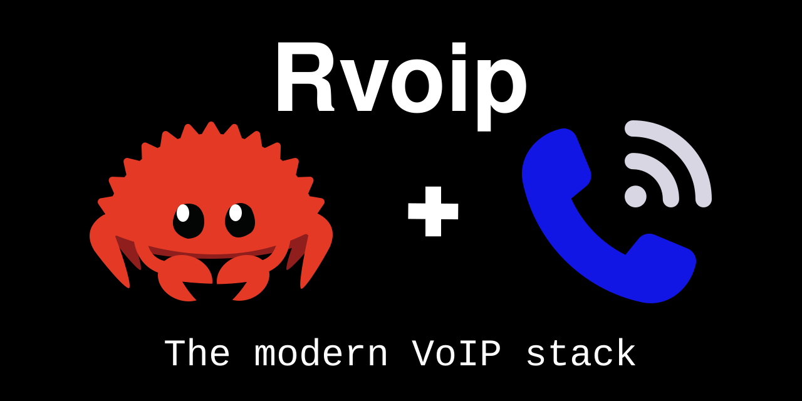

<div align="center">
  

# rvoip

**A Rust library for building communications applications. SIP, RTP, WebRTC, QUIC/WebTransport/WebSocket conversations, Media over QUIC, and voice-AI agents share one call model, and the whole stack is in the box: no external SIP server, media server, or RTP engine to install and wire together.**

[](https://www.rust-lang.org)
[](#license)
[](https://crates.io/crates/rvoip/0.3.10)
[](https://crates.io/crates/rvoip-sip/0.3.10)
[](https://docs.rs/rvoip/0.3.10/rvoip/)
[](https://docs.rs/rvoip-sip/0.3.10/rvoip_sip/)

[**Five-minute start**](#five-minute-start) · [**For carriers**](docs/CARRIERS.md) · [**Which crate?**](#you-need-one-crate) · [**Pick a path**](#pick-your-path) · [**How it fits together**](#how-it-fits-together) · [**What ships**](#what-ships-today) · [**Interop evidence**](#sip-interoperability-and-release-evidence) · [**Changes**](CHANGELOG.md)

</div>

---

## What rvoip is

rvoip is a library, not a server you deploy next to your application. Signalling,
media, codecs, NAT traversal, security, and the conversation model are all
Rust crates in this workspace, so a call goes from your code to the wire without
a separately installed SIP proxy, media server, or RTP engine. The examples
below run on a laptop with nothing installed but Rust; the same crates carry
the release-gated interoperability evidence against Asterisk, FreeSWITCH,
Jambonz, Kamailio, and OpenSIPS. Carriers evaluating standards coverage,
performance, and reliability should start with [For carriers](docs/CARRIERS.md).

## Five-minute start

**1. Add one dependency.**

```toml
[dependencies]
rvoip-sip = "0.3.10"
tokio = { version = "1", features = ["full"] }
```

**2. Make a call.** Bob answers, Alice dials, Alice hangs up. Everything runs
on loopback, so this works on a laptop with no PBX, no account, and no network
setup.

```rust
use std::time::Duration;
use rvoip_sip::{Config, Endpoint, EndpointProfile};

#[tokio::main]
async fn main() -> rvoip_sip::Result<()> {
    let bob = tokio::spawn(async {
        let mut bob = Endpoint::builder()
            .name("bob")
            .profile(EndpointProfile::Custom(Config::local("bob", 5071)))
            .build()
            .await?;
        let incoming = bob.wait_for_incoming().await?;
        let call = incoming.answer().await?;
        call.wait_for_end(None).await?;
        bob.shutdown().await
    });

    tokio::time::sleep(Duration::from_millis(300)).await;

    let alice = Endpoint::builder()
        .name("alice")
        .profile(EndpointProfile::Custom(Config::local("alice", 5070)))
        .build()
        .await?;

    let call = alice
        .call_and_wait("sip:bob@127.0.0.1:5071", Some(Duration::from_secs(10)))
        .await?;
    call.hangup_and_wait(Some(Duration::from_secs(5))).await?;
    alice.shutdown().await?;
    bob.await.unwrap()
}
```

**3. Or run the same program from the checkout.**

```sh
git clone https://github.com/eisenzopf/rvoip.git && cd rvoip
cargo run -p rvoip-sip --example endpoint_local_call
```

From here, [`examples/`](examples/) walks forward one step at a time: real
microphone audio, registering to a PBX, hold/DTMF, transfers, SRTP and TLS, an
IVR, a B2BUA, then browser and voice-AI gateways.

## You need one crate

The workspace publishes 46 crates. You import **one** of them; it pulls in
everything it needs. The rest are internal layers you never name in your own
`Cargo.toml`.

| You are building | Depend on | Enable |
| --- | --- | --- |
| A SIP phone, PBX, IVR, registrar, proxy, B2BUA, or trunk gateway | [`rvoip-sip`](crates/sip/rvoip-sip) | nothing extra |
| One server that takes SIP **and** browser (WebRTC) callers and connects them | [`rvoip`](crates/rvoip) | `features = ["app"]` |
| A SIP or WebRTC caller talking to a hosted voice agent (Vapi) | [`rvoip`](crates/rvoip) | `features = ["app", "vapi"]` |
| Your own ASR / TTS / dialog pipeline, with recordings and signed vCons | [`rvoip`](crates/rvoip) | `features = ["voip-3"]` |
| A native, mobile, or embedded client SDK | [`rvoip-client`](crates/rvoip-client) | pick transports |
| SIP calls delivered to Amazon Connect agents | [`rvoip-amazon-connect`](crates/webrtc/rvoip-amazon-connect) | — |
| Media fan-out over Media over QUIC | [`rvoip-moq`](crates/moq/rvoip-moq) | — |

Two shortcuts:

- **`rvoip-sip` is the release-gated product.** If your application is
  telephony, start and stay there. It is the only crate with a signed
  interoperability attestation (see [evidence](#sip-interoperability-and-release-evidence)).
- **`rvoip` is the facade.** It re-exports `rvoip-sip` as `rvoip::sip` and adds
  the shared `Orchestrator` plus optional transports and extensions behind
  Cargo features. Its [feature table](crates/rvoip/README.md#cargo-features)
  and the [deployment bundles](docs/FEATURE_BUNDLES.md) (`bundle-sip-endpoint`,
  `bundle-carrier-sip`, `bundle-browser-gateway`, `bundle-ai-conversation`,
  `bundle-full-pure-rust`, `bundle-full-native`) are the only feature lists you
  need.

Deployment backends (Keycloak, LDAP, Redis, Postgres vCon storage, audit and
SIEM sinks, SAML, SCIM, WebAuthn, STIR/SHAKEN, IMS AKA) are separate
`rvoip-*` extension crates you add only when you operate that backend. The
[extension catalog](#extensions) lists them.

## Pick your path

### Path 1 — SIP telephony (`rvoip-sip`)

Four API surfaces, from simplest to most control. Most applications use the
first one.

| Surface | Use it when | Example |
| --- | --- | --- |
| `Endpoint` | You want a softphone, an account that registers, or a scripted caller/callee | [`01-quickstart-p2p`](examples/01-quickstart-p2p), [`02-softphone-audio`](examples/02-softphone-audio), [`03-register-to-pbx`](examples/03-register-to-pbx) |
| `StreamPeer` | You want a sequential "send, then wait for the matching event" client | [`04-call-control`](examples/04-call-control), [`05-blind-transfer`](examples/05-blind-transfer) |
| `CallbackPeer` | You are writing a server that reacts to inbound calls (IVR, auto-attendant) | [`09-ivr-server`](examples/09-ivr-server) |
| `UnifiedCoordinator` + `server::b2bua` | You need a PBX, registrar, proxy, or B2BUA with routing and media bridging | [`10-call-center-b2bua`](examples/10-call-center-b2bua) |

Register an account on a PBX and place a call through it:

```rust,no_run
use std::time::Duration;
use rvoip_sip::{Endpoint, EndpointProfile, Result};

# async fn example() -> Result<()> {
let mut endpoint = Endpoint::builder()
    .name("alice")
    .account("1001")
    .password("secret")
    .registrar("sips:pbx.example.com:5061")
    .profile(EndpointProfile::AsteriskTlsSrtpRegisteredFlow)
    .build()
    .await?;

endpoint.register().await?;

let call = endpoint
    .call_and_wait("1002", Some(Duration::from_secs(30)))
    .await?;
call.send_dtmf('1').await?;
call.hangup_and_wait(Some(Duration::from_secs(5))).await?;
endpoint.shutdown().await?;
# Ok(())
# }
```

Answer calls and react to key presses, the shape of an IVR or auto-attendant:

```rust,no_run
use rvoip_sip::{CallHandlerDecision, CallbackPeer, Config, Result};

# async fn example() -> Result<()> {
let peer = CallbackPeer::builder(Config::local("ivr", 5120))
    .on_incoming(|call| async move {
        println!("incoming call from {}", call.from);
        CallHandlerDecision::Accept
    })
    .on_dtmf(|call, digit| async move {
        if digit == '0' {
            call.transfer_blind("sip:operator@127.0.0.1:5122").await?;
        }
        Ok(())
    })
    .on_ended(|call_id, reason| async move {
        println!("call {call_id} ended: {reason:?}");
        Ok(())
    })
    .build()
    .await?;

peer.run().await
# }
```

Security and transports are configuration, not different APIs: SDES-SRTP in
[`07-secure-call-srtp`](examples/07-secure-call-srtp), TLS in
[`08-tls-transport`](examples/08-tls-transport), DTLS-SRTP, G.729, AMR-NB/WB,
and Opus behind Cargo features. The full surface is documented in the
[SIP crate README](crates/sip/rvoip-sip/README.md).

### Path 2 — Browser and cross-transport gateways (`rvoip` + `app`)

`RvoipApp` declares transports, roles, and routing through one builder and
runs SIP, WebRTC, and UCTP listeners on the shared `Orchestrator`:

```toml
rvoip = { version = "0.3.10", features = ["app"] }
```

```rust,no_run
use rvoip::app::*;

# async fn run() -> rvoip::app::AppResult<()> {
let app = RvoipApp::builder()
    .webrtc(
        WebRtcConfig::ws("127.0.0.1:8081")
            .allow(Role::Customer, [Capability::Text, Capability::Voice]),
    )
    .sip(
        SipConfig::bind("127.0.0.1:5060")
            .domain("callcenter.local")
            .allow(Role::Employee, [Capability::Voice])
            .registrar_users([("alice", "password123")]),
    )
    .employees(EmployeePolicy::named(["alice"]))
    .customers(CustomerPolicy::webrtc_only())
    .assignment(AssignmentPolicy::fixed("alice"))
    .on_message(|ctx, msg| async move {
        ctx.reply("Alice", format!("Alice received: {}", msg.text)).await
    })
    .build()
    .await?;

app.run().await
# }
```

Start from [`12-customer-escalation-sip-webrtc`](examples/12-customer-escalation-sip-webrtc):
a browser chat escalates to a SIP agent's phone. For SIP into Amazon Connect,
see [`13-sip-to-amazon-connect`](examples/13-sip-to-amazon-connect).

### Path 3 — Voice AI (`rvoip` + `vapi` or `voip-3`)

- **Hosted agent.** [`rvoip-vapi`](crates/extensions/rvoip-vapi) speaks Vapi's
  bidirectional raw-audio WebSocket directly. Your SIP or WebRTC caller is
  bridged to the agent through the `Orchestrator`; the agent joins as its own
  AI participant with typed events, control messages, and supervised teardown.
  Start from [`14-vapi-agent`](examples/14-vapi-agent), one server that accepts
  either kind of caller. Attaching an agent to a caller you already hold:

  ```rust,no_run
  use std::sync::Arc;
  use rvoip::Orchestrator;
  use rvoip::core_traits::ids::ConnectionId;
  use rvoip::vapi::{VapiAdapter, VapiApiKey, VapiAssistant, VapiCallOptions, VapiConfig};

  # async fn attach(orchestrator: Arc<Orchestrator>, caller: ConnectionId)
  # -> Result<(), Box<dyn std::error::Error>> {
  let key = VapiApiKey::new(std::env::var("VAPI_API_KEY")?)?;
  let adapter = VapiAdapter::new(VapiConfig::new(key))?;
  let options = VapiCallOptions::new(VapiAssistant::saved(std::env::var("VAPI_ASSISTANT_ID")?));

  // Joins a distinct AI participant, originates the agent leg, bridges audio.
  let mut call = adapter.attach_agent(&orchestrator, caller, options).await?;
  call.say("One moment while I look that up.", false, true).await?;
  let _outcome = call.wait().await;
  # Ok(())
  # }
  ```

- **Your own pipeline.** [`rvoip-harness`](crates/extensions/rvoip-harness)
  gives you ASR, TTS, dialog, and recording provider traits, and
  [`rvoip-vcon`](crates/extensions/rvoip-vcon) emits signed vCon records of the
  conversation. [`11-ai-harness-demo`](examples/11-ai-harness-demo) runs the
  whole loop with deterministic providers, so you can see the shape before you
  plug in a real model.

## How it fits together

Every transport turns into the same objects, so an application written against
the conversation model does not care whether a leg arrived over SIP, a browser,
or QUIC. That is what lets one `Orchestrator` bridge them.

```text
┌───────────────────────────────────────────────────────────────────┐
│ Your application                                                  │
│ softphone · PBX · contact center · browser gateway · AI agent     │
└───────────────────────────────┬───────────────────────────────────┘
                                │  rvoip-sip  /  rvoip (+ features)
┌───────────────────────────────▼───────────────────────────────────┐
│ Shared conversation model  (rvoip-core)                           │
│ Orchestrator · Conversation · Session · Participant · Connection  │
│ routing · admission · bridges · media graph · events              │
└──────────────┬────────────────┬────────────────┬──────────────────┘
               │                │                │
        ┌──────▼──────┐  ┌──────▼──────┐  ┌──────▼───────────────┐
        │ SIP + RTP   │  │ WebRTC      │  │ UCTP                 │
        │ UDP/TCP/TLS │  │ ICE/DTLS    │  │ QUIC/WebTransport/WS │
        └──────┬──────┘  └──────┬──────┘  └──────┬───────────────┘
               └────────────────┼────────────────┘
                                │
             ┌──────────────────▼───────────────────┐
             │ Optional products and extensions      │
             │ Vapi · AI harness · vCon · MoQ        │
             │ Amazon Connect · identity · audit     │
             └───────────────────────────────────────┘
```

Words you will meet in the API:

- **Conversation** — the thing people are in together. It outlives any one
  connection.
- **Session** — one participant's time in a conversation.
- **Participant** — a human or an AI agent. Roles (`Agent`, `Observer`,
  customer) can change without moving connections.
- **Connection** — one transport leg: a SIP dialog, a browser peer connection,
  a UCTP session.
- **Stream** — the audio (or video, or data) flowing on a connection. Bridges
  join streams across connections, transcoding when codecs differ.

Adapters depend on the shared `ConnectionAdapter` trait; the core never
imports a transport. The [design docs](docs/) go deeper, starting with
[`INTERFACE_DESIGN.md`](docs/INTERFACE_DESIGN.md) and
[`CONVERSATION_PROTOCOL.md`](docs/CONVERSATION_PROTOCOL.md).

## What ships today

| Product area | Available capabilities | Maturity |
| --- | --- | --- |
| **SIP telephony** | Endpoints, reactive servers, PBX/registrar/proxy building blocks, B2BUA bridging, call control, transfers, authentication, full RTP media | **Beta-qualified** |
| **Media and devices** | RTP/RTCP, SDES-SRTP, G.711, optional G.729/AMR/Opus/G.722, DTMF, OS microphone/speaker, resampling, jitter buffering, mixing primitives | Beta-qualified core + preview additions |
| **WebRTC** | WHIP/WHEP and WebSocket signaling, full-gather and trickle ICE, DTLS-SRTP, Opus/G.711, VP8, SCTP data channels, RFC 4733 DTMF | Developer preview |
| **UCTP substrates** | One conversation protocol over raw QUIC, WebTransport, or WebSocket, with capability negotiation and RTP datagram framing | Developer preview |
| **Media over QUIC** | MOQT draft-19 transport, native helper, embeddable relay, media-graph broadcast adapter | Developer preview |
| **Gateways and bridges** | SIP ↔ WebRTC ↔ UCTP routing, the `RvoipApp` builder, SIP-to-Amazon-Connect audio and screen pops | Developer preview |
| **Voice AI and conversation data** | Pluggable ASR/TTS/dialog/recording providers, native Vapi agents, signed vCons, Postgres vCon storage | Developer preview |
| **Identity and compliance** | Digest/Bearer, OIDC, Keycloak, LDAP, Redis, SAML, SCIM, WebAuthn, IMS AKA, STIR/SHAKEN, redacted audit and SIEM sinks | Beta-qualified SIP auth core + preview extensions |

**Beta-qualified** means covered by the SIP release gate and its
interoperability, security, standards, performance, and soak evidence.
**Developer preview** means implemented and published, but API-unstable or
outside that attestation. **Planned** items appear only in the
[roadmap](#roadmap). A published crate or Cargo feature is evidence of
availability, not a blanket production-readiness statement.

<details>
<summary><strong>Capability detail by area</strong> (click to expand)</summary>

### SIP application and signaling

| Capability | Maturity | Supported behavior | Start/evidence |
| --- | --- | --- | --- |
| Endpoint and server APIs | **Beta-qualified** | Outbound/inbound calls through `Endpoint`, scripted `StreamPeer`, reactive `CallbackPeer`, and lower-level `UnifiedCoordinator` | [`rvoip-sip`](crates/sip/rvoip-sip) |
| Core dialog control | **Beta-qualified** | INVITE, ACK, BYE, CANCEL, REGISTER, OPTIONS, UPDATE, PRACK, REFER, SUBSCRIBE/NOTIFY, MESSAGE, and INFO within documented bounds | [RFC matrix](crates/sip/rvoip-sip/docs/RFC_COMPLIANCE_MATRIX.md) |
| PBX/gateway building | **Beta-qualified** | Registrar bindings, stateful proxy primitives, B2BUA call-leg coordination, media bridging, custom SIP headers | [`10-call-center-b2bua`](examples/10-call-center-b2bua) |
| Blind transfer | **Beta-qualified** | REFER-driven transfer and typed NOTIFY progress/final outcomes | [`05-blind-transfer`](examples/05-blind-transfer) |
| Attended-transfer primitives | Developer preview | Consultation dialog identity, `Replaces` construction, REFER delivery, working orchestration example; not a complete RFC 3891 qualification | [`06-attended-transfer`](examples/06-attended-transfer) |
| SIP transport | **Beta-qualified** | UDP, TCP, and TLS; plain SIP-over-WebSocket has bounded evidence | [`rvoip-sip-transport`](crates/sip/sip-transport) |
| Secure WebSocket | Developer preview | WSS listener/lower-level support; outbound WSS dialing is not a SIP beta claim | [Transport README](crates/sip/sip-transport/README.md) |
| Ingress protection | Developer preview | Per-source request budget and an admission observer on the SIP listener | [`rvoip-sip`](crates/sip/rvoip-sip) |

### Media

| Capability | Maturity | Supported behavior | Start/evidence |
| --- | --- | --- | --- |
| RTP/RTCP and G.711 | **Beta-qualified** | PCMU/PCMA media delivery, RTCP receiver reports, telephone-event DTMF, hold/resume, bridging | [`rvoip-media-core`](crates/media/media-core) |
| SDES-SRTP | **Beta-qualified** | Tested AES-CM/HMAC profiles with negotiated encrypted media | [`07-secure-call-srtp`](examples/07-secure-call-srtp) |
| DTLS-SRTP for SIP | Developer preview | Feature-gated `dtls-srtp`: SAVPF and configurable DTLS-SRTP offers, authenticated SDP fingerprints | [Compatibility matrix](crates/sip/rvoip-sip/docs/COMPATIBILITY_MATRIX.md) |
| NAT traversal | Developer preview | STUN-discovered advertised addresses, with the mapping learned on the live RTP socket | [`rvoip-sip`](crates/sip/rvoip-sip) |
| G.729A/G.729AB | Developer preview | Fully integrated optional path: PT 18 SDP/Annex B negotiation, RTP encode/decode, G.711 transcoding, Asterisk/FreeSWITCH matrix coverage | [Compatibility matrix](crates/sip/rvoip-sip/docs/COMPATIBILITY_MATRIX.md) |
| AMR-NB and AMR-WB | Developer preview | Bit-exact against the 3GPP reference over committed fixtures, RFC 4867 octet-aligned and bandwidth-efficient framing, DTX, CMR and mode negotiation, live calls through Asterisk, FreeSWITCH, Kamailio, OpenSIPS | [AMR status](crates/media/codec-core/docs/AMR_IMPLEMENTATION_STATUS.md) |
| Opus and G.722 | Developer preview | Feature-gated codec/media support; Opus needs libopus on the build host | [`rvoip-media-core`](crates/media/media-core) |
| OS audio devices | Developer preview | Microphone/speaker bridge, drift-free pacing, resampling, jitter buffering, mute-as-silence, VU metering | [`02-softphone-audio`](examples/02-softphone-audio) |
| Conference mixing | Developer preview | Lower-level N-way/N-1 mixing and conference monitoring primitives | [Media README](crates/media/media-core/README.md) |

### WebRTC, UCTP, MoQ, and integrations

| Capability | Maturity | Supported behavior | Start/evidence |
| --- | --- | --- | --- |
| WebRTC interop | Developer preview | WHIP/WHEP and WebSocket signaling, full-gather/trickle ICE, DTLS-SRTP, Opus/G.711, VP8, SCTP data channels, DTMF; mDNS and dual-stack browser candidates accepted | [`rvoip-webrtc`](crates/webrtc/rvoip-webrtc) |
| TURN integration | Developer preview | External TURN server configuration; rvoip does not ship a hosted TURN service | [WebRTC scope](crates/webrtc/rvoip-webrtc/README.md) |
| UCTP | Developer preview | Envelopes, state machines, capability negotiation, authenticated resource binding, conversation dispatch, RTP datagram framing | [`rvoip-uctp`](crates/uctp/rvoip-uctp) |
| UCTP substrates | Developer preview | Raw QUIC, WebTransport (with origin allowlist), and WebSocket adapters | [`crates/uctp`](crates/uctp) |
| Media over QUIC | Developer preview | MOQT draft-19 transport/native/relay packages plus media-graph broadcast integration | [`crates/moq`](crates/moq) |
| Cross-transport app builder | Developer preview | Role/capability policy, assignment, callbacks, SIP/WebRTC/UCTP listeners, orchestration | [`rvoip::app`](crates/rvoip/src/app.rs) |
| Amazon Connect | Developer preview | `StartWebRTCContact`, Amazon Chime WebRTC media, SIP-header contact attributes, G.711 ↔ Opus bridging, agent screen pops | [`13-sip-to-amazon-connect`](examples/13-sip-to-amazon-connect) |
| Vapi voice agents | Developer preview | Native bidirectional μ-law/PCM raw-audio WebSocket sessions bridged to SIP or WebRTC legs; the agent is a distinct AI participant | [`rvoip-vapi`](crates/extensions/rvoip-vapi) |
| AI harness | Developer preview | Provider-neutral ASR/TTS/dialog/recording attachments with bounded, fenced lifecycle and in-process bridge handoff | [`rvoip-harness`](crates/extensions/rvoip-harness) |

The WebRTC implementation of ICE and DTLS-SRTP is separate from the SIP beta
claim. UCTP and MoQ availability does not imply that SIP-over-QUIC or
RTP-over-QUIC has shipped.

</details>

## Extensions

All 14 extension crates ship at `0.3.10`. They stay optional so protocol
crates depend on provider contracts, never on a deployment backend.

| Group | Extensions | Available capability |
| --- | --- | --- |
| **AI and conversation data** | [`rvoip-harness`](crates/extensions/rvoip-harness), [`rvoip-vapi`](crates/extensions/rvoip-vapi), [`rvoip-vcon`](crates/extensions/rvoip-vcon), [`rvoip-vcon-postgres`](crates/extensions/rvoip-vcon-postgres) | ASR/TTS/dialog/recording provider traits, native Vapi agents, signed vCon artifacts, Postgres storage |
| **Caller trust** | [`rvoip-stir-shaken`](crates/extensions/rvoip-stir-shaken) | STIR/SHAKEN PASSporT signing and verification (RFC 8224/8225, ATIS profiles) |
| **Authentication providers** | [`rvoip-oidc`](crates/extensions/rvoip-oidc), [`rvoip-keycloak`](crates/extensions/rvoip-keycloak), [`rvoip-ldap`](crates/extensions/rvoip-ldap), [`rvoip-redis`](crates/extensions/rvoip-redis), [`rvoip-ims-aka`](crates/extensions/rvoip-ims-aka) | OIDC discovery and validation, Keycloak, LDAP password verification, clustered auth/revocation/replay state, IMS AKA |
| **User lifecycle** | [`rvoip-saml`](crates/extensions/rvoip-saml), [`rvoip-scim`](crates/extensions/rvoip-scim), [`rvoip-webauthn`](crates/extensions/rvoip-webauthn) | SAML 2.0 service provider, SCIM 2.0 provisioning, WebAuthn/passkeys |
| **Audit and observability** | [`rvoip-audit`](crates/extensions/rvoip-audit) | Redacted JSONL and tracing sinks plus OTLP and SIEM exports (generic webhook, Splunk, Elastic/ECS, Microsoft Sentinel, Datadog) |

How they attach: `voip-3` on the facade brings in the harness, vCon, and the
identity surface; `vapi` and `sip-stir-shaken` are their own facade features;
everything else is a direct dependency.

```toml
rvoip = { version = "0.3.10", features = ["sip", "vapi", "sip-stir-shaken"] }
rvoip-keycloak = "0.3.10"
rvoip-redis = "0.3.10"
rvoip-audit = "0.3.10"
```

The contracts they implement live in
[`rvoip-auth-core`](crates/identity/auth-core),
[`rvoip-users-core`](crates/identity/users-core), and
[`rvoip-identity`](crates/identity/rvoip-identity).

## Workspace map

For orientation only. Everything below the front doors is a transitive
dependency of `rvoip` or `rvoip-sip`; depend on it directly only when you are
extending the platform itself.

| Family | Crates |
| --- | --- |
| **Front doors** | [`rvoip`](crates/rvoip), [`rvoip-sip`](crates/sip/rvoip-sip), [`rvoip-client`](crates/rvoip-client) |
| Foundation | [`rvoip-core`](crates/foundation/rvoip-core), [`rvoip-core-traits`](crates/foundation/rvoip-core-traits), [`rvoip-infra-common`](crates/foundation/infra-common) |
| SIP internals | [`rvoip-sip-core`](crates/sip/sip-core), [`rvoip-sip-transport`](crates/sip/sip-transport), [`rvoip-sip-dialog`](crates/sip/sip-dialog), [`rvoip-sip-proxy`](crates/sip/sip-proxy), [`rvoip-sip-registrar`](crates/sip/sip-registrar) |
| Media | [`rvoip-media-core`](crates/media/media-core), [`rvoip-codec-core`](crates/media/codec-core), [`rvoip-rtp-core`](crates/media/rtp-core), [`rvoip-ice-core`](crates/media/ice-core), [`rvoip-audio-send-queue`](crates/media/rvoip-audio-send-queue), [`rvoip-audio-device`](crates/media/rvoip-audio-device) |
| WebRTC and Connect | [`rvoip-webrtc`](crates/webrtc/rvoip-webrtc), [`rvoip-rtc`](crates/webrtc/rvoip-rtc), [`rvoip-webrtc-stack`](crates/webrtc/rvoip-webrtc-stack), [`rvoip-amazon-connect`](crates/webrtc/rvoip-amazon-connect) |
| UCTP | [`rvoip-uctp`](crates/uctp/rvoip-uctp), [`rvoip-quic`](crates/uctp/rvoip-quic), [`rvoip-webtransport`](crates/uctp/rvoip-webtransport), [`rvoip-websocket`](crates/uctp/rvoip-websocket) |
| MoQ | [`rvoip-moq`](crates/moq/rvoip-moq), [`rvoip-moq-transport`](crates/moq/rvoip-moq-transport), [`rvoip-moq-native`](crates/moq/rvoip-moq-native), [`rvoip-moq-relay`](crates/moq/rvoip-moq-relay) |
| Identity | [`rvoip-auth-core`](crates/identity/auth-core), [`rvoip-users-core`](crates/identity/users-core), [`rvoip-identity`](crates/identity/rvoip-identity) |
| Extensions | The [14 extension crates](#extensions) above |

## SIP interoperability and release evidence

`rvoip-sip` exercises its public APIs against independently implemented peers
on every release. The exact peer versions, scenarios, transports, results, and
exclusions are recorded in signed qualification evidence; see the
[compatibility matrix](crates/sip/rvoip-sip/docs/COMPATIBILITY_MATRIX.md).

| Peer/tool | Status | Executed scope |
| --- | --- | --- |
| **Asterisk** | Release-gated | `Endpoint`, `StreamPeer`, and `CallbackPeer`; registration, calls/media, codecs, hold/resume, ring-cancel, RFC 4733 DTMF, rejection, and blind transfer over the documented UDP and TLS profiles |
| **FreeSWITCH** | Release-gated | The corresponding public-API, scenario, codec, and transport matrix |
| **Jambonz OSS 0.9.9** | Release-gated | Revision- and digest-pinned Jambonz SBC/registrar/RTPengine profile across the applicable public-API UDP/plain-RTP matrix |
| **SIPp** | Release-gated | Standards scenarios and bounded signaling-load profiles |
| **baresip** | Release-gated | External strict user-agent call against the RVoIP SIP listener |
| **Kamailio** | Release-gated | RFC 3261 transaction-stateful proxy in both hop orders over UDP, TCP, and TLS, plus registrar-proxy with an rtpengine media relay: registration, calls, AMR in all four framings, DTMF, SDES-SRTP |
| **OpenSIPS** | Release-gated | The same proxy matrix in both hop orders over UDP, TCP, and TLS, and the same rtpengine lab scope |

The strict full-beta gate requires an explicit PASS attestation for Asterisk,
FreeSWITCH, Jambonz, Kamailio, and OpenSIPS. The report generator binds each
row to the tested source tree, exact peer identity and configuration, selected
matrix, and hashed evidence; it refuses to produce a release-candidate report
if a required peer is missing, skipped, ambiguous, unpinned, or failing.

The current release's authority documents:

- [Qualification report](crates/sip/rvoip-sip/docs/BETA_RELEASE_REPORT.md) — exact versions, row counts, scenarios, hashes, PASS status.
- [Performance report](crates/sip/rvoip-sip/docs/BETA_PERFORMANCE_REPORT.md).
- [RFC evidence matrix](crates/sip/rvoip-sip/docs/RFC_COMPLIANCE_MATRIX.md) and [security posture](crates/sip/rvoip-sip/docs/SECURITY_POSTURE.md).
- [Interop plan](crates/sip/rvoip-sip/docs/INTEROP_CI_PLAN.md) — the evidence boundaries.
- [Changelog](CHANGELOG.md) and [release notes](crates/sip/rvoip-sip/docs/RELEASE_NOTES_NEXT.md) — what changed in this release.

A passing lab matrix is bounded interoperability evidence, not carrier
certification or a claim about every peer version and topology. Anything
outside a stated qualification boundary remains the application's
responsibility to validate in its own deployment.

## Building and testing the workspace

```sh
git clone https://github.com/eisenzopf/rvoip.git
cd rvoip

# Build the default workspace members
cargo build

# Run a working SIP call
cargo run -p rvoip-sip --example endpoint_local_call

# Run the workspace test suite
scripts/test_all.sh
```

Feature-gated targets (codecs, DTLS-SRTP, generated compliance suites) only
build with their features on; use `--all-features` when you touch a gated
path. [`docs/RELEASING.md`](docs/RELEASING.md) describes the release train.

## Roadmap

Remaining major items, beyond the developer-preview products above:

- **SIP-over-QUIC** and **RTP-over-QUIC (RoQ)** transport profiles.
- Integrated multi-party **SFU/MCU** products beyond the existing media primitives.
- Production graduation of **AAuth** as its standards work and deployment evidence mature.
- Deeper **AI participants** with multi-agent orchestration beyond today's provider harness.
- Additional qualification and release gates for the developer-preview products.

Detailed engineering gaps are tracked in [`docs/GAP_PLAN.md`](docs/GAP_PLAN.md)
and in [issues](https://github.com/eisenzopf/rvoip/issues).

## Contributing

- **Bugs:** open an issue with reproduction steps.
- **Feature requests:** use discussions or issues and describe the target product and compatibility expectations.
- **Pull requests:** workspace-wide tests run through `scripts/test_all.sh`.

<a id="license"></a>
## License

Licensed under the [MIT License](LICENSE).

<div align="center">

---

**Built in Rust** · [Facade API](https://docs.rs/rvoip/0.3.10/rvoip/) · [SIP API](https://docs.rs/rvoip-sip/0.3.10/rvoip_sip/) · [Examples](examples/) · [Issues](https://github.com/eisenzopf/rvoip/issues) · [Discussions](https://github.com/eisenzopf/rvoip/discussions)

</div>
