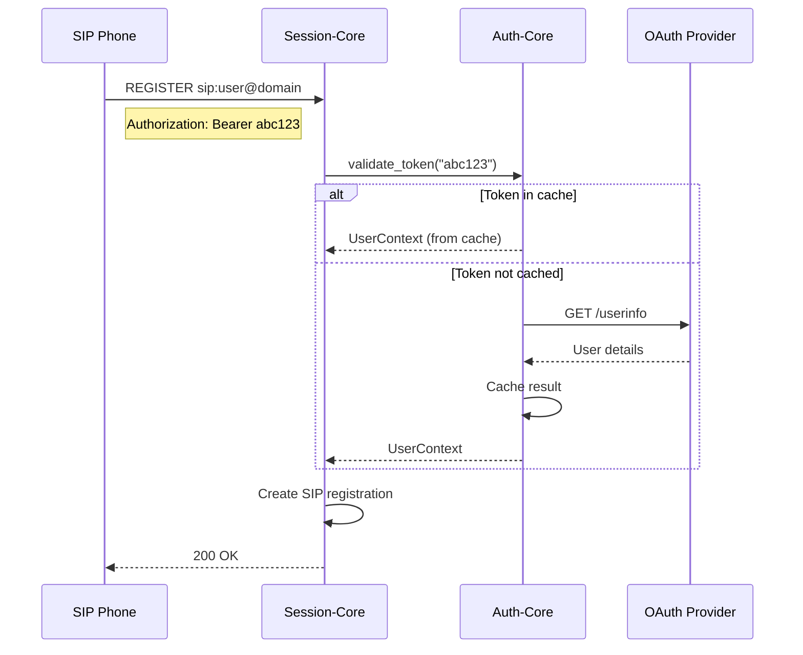
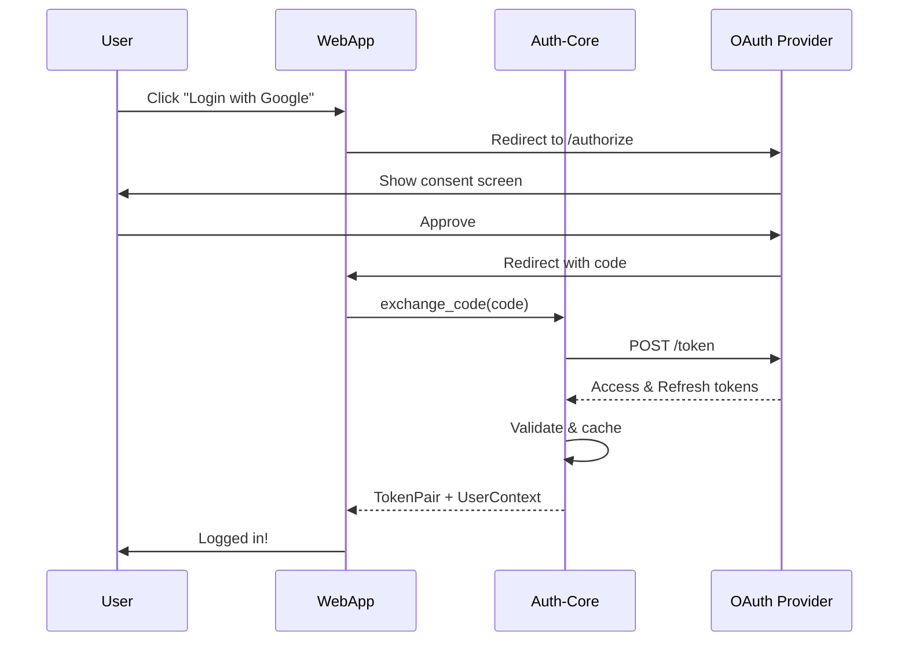
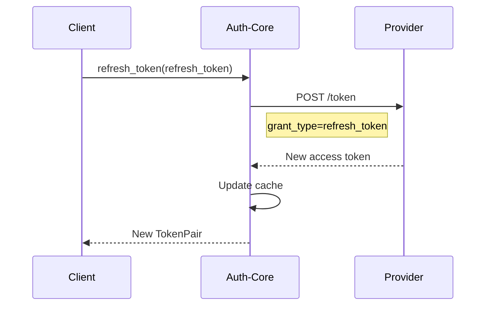

# Auth-Core Authentication Plan

## Executive Summary

Auth-Core provides a unified authentication and authorization service for the RVoIP ecosystem. It handles OAuth2 flows, token validation, user context management, and integrates seamlessly with session-core, registrar-core, and other services.

## Architecture Overview

```
┌─────────────────────────────────────────────────────────────────┐
│                         External Clients                         │
│                    (SIP Phones, Web Apps, APIs)                  │
└─────────────────┬───────────────────────────────┬───────────────┘
                  │                               │
                  │ SIP REGISTER                  │ HTTP /auth
                  │ Authorization: Bearer xxx     │ 
                  ▼                               ▼
┌─────────────────────────────┐   ┌─────────────────────────────┐
│      Session-Core           │   │        API Gateway          │
│   (SIP Authentication)      │   │    (REST Authentication)    │
└──────────────┬──────────────┘   └──────────────┬──────────────┘
               │                                  │
               │         ┌────────────┐          │
               └────────▶│ Auth-Core  │◀─────────┘
                        │             │
                        │ • Validate  │
                        │ • Cache     │
                        │ • Refresh   │
                        └──────┬──────┘
                               │
                ┌──────────────┼──────────────┐
                ▼              ▼              ▼
        ┌──────────┐   ┌──────────┐   ┌──────────┐
        │  OAuth2  │   │   JWT    │   │  Local   │
        │ Provider │   │  Issuer  │   │   Store  │
        └──────────┘   └──────────┘   └──────────┘
```

## Core Components

### 1. Authentication Service
The main service that orchestrates all authentication operations.

```rust
pub trait AuthenticationService {
    /// Validate a token and return user context
    async fn validate_token(&self, token: &str) -> Result<UserContext>;
    
    /// Refresh an expired token
    async fn refresh_token(&self, refresh_token: &str) -> Result<TokenPair>;
    
    /// Revoke a token
    async fn revoke_token(&self, token: &str) -> Result<()>;
    
    /// Exchange authorization code for tokens (OAuth2)
    async fn exchange_code(&self, code: &str) -> Result<TokenPair>;
}
```

### 2. Token Validators
Pluggable validators for different token types:

- **OAuth2 Validator**: Validates against OAuth2 authorization servers
- **JWT Validator**: Local validation of JWT tokens
- **Opaque Token Validator**: Remote validation via introspection endpoint

### 3. Cache Layer
High-performance caching to reduce validation latency:

- Token validation results cached for configurable TTL
- Negative caching for invalid tokens
- Cache invalidation on token revocation

### 4. Provider Adapters
Support for multiple authentication providers:

- Google OAuth2
- Microsoft Azure AD
- Keycloak
- Auth0
- Custom OAuth2 providers

## Authentication Flows

### Flow 1: SIP Phone Registration



### Flow 2: Web Application Login



### Flow 3: Token Refresh



## Understanding JWT Issuers and OAuth2 Providers

### The Relationship

JWT issuers and OAuth2 providers are often the **same entity** but serve different roles:

- **OAuth2 Provider (Authorization Server)**: Handles the authentication flow, manages client apps, and issues tokens
- **JWT Issuer**: Creates and signs JWT tokens, provides public keys for verification

### Common Patterns

#### Pattern 1: Same Entity (Most Common)
Modern providers like Google, Auth0, and Keycloak act as both:
```
User → Google OAuth2 → Google issues JWT → JWT has "iss": "https://accounts.google.com"
```

#### Pattern 2: Separate Entities
Sometimes an OAuth2 provider issues opaque tokens, and you create your own JWTs:
```
User → GitHub OAuth2 → Opaque token → Your backend → Issues custom JWT
```

### Token Types in OAuth2

OAuth2 doesn't mandate token format. Providers can issue:

1. **JWT Tokens** (self-contained, locally verifiable):
```json
{
  "iss": "https://accounts.google.com",  // Issuer claim
  "sub": "user123",
  "exp": 1735689600,
  "scope": "email profile"
}
```

2. **Opaque Tokens** (must call provider to validate):
```
xyz789opaque  // No embedded information
```

### Why This Matters for Auth-Core

Auth-core handles both scenarios intelligently:

```rust
async fn validate_token(&self, token: &str) -> Result<UserContext> {
    if is_jwt(token) {
        // JWT: Validate locally using cached public keys from issuer
        let claims = validate_jwt(token, &self.jwks_cache)?;
        verify_trusted_issuer(&claims.iss)?;
        Ok(UserContext::from_jwt_claims(claims))
    } else {
        // Opaque: Must call OAuth2 provider's introspection endpoint
        let response = self.oauth_client.introspect_token(token).await?;
        Ok(UserContext::from_introspection(response))
    }
}
```

### Real-World Examples

| Provider | OAuth2 Endpoint | JWT Issuer | Token Type | Same Entity? |
|----------|----------------|------------|------------|--------------|
| Google | accounts.google.com | accounts.google.com | JWT | Yes |
| Auth0 | tenant.auth0.com | tenant.auth0.com | JWT | Yes |
| Keycloak | keycloak.com/realms/x | keycloak.com/realms/x | JWT | Yes |
| GitHub | github.com | N/A | Opaque | No |

### Performance Implications

- **JWT from same entity**: Fast local validation after first public key fetch
- **Opaque tokens**: Network call required for every validation (slower)
- **Custom JWT after OAuth2**: Flexibility but adds complexity

## Integration Points

### Session-Core Integration

```rust
// In session-core's SIP handler
pub async fn handle_register(request: SipRequest) -> SipResponse {
    // Extract token from Authorization header
    if let Some(token) = extract_bearer_token(&request) {
        // Validate via auth-core
        match auth_service.validate_token(&token).await {
            Ok(user_context) => {
                // Create registration with user context
                registrar.register(user_context, contact_info).await;
                SipResponse::ok()
            }
            Err(AuthError::TokenExpired) => {
                SipResponse::unauthorized("Token expired")
            }
            Err(_) => {
                SipResponse::forbidden()
            }
        }
    } else {
        SipResponse::unauthorized("Bearer token required")
    }
}
```

### Registrar-Core Integration

```rust
// Registrar uses UserContext from auth-core
pub struct UserRegistration {
    pub user_context: UserContext,  // From auth-core
    pub contact_info: ContactInfo,
    pub expires_at: Instant,
}
```

### API Gateway Integration

```rust
// HTTP middleware for REST APIs
pub async fn auth_middleware(
    req: Request,
    next: Next,
) -> Response {
    if let Some(token) = extract_bearer_token(&req) {
        match auth_service.validate_token(&token).await {
            Ok(user_context) => {
                // Add user context to request extensions
                req.extensions_mut().insert(user_context);
                next.run(req).await
            }
            Err(_) => {
                Response::unauthorized()
            }
        }
    } else {
        Response::unauthorized()
    }
}
```

## Token Management

### Token Types

1. **Access Token**
   - Short-lived (5-60 minutes)
   - Used for API access
   - Can be JWT or opaque

2. **Refresh Token**
   - Long-lived (days to months)
   - Used to obtain new access tokens
   - Should be securely stored

3. **ID Token** (OpenID Connect)
   - Contains user identity claims
   - Always JWT format
   - Not used for API access

### Token Storage Strategy

```rust
pub struct TokenStore {
    // In-memory cache with TTL
    cache: Cache<String, ValidationResult>,
    
    // Optional persistent store for refresh tokens
    persistent: Option<Box<dyn PersistentStore>>,
}
```

### Token Validation Pipeline

```rust
async fn validate_token(&self, token: &str) -> Result<UserContext> {
    // 1. Check cache
    if let Some(cached) = self.cache.get(token).await {
        if !cached.is_expired() {
            return Ok(cached.user_context);
        }
    }
    
    // 2. Determine token type
    let token_type = detect_token_type(token)?;
    
    // 3. Validate based on type
    let user_context = match token_type {
        TokenType::JWT => self.validate_jwt(token).await?,
        TokenType::Opaque => self.validate_opaque(token).await?,
        TokenType::Bearer => self.validate_oauth2(token).await?,
    };
    
    // 4. Check permissions/scopes
    self.check_permissions(&user_context)?;
    
    // 5. Cache result
    self.cache.insert(token, user_context.clone()).await;
    
    Ok(user_context)
}
```

## Security Considerations

### 1. Token Security
- Always use HTTPS for token transmission
- Implement token binding (RFC 8471) for enhanced security
- Support token revocation lists
- Implement rate limiting on validation endpoints

### 2. Cache Security
- Encrypt sensitive data in cache
- Implement cache poisoning prevention
- Use secure random keys for cache entries
- Regular cache invalidation

### 3. Provider Security
- Validate issuer claims in JWTs
- Use PKCE for OAuth2 authorization code flow
- Implement discovery document caching
- Certificate pinning for critical providers

### 4. SIP-Specific Security
- Support both Bearer tokens and SIP Digest authentication
- Implement nonce validation for digest auth
- Support mutual TLS for high-security deployments

## Configuration

### Provider Configuration

```toml
[auth.providers.google]
type = "oauth2"
client_id = "xxx.apps.googleusercontent.com"
client_secret = "${GOOGLE_CLIENT_SECRET}"
auth_url = "https://accounts.google.com/o/oauth2/v2/auth"
token_url = "https://oauth2.googleapis.com/token"
userinfo_url = "https://openidconnect.googleapis.com/v1/userinfo"
scopes = ["openid", "email", "profile"]

[auth.providers.keycloak]
type = "oauth2"
issuer = "https://keycloak.example.com/realms/rvoip"
discovery_url = "https://keycloak.example.com/realms/rvoip/.well-known/openid-configuration"
client_id = "rvoip-client"
client_secret = "${KEYCLOAK_CLIENT_SECRET}"

[auth.jwt]
audiences = ["rvoip-api", "rvoip-sip"]
issuers = ["https://auth.rvoip.com", "https://keycloak.example.com/realms/rvoip"]
algorithms = ["RS256", "ES256"]
validation_options = {
    validate_exp = true,
    validate_nbf = true,
    leeway = 60
}
```

### Cache Configuration

```toml
[auth.cache]
# Maximum number of cached tokens
max_entries = 10000

# TTL for positive cache entries (seconds)
positive_ttl = 300

# TTL for negative cache entries (seconds)  
negative_ttl = 60

# Cache implementation: "memory" or "redis"
backend = "memory"

[auth.cache.redis]
url = "redis://localhost:6379"
prefix = "auth:token:"
```

## Implementation Phases

### Phase 1: Core Framework (Days 1-2)
- [ ] Basic project structure
- [ ] Error types and result handling
- [ ] Core traits and types
- [ ] Configuration system

### Phase 2: JWT Support (Days 3-4)
- [ ] JWT validation logic
- [ ] RSA and ECDSA signature verification
- [ ] Claims extraction and validation
- [ ] JWKS endpoint support

### Phase 3: OAuth2 Integration (Days 5-7)
- [ ] OAuth2 client implementation
- [ ] Authorization code flow
- [ ] Token endpoint integration
- [ ] Refresh token handling
- [ ] PKCE support

### Phase 4: Caching Layer (Days 8-9)
- [ ] In-memory cache with Moka
- [ ] Cache invalidation strategies
- [ ] Negative caching
- [ ] Cache metrics and monitoring

### Phase 5: Provider Adapters (Days 10-12)
- [ ] Google OAuth2 adapter
- [ ] Generic OpenID Connect adapter
- [ ] Keycloak adapter
- [ ] Discovery document support
- [ ] Provider health checks

### Phase 6: SIP Integration (Days 13-14)
- [ ] Bearer token extraction from SIP headers
- [ ] SIP Digest authentication support
- [ ] Session-core integration module
- [ ] Challenge-response handling

### Phase 7: Testing & Documentation (Days 15-16)
- [ ] Unit tests for all components
- [ ] Integration tests with mock providers
- [ ] Performance benchmarks
- [ ] API documentation
- [ ] Integration guides

## Performance Targets

- Token validation latency: < 1ms (cached), < 100ms (uncached)
- Cache hit rate: > 95% in production
- Concurrent validations: 10,000+ per second
- Memory usage: < 100MB for 10,000 cached tokens
- Startup time: < 500ms

## Monitoring & Observability

### Metrics
- Token validation rate
- Cache hit/miss ratio
- Provider response times
- Token expiration events
- Authentication failures by type

### Logging
- Structured logging with tracing
- Correlation IDs for request tracking
- Security events (failed authentications)
- Provider communication logs

### Health Checks
- Provider connectivity
- Cache availability
- Token validation endpoint
- Certificate expiration warnings

## Testing Strategy

### Unit Tests
- Token parsing and validation
- Cache operations
- Provider communication
- Error handling

### Integration Tests
- Full authentication flows
- Provider failover
- Cache invalidation
- Token refresh cycles

### Security Tests
- Token replay attacks
- Cache poisoning attempts
- Invalid token formats
- Expired certificate handling

### Performance Tests
- Concurrent validation load
- Cache performance under pressure
- Provider timeout handling
- Memory leak detection

## Migration & Deployment

### Migration from Existing Auth
1. Parallel run with existing system
2. Gradual traffic migration
3. Token format compatibility layer
4. Rollback procedures

### Deployment Options
1. **Standalone Service**: Separate auth-core service
2. **Embedded Library**: Integrated into session-core
3. **Sidecar Pattern**: Auth proxy for each service

## Future Enhancements

### Version 2.0
- WebAuthn/FIDO2 support
- Multi-factor authentication
- Risk-based authentication
- Session management

### Version 3.0
- Zero-knowledge proofs
- Decentralized identity (DID)
- Blockchain-based auth
- Quantum-resistant algorithms

## Appendix

### A. Token Format Examples

#### JWT Token
```json
{
  "iss": "https://auth.rvoip.com",
  "sub": "user123",
  "aud": ["rvoip-api", "rvoip-sip"],
  "exp": 1735689600,
  "iat": 1735686000,
  "scope": "openid profile email sip.register",
  "email": "user@example.com",
  "preferred_username": "user123"
}
```

#### OAuth2 Introspection Response
```json
{
  "active": true,
  "scope": "openid profile email",
  "client_id": "rvoip-client",
  "username": "user123",
  "token_type": "Bearer",
  "exp": 1735689600,
  "iat": 1735686000,
  "sub": "user123",
  "aud": "rvoip-api"
}
```

### B. Error Response Formats

#### SIP Error Response
```
SIP/2.0 401 Unauthorized
WWW-Authenticate: Bearer realm="rvoip", error="invalid_token", error_description="Token expired"
```

#### HTTP Error Response
```json
{
  "error": "invalid_token",
  "error_description": "Token signature verification failed",
  "error_uri": "https://docs.rvoip.com/auth/errors#invalid_token"
}
```

### C. Integration Code Examples

#### Session-Core Integration
```rust
use rvoip_auth_core::{AuthenticationService, UserContext};

pub struct AuthenticatedSessionManager {
    auth_service: Arc<dyn AuthenticationService>,
    session_manager: SessionManager,
}

impl AuthenticatedSessionManager {
    pub async fn handle_register(&self, request: SipRequest) -> SipResponse {
        // Extract and validate token
        let token = extract_bearer_token(&request)?;
        let user_context = self.auth_service.validate_token(&token).await?;
        
        // Create authenticated session
        self.session_manager.create_session(user_context, request).await
    }
}
```

#### Registrar-Core Integration
```rust
use rvoip_auth_core::UserContext;

impl RegistrarService {
    pub async fn register_with_auth(
        &self,
        user_context: UserContext,
        contact: ContactInfo,
    ) -> Result<()> {
        // User is already authenticated via auth-core
        let registration = UserRegistration {
            user_id: user_context.user_id,
            username: user_context.username,
            contact,
            expires_at: Instant::now() + Duration::from_secs(3600),
        };
        
        self.registry.register(registration).await
    }
}
```

---

This plan provides a comprehensive authentication solution that can be integrated throughout the RVoIP ecosystem while maintaining security, performance, and flexibility.