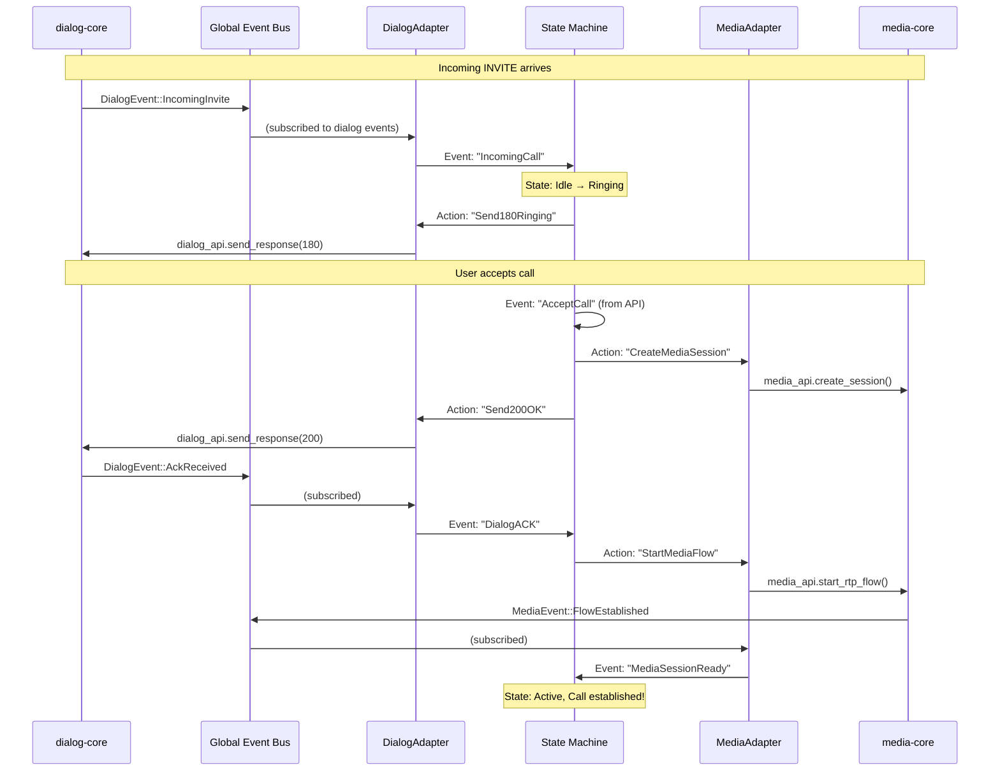

# Session-Core-V2 as a Coordination Library

## Your Understanding is Correct!

Session-core-v2 is indeed a **coordination library** that:
1. **Listens** to events from dialog-core and media-core via the global event bus
2. **Decides** what should happen next based on the current state
3. **Instructs** dialog-core and media-core what to do next

## The Flow

### 1. Events Come In
```rust
// dialog-core emits an event
DialogEvent::IncomingInvite { from, to, sdp } → GlobalEventCoordinator

// media-core emits an event  
MediaEvent::RtpFlowEstablished { local_addr, remote_addr } → GlobalEventCoordinator
```

### 2. Adapters Subscribe and Translate
```rust
// DialogAdapter subscribes to dialog events
global_coordinator.subscribe("dialog_events", dialog_adapter);

// When event arrives, adapter translates it
DialogEvent::ResponseReceived(200) → "Dialog200OK" (state machine event)
MediaEvent::FlowReady → "MediaSessionReady" (state machine event)
```

### 3. State Machine Coordinates
The state machine:
- Looks at current state (e.g., "Ringing")
- Receives event (e.g., "Dialog200OK")
- Consults state table for what to do
- Returns actions to execute

### 4. Actions Go Back Through Adapters
```rust
// State machine says: "SendACK"
// DialogAdapter translates this to:
dialog_core_api.send_ack(dialog_id)

// State machine says: "StartMediaFlow"  
// MediaAdapter translates this to:
media_core_api.create_rtp_flow(session_id, remote_addr)
```

## Key Insight: Session-Core Does NOT:

- ❌ Implement SIP protocol (that's dialog-core)
- ❌ Handle RTP packets (that's media-core)
- ❌ Parse SDP (that's dialog-core)
- ❌ Encode audio (that's media-core)

## Session-Core ONLY:

- ✅ Listens to events from other crates
- ✅ Maintains call state
- ✅ Decides order of operations
- ✅ Tells other crates what to do next

## Real Example: Answering a Call



## Why This Architecture?

1. **Loose Coupling**: dialog-core and media-core don't know about each other
2. **Single Source of Truth**: session-core owns the call state
3. **Flexible Coordination**: Change call flow by editing state table
4. **Clear Responsibilities**: Each crate has one job

## The Adapter Pattern Here

Adapters are NOT doing complex logic. They are simply:

```rust
// Incoming: Protocol Event → State Machine Event
match dialog_event {
    DialogEvent::ResponseReceived(200, _) => "Dialog200OK",
    DialogEvent::ResponseReceived(180, _) => "Dialog180Ringing",
    DialogEvent::ByeReceived(_) => "DialogBYE",
}

// Outgoing: State Machine Action → Protocol API Call
match action {
    "SendINVITE" => dialog_api.create_uac_invite(...),
    "SendBYE" => dialog_api.send_bye(dialog_id),
    "SendACK" => dialog_api.send_ack(dialog_id),
}
```

## Summary

You're thinking about this correctly:

- **session-core-v2 = Coordination Layer**
- **Adapters = Message Translators** (protocol events ↔ state events)
- **State Machine = Coordination Logic** (when X happens, do Y and Z)
- **State Table = Coordination Rules** (declarative configuration)

The beauty is that session-core doesn't need to understand SIP or RTP - it just needs to know "when we get event X in state Y, we should do actions A, B, and C in that order."
