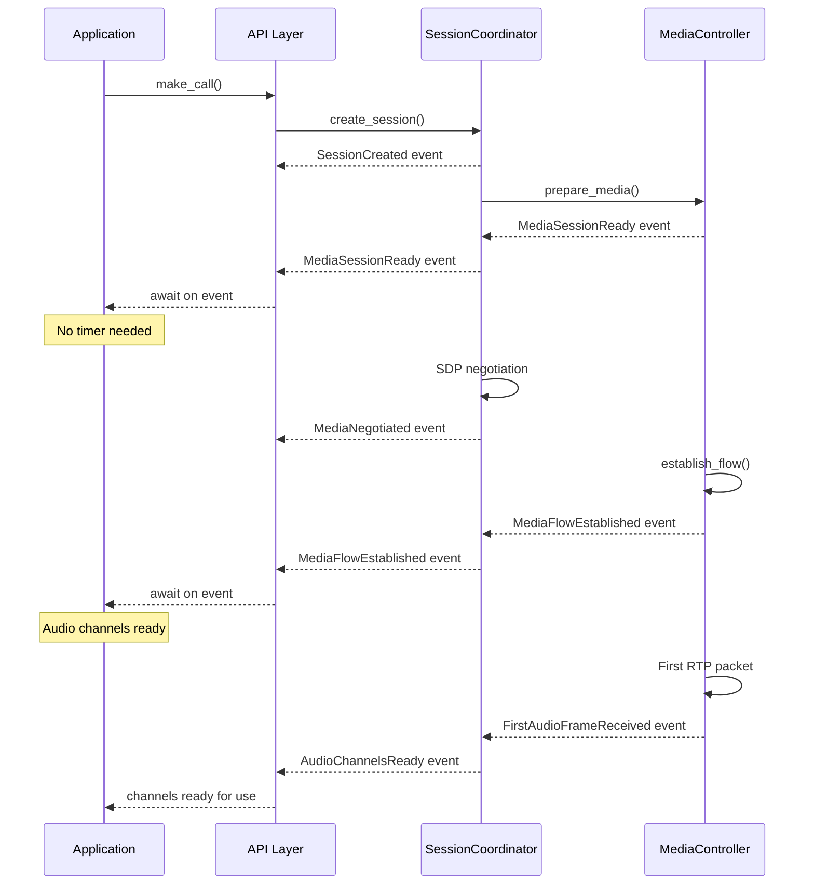
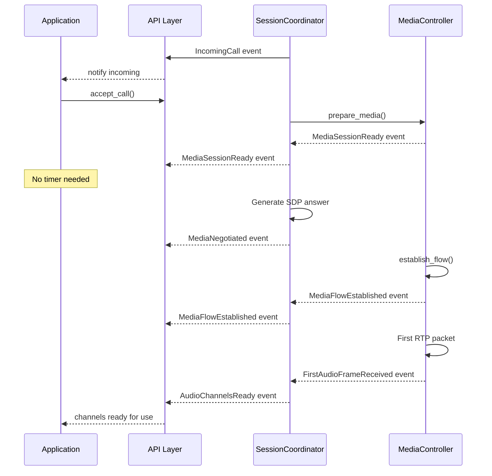

# Event-Driven Audio Architecture Implementation Plan

## Executive Summary

This plan outlines the transition from timer-based to event-driven audio handling in the session-core library. The goal is to eliminate arbitrary sleep timers and replace them with proper event notifications, making the system more responsive, reliable, and maintainable.

## Current State Analysis

### Timer Usage Patterns

Currently, the codebase uses timers in three main categories:

1. **Call Setup Delays**
   - `sleep(Duration::from_secs(2))` - Waiting for peer to start
   - `sleep(Duration::from_millis(100))` - Polling for state changes
   - `sleep(Duration::from_secs(2))` - Waiting for media to be ready

2. **Audio Reception Timeouts**
   - `timeout(Duration::from_millis(100))` - Waiting for audio frames
   - Consecutive timeout counting for resilience

3. **Pacing and Coordination**
   - `sleep(Duration::from_millis(20))` - Audio frame pacing
   - `sleep(Duration::from_secs(1))` - Cleanup delays

### Affected Components

- `/examples/api_peer_audio`: Uses polling loop for Active state
- `/examples/api_uac_uas`: Uses fixed 2-second wait for media readiness
- `/tests/audio_exchange_test_integration`: Multiple sleeps for stabilization

## Proposed Event Architecture

### Core Events to Leverage

#### Existing Events
```rust
pub enum SessionEvent {
    // Call state transitions
    StateChanged { 
        session_id: SessionId, 
        old_state: CallState, 
        new_state: CallState,
    },
    
    // Media events
    MediaEvent { 
        session_id: SessionId, 
        event: String,
    },
    
    // SDP negotiation
    SdpEvent {
        session_id: SessionId,
        event_type: String,
        sdp: String,
    },
    
    // Dialog events
    DialogStateChanged {
        session_id: SessionId,
        old_state: DialogState,
        new_state: DialogState,
    },
}
```

#### New Events to Add
```rust
pub enum SessionEvent {
    // ... existing events ...
    
    /// Media session is fully initialized and ready
    MediaSessionReady {
        session_id: SessionId,
        local_addr: SocketAddr,
        codec: String,
    },
    
    /// Bidirectional media flow is confirmed
    MediaFlowEstablished {
        session_id: SessionId,
        local_addr: SocketAddr,
        remote_addr: SocketAddr,
        direction: MediaDirection,  // Inbound, Outbound, Bidirectional
    },
    
    /// First audio frame received from remote
    FirstAudioFrameReceived {
        session_id: SessionId,
        timestamp: std::time::Instant,
        ssrc: u32,
    },
    
    /// Audio channels are ready for use
    AudioChannelsReady {
        session_id: SessionId,
        can_send: bool,
        can_receive: bool,
    },
    
    /// Remote media endpoint confirmed ready
    RemoteMediaConfirmed {
        session_id: SessionId,
        remote_addr: SocketAddr,
        rtp_flowing: bool,
        rtcp_received: bool,
    },
    
    /// Media quality threshold crossed
    MediaQualityChange {
        session_id: SessionId,
        quality: MediaQuality,  // Good, Degraded, Poor, Failed
        metrics: MediaMetrics,
    },
}
```

### Event Flow Sequences

#### UAC Flow


#### UAS Flow


## Implementation Details

### Phase 1: Event Infrastructure

#### 1.1 Add Event Types
```rust
// In src/manager/events.rs
#[derive(Debug, Clone)]
pub enum MediaDirection {
    Inbound,
    Outbound, 
    Bidirectional,
}

#[derive(Debug, Clone)]
pub enum MediaQuality {
    Good,      // < 1% loss, < 50ms jitter
    Degraded,  // < 5% loss, < 150ms jitter
    Poor,      // < 10% loss, < 300ms jitter
    Failed,    // > 10% loss or > 300ms jitter
}

#[derive(Debug, Clone)]
pub struct MediaMetrics {
    pub packet_loss: f32,
    pub jitter_ms: f32,
    pub round_trip_ms: Option<f32>,
    pub bitrate_bps: u32,
}
```

#### 1.2 Event Publisher Updates
```rust
// In src/coordinator/event_handler.rs
impl SessionCoordinator {
    async fn publish_media_ready(&self, session_id: &SessionId) {
        let event = SessionEvent::MediaSessionReady {
            session_id: session_id.clone(),
            local_addr: self.get_media_addr(session_id).await,
            codec: self.get_negotiated_codec(session_id).await,
        };
        self.event_bus.publish(event).await;
    }
    
    async fn publish_media_flow_established(&self, 
        session_id: &SessionId, 
        direction: MediaDirection
    ) {
        // Only publish once both directions confirmed
        if direction == MediaDirection::Bidirectional {
            let event = SessionEvent::MediaFlowEstablished {
                session_id: session_id.clone(),
                local_addr: self.get_local_addr(session_id).await,
                remote_addr: self.get_remote_addr(session_id).await,
                direction,
            };
            self.event_bus.publish(event).await;
        }
    }
}
```

### Phase 2: API Layer Integration

#### 2.1 Event-based Waiting in SimpleCall
```rust
// In src/api/call.rs
impl SimpleCall {
    /// Wait for media to be ready without timers
    pub async fn wait_for_media(&mut self) -> Result<()> {
        // Subscribe to events for this session
        let mut event_rx = self.coordinator
            .subscribe_to_session_events(&self.session_id)
            .await?;
        
        // Wait for MediaSessionReady event
        while let Some(event) = event_rx.recv().await {
            match event {
                SessionEvent::MediaSessionReady { .. } => {
                    tracing::debug!("Media session ready for {}", self.session_id);
                    break;
                }
                SessionEvent::StateChanged { new_state: CallState::Failed(reason), .. } => {
                    return Err(SessionError::CallFailed(reason));
                }
                _ => continue,
            }
        }
        
        // Wait for MediaFlowEstablished event
        while let Some(event) = event_rx.recv().await {
            match event {
                SessionEvent::MediaFlowEstablished { direction: MediaDirection::Bidirectional, .. } => {
                    tracing::debug!("Bidirectional media flow established for {}", self.session_id);
                    return Ok(());
                }
                SessionEvent::StateChanged { new_state: CallState::Failed(reason), .. } => {
                    return Err(SessionError::CallFailed(reason));
                }
                _ => continue,
            }
        }
        
        Err(SessionError::Timeout("Media setup timeout".into()))
    }
    
    /// Get audio channels when ready (event-based)
    pub async fn audio_channels_when_ready(&mut self) 
        -> Result<(mpsc::Sender<AudioFrame>, mpsc::Receiver<AudioFrame>)> 
    {
        // Wait for media to be ready
        self.wait_for_media().await?;
        
        // Now safe to get channels
        self.audio_channels().await
    }
}
```

#### 2.2 Transparent API Compatibility
```rust
// Maintain backward compatibility
impl SimpleCall {
    /// Original audio_channels() - now event-aware internally
    pub async fn audio_channels(&mut self) 
        -> Result<(mpsc::Sender<AudioFrame>, mpsc::Receiver<AudioFrame>)> 
    {
        if !self.is_media_ready().await {
            // Automatically wait for media events
            self.wait_for_media().await?;
        }
        
        // Original channel setup logic
        setup_audio_channels(&self.coordinator, &self.session_id).await
    }
}
```

### Phase 3: Test/Example Migration

#### 3.1 api_peer_audio Migration
```rust
// BEFORE: Polling with timer
while !call.is_active().await {
    tokio::time::sleep(Duration::from_millis(100)).await;
}

// AFTER: Event-based
call.wait_for_state(CallState::Active).await?;
```

#### 3.2 api_uac_uas Migration
```rust
// BEFORE: Fixed delay
sleep(Duration::from_secs(2)).await;
let (audio_tx, mut audio_rx) = call.audio_channels().await?;

// AFTER: Event-based
let (audio_tx, mut audio_rx) = call.audio_channels_when_ready().await?;
```

#### 3.3 audio_exchange_test_integration Migration
```rust
// BEFORE: Multiple sleeps
sleep(Duration::from_secs(2)).await;  // Wait for establishment
sleep(Duration::from_millis(500)).await;  // Stabilization
sleep(Duration::from_secs(2)).await;  // RTP initialization

// AFTER: Event-based coordination
coordinator.wait_for_event(SessionEvent::MediaFlowEstablished { 
    direction: MediaDirection::Bidirectional, 
    .. 
}).await?;
```

### Phase 4: Audio Reception Improvements

#### 4.1 Event-Driven Frame Reception
```rust
// In src/api/common/audio_channels.rs
pub async fn setup_audio_channels(
    coordinator: &Arc<SessionCoordinator>,
    session_id: &SessionId,
) -> Result<(mpsc::Sender<AudioFrame>, mpsc::Receiver<AudioFrame>)> {
    // Wait for AudioChannelsReady event first
    coordinator.wait_for_event_timeout(
        SessionEvent::AudioChannelsReady { session_id: session_id.clone(), .. },
        Duration::from_secs(5)
    ).await?;
    
    // Create channels with appropriate buffer size
    let (tx_to_remote, mut rx_from_app) = mpsc::channel::<AudioFrame>(1000);
    let (tx_to_app, rx_from_remote) = mpsc::channel::<AudioFrame>(1000);
    
    // Subscribe to frames and media events
    let mut audio_subscriber = MediaControl::subscribe_to_audio_frames(coordinator, session_id).await?;
    let mut event_subscriber = coordinator.subscribe_to_session_events(session_id).await?;
    
    // Improved receiver task with event awareness
    let session_id_clone = session_id.clone();
    tokio::spawn(async move {
        let mut first_frame_received = false;
        
        loop {
            tokio::select! {
                // Audio frame received
                Some(frame) = audio_subscriber.recv() => {
                    if !first_frame_received {
                        tracing::info!("First audio frame received for {}", session_id_clone);
                        first_frame_received = true;
                    }
                    if tx_to_app.send(frame).await.is_err() {
                        break;
                    }
                }
                
                // Session event received
                Some(event) = event_subscriber.recv() => {
                    match event {
                        SessionEvent::StateChanged { new_state: CallState::Terminated, .. } |
                        SessionEvent::StateChanged { new_state: CallState::Failed(_), .. } => {
                            tracing::info!("Session {} ended, stopping audio receiver", session_id_clone);
                            break;
                        }
                        SessionEvent::MediaFlowEstablished { .. } => {
                            tracing::debug!("Media flow confirmed for {}", session_id_clone);
                        }
                        _ => {}
                    }
                }
                
                // Periodic health check (much longer than before)
                _ = tokio::time::sleep(Duration::from_secs(30)) => {
                    if !first_frame_received {
                        tracing::warn!("No frames received after 30s for {}", session_id_clone);
                        break;
                    }
                }
            }
        }
    });
    
    Ok((tx_to_remote, rx_from_remote))
}
```

## Benefits

### Reliability
- No arbitrary timing assumptions
- Responsive to actual system state
- Graceful handling of slow networks

### Performance
- Reduced latency (no unnecessary waits)
- Event-driven means immediate response
- No polling overhead

### Maintainability
- Clear cause-and-effect relationships
- Easy to debug event flows
- Self-documenting through events

### Developer Experience
- Transparent to existing API users
- Optional explicit event waiting for advanced users
- Better error messages (event-based failures)

## Migration Strategy

### Phase 1: Foundation (Week 1)
1. Add new event types to `manager/events.rs`
2. Update MediaController to emit new events
3. Add event subscription helpers to SessionCoordinator
4. Unit tests for event emission

### Phase 2: API Layer (Week 2)
1. Add `wait_for_media()` to SimpleCall
2. Update `audio_channels()` to be event-aware internally
3. Add `audio_channels_when_ready()` variant
4. Maintain backward compatibility

### Phase 3: Test Migration (Week 3)
1. Update api_peer_audio example
2. Update api_uac_uas example
3. Update audio_exchange_test_integration
4. Verify all tests pass

### Phase 4: Documentation (Week 4)
1. Update API documentation
2. Add event flow diagrams
3. Migration guide for existing users
4. Performance comparison metrics

## Backward Compatibility

### API Compatibility
- Existing `audio_channels()` method continues to work
- Internal event waiting is transparent
- Optional timeout parameters for safety

### Gradual Adoption
```rust
// Old way still works
sleep(Duration::from_secs(2)).await;
let (tx, rx) = call.audio_channels().await?;

// New way available
let (tx, rx) = call.audio_channels_when_ready().await?;

// Expert mode
call.wait_for_event(SessionEvent::FirstAudioFrameReceived { .. }).await?;
let (tx, rx) = call.audio_channels().await?;
```

## Success Metrics

### Quantitative
- Call setup time: 2s → <500ms (75% reduction)
- Audio start delay: 2-3s → <100ms after Active state
- Failed call detection: 5s timeout → immediate event

### Qualitative
- No sleep() calls in examples
- Event logs show clear causality
- Reduced "100-FRAME BUG" occurrences to zero

## Risk Mitigation

### Timeout Fallbacks
```rust
// All event waits have configurable timeouts
coordinator.wait_for_event_timeout(
    event,
    Duration::from_secs(10)  // Safety timeout
).await
```

### Event Ordering
- Use state machines to ensure event order
- Queue events during transitions
- Log unexpected event sequences

### Testing Strategy
- Unit tests for each event type
- Integration tests for event sequences
- Stress tests with delayed events
- Backwards compatibility tests

## Conclusion

This event-driven architecture will make the audio system more robust, responsive, and maintainable. By replacing timers with events, we create a system that adapts to actual conditions rather than hoping fixed delays are sufficient. The implementation is designed to be backward compatible while providing immediate benefits to new code.

The key insight is that **waiting for events is always better than waiting for time**. Events represent actual state changes, while timers represent hope that state will change. This fundamental shift will improve reliability across all network conditions and system loads.