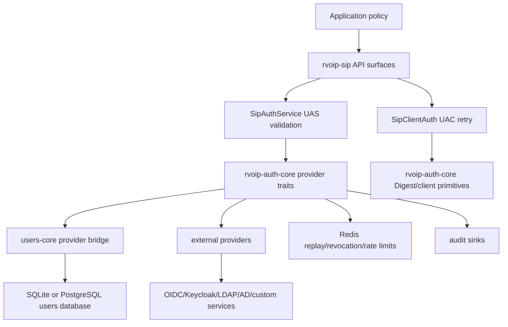

# RVoIP Identity And Auth Provider Implementers Guide

## Purpose

This guide explains how identity and authentication providers fit into RVoIP.
Use it when deciding whether to use the first-party users-core service, an
external identity provider, LDAP/AD, Redis-backed shared state, or a custom
database/service.

The short version:

- `rvoip-sip` owns SIP authentication protocol behavior.
- `rvoip-auth-core` owns reusable auth contracts and crypto/token validators.
- `rvoip-users-core` is the optional first-party user/auth database.
- Extension crates provide optional concrete integrations such as Keycloak,
  OIDC, LDAP, SCIM, SAML, WebAuthn/passkeys, IMS AKA, Redis, and audit
  exporters.
- Applications own final authorization policy: which authenticated user can
  register, call, message, subscribe, transfer, or administer anything.

SIP access authentication is SIP header authentication. It uses
`WWW-Authenticate`, `Proxy-Authenticate`, `Authorization`, and
`Proxy-Authorization`. SDP is not an auth negotiation layer, except that SIP
Digest `qop=auth-int` hashes the SIP message body when computing the Digest
response.

## Mental Model

There are four distinct jobs. Keep them separate.

| Job | Question | RVoIP layer |
|-----|----------|-------------|
| Identity storage and issuance | Who are users, how do they log in, how are tokens/API keys/Digest secrets created? | `rvoip-users-core` or an external user/IdP service |
| Credential validation | Is this password, token, API key, or Digest response valid? | `rvoip-auth-core` traits and validators |
| SIP auth orchestration | Which SIP challenge was sent, which retry header is correct, which scheme wins negotiation? | `rvoip-sip` |
| Application authorization | Is this authenticated identity allowed to do this SIP action? | Your application |

Do not put user database logic into `rvoip-sip`. Do not make protocol code
depend directly on a specific IdP. The protocol layer consumes auth-core
traits, and applications choose the concrete provider.

## Layer Diagram



## Crate Responsibilities

| Crate | Use it for | Do not use it for |
|-------|------------|-------------------|
| `rvoip-sip` | SIP UAC retry, UAS challenges, `401`/`407` routing, `SipClientAuth`, `SipAuthService`, `SipAccount`, inbound `authenticate_with(...)` helpers | Password hashing, JWT signing, database schema ownership |
| `rvoip-auth-core` | `BearerValidator`, `PasswordVerifier`, `DigestSecretProvider`, `ApiKeyVerifier`, `TokenRevocationChecker`, `DigestReplayStore`, `AuthAuditSink`, `AuthRateLimiter`, JWT/JWKS/OAuth2 introspection/Digest primitives | SIP transaction state or SIP message retry orchestration |
| `rvoip-users-core` | Optional first-party users database, password login, API keys, JWT issuance, refresh/access-token revocation, SIP Digest HA1 material, SQLite/PostgreSQL storage | Mandatory dependency of protocol crates |
| `rvoip-keycloak` | Keycloak-specific OIDC discovery, JWKS and introspection validator construction, local Keycloak fixture support | Production login UX or SIP protocol logic |
| `rvoip-oidc` | Generic OIDC discovery, JWKS validation, OAuth2 introspection, issuer/audience enforcement, health metadata | Keycloak-only behavior or user registration |
| `rvoip-ldap` | LDAP/OpenLDAP/AD-compatible password verification for Basic-over-TLS | SIP Digest, Bearer token validation, user provisioning |
| `rvoip-redis` | Cluster-safe Digest replay, token revocation markers, auth rate limits | Primary user database |
| `rvoip-audit` | Redacted audit sinks for JSON lines, tracing, fanout, OTLP, and SIEM exports | Credential validation |
| `rvoip-scim` | SCIM 2.0 provisioning into users-core users, roles, active state, and external identity links | End-user login or SIP header auth |
| `rvoip-saml` | SAML 2.0 service-provider adapter that links verified assertions to users-core and issues tokens | SIP access-auth scheme or unreviewed XML signature parsing |
| `rvoip-webauthn` | WebAuthn/passkey ceremonies backed by users-core passkey storage and token issuance | SIP header auth or password verification |
| `rvoip-ims-aka` | IMS AKA provider adapters implementing SIP `AkaClientProvider` / `AkaVectorProvider` | Carrier IMS certification or embedded production HSS/UDM |

## Choosing An Auth Stack

| Requirement | Recommended setup |
|-------------|-------------------|
| PBX interoperability, REGISTER, challenged INVITE | SIP Digest using `SipAccount` on UAC and `SipAuthService::with_digest_provider(...)` or `SipDigestAuthService` on UAS |
| First-party service with RVoIP-managed users | `rvoip-users-core` plus `UsersCoreAuthProvider` for Bearer, Basic, Digest, API keys, and token revocation |
| Enterprise IdP with JWT access tokens | `rvoip-oidc` or `rvoip-keycloak` building a `BearerValidator`, then `SipAuthService::with_bearer_validator(...)` |
| Opaque OAuth2 access tokens or immediate token revocation | OAuth2 introspection validator from `rvoip-auth-core`, `rvoip-oidc`, or `rvoip-keycloak` |
| Existing LDAP/AD password directory | `rvoip-ldap` as a `PasswordVerifier` for SIP Basic over TLS/WSS only |
| Enterprise user lifecycle provisioning | `rvoip-scim` with a Bearer-admin validator and users-core external identity links |
| Enterprise browser SSO | OIDC first; use `rvoip-saml` when SAML is required, then issue users-core tokens |
| Passwordless application login | `rvoip-webauthn` for passkey registration/authentication, then users-core token issuance |
| IMS/telecom AKA auth | `rvoip-ims-aka` or a custom `AkaVectorProvider`; vectors come from IMS infrastructure |
| Multi-node SIP UAS with Digest | `SipAuthService::with_digest_replay_store(...)` backed by `rvoip-redis` |
| Centralized lockout/rate limits | `SipAuthService::with_rate_limiter(...)` backed by `rvoip-redis` or a custom `AuthRateLimiter` |
| Central security logs | `SipAuthService::with_audit_sink(...)` backed by `rvoip-audit` or a custom `AuthAuditSink` |
| Existing custom identity service | Implement `rvoip-auth-core` traits directly and pass trait objects into `rvoip-sip` |

## Identity Objects

Provider traits return `IdentityAssurance` from `rvoip-core-traits`. The SIP
facade maps accepted credentials into `AuthIdentity`.

`AuthIdentity` is authentication output. It tells your application what was
authenticated:

- scheme: Digest, Bearer, Basic, AKA, or future scheme;
- username or subject;
- realm;
- scopes/roles when the provider supplied them;
- whether credentials came from origin auth or proxy auth.

`AuthIdentity` is not the final authorization decision. After authentication,
your application should still check method, target, tenant, registration AOR,
scope, role, account status, call policy, and rate limits before allowing the
SIP action.

## SIP Auth Schemes

### Digest

Digest is the common PBX-compatible SIP auth scheme.

UAC configuration:

- `SipAccount` for PBX accounts and REGISTER plus challenged outbound calls;
- `SipClientAuth::digest(username, password)` for default or per-request auth;
- `.with_credentials(...)` remains Digest shorthand on public builders.

UAS configuration:

- `SipAuthService::with_digest_provider(realm, provider)` for provider-backed
  HA1/plain-secret lookup;
- `SipAuthService::digest(realm)` or `SipDigestAuthService` for simple
  in-memory/local cases;
- `with_digest_provider_algorithm(...)` to choose the challenge algorithm;
- `with_digest_replay_store(...)` for shared nonce/replay state in clusters.

Storage rule:

- Store dedicated SIP Digest HA1 material, not Argon2 login password hashes.
- HA1 is password-equivalent for a username, realm, and algorithm family.

Algorithm support:

- MD5 and MD5-sess for legacy PBX compatibility;
- SHA-256 and SHA-256-sess;
- SHA-512-256 and SHA-512-256-sess;
- `qop=auth`;
- `qop=auth-int` when the request body is available.

### Bearer

Bearer is the preferred modern path for first-party and enterprise IdP-backed
systems.

UAC configuration:

- `SipClientAuth::bearer_token(token)`;
- `.with_bearer_token(...)` builder shorthand;
- `SipClientAuth::any(...)` when Bearer should compete with Digest/Basic/AKA.

UAS configuration:

- `SipAuthService::with_bearer_validator(realm, validator)`;
- optional `with_bearer_scope(...)` for challenge authoring;
- validator supplied by users-core, JWT/JWKS, OIDC/Keycloak, introspection,
  AAuth, or custom provider.

Security rule:

- Bearer validators must enforce issuer, audience/resource, expiry,
  not-before, allowed algorithms, `kid` behavior, revocation/introspection
  policy, and application-required scopes.
- A SIP realm is only a challenge label. It is not token trust policy.
- Bearer is rejected over cleartext SIP by default unless explicitly allowed.

### Basic

Basic exists for legacy compatibility.

UAC configuration:

- `SipClientAuth::basic(username, password)`;
- `.with_basic_credentials(...)` builder shorthand;
- `allow_basic_over_cleartext(true)` only for controlled legacy/lab cases.

UAS configuration:

- `SipAuthService::with_basic_verifier(realm, provider)`;
- `SipAuthService::with_basic_realm(...)` plus `add_basic_user(...)` for local
  simple cases;
- providers usually come from users-core or `rvoip-ldap`.

Security rule:

- Use Basic only over TLS/WSS.
- LDAP/AD password verification belongs in a `PasswordVerifier`; it should not
  be mixed into SIP protocol code.

### AKA

AKA is provider-backed IMS-style authentication.

UAC configuration:

- `SipClientAuth::aka(config)` where the application supplies an AKA client
  provider.

UAS configuration:

- `SipAuthService::with_aka_provider(provider)`.

Security rule:

- RVoIP supports the integration shape and SIP negotiation. It does not include
  built-in SIM/USIM infrastructure, carrier IMS certification, or production
  HSS/UDM vector services.

### API Keys

API keys are not a SIP access-auth scheme in this implementation. They are an
auth-core/users-core facility for services that accept API keys directly, such
as management APIs, provisioning APIs, or non-SIP protocols.

Use `ApiKeyVerifier` where a protocol or service accepts API keys. Do not map
API keys into SIP `Authorization` headers unless you define a separate,
reviewed scheme for that protocol surface.

## Enterprise Identity Protocols

These protocols are application identity and lifecycle integrations, not SIP
access-auth headers.

### SCIM

SCIM provisions users and groups. It does not authenticate SIP requests.

Use `rvoip-scim` when an enterprise IdP such as Okta, Entra ID, Keycloak, or
Ping should create, update, deactivate, or delete users in users-core.

Layer behavior:

- admin requests are authorized by a configured `BearerValidator`;
- default scopes are `scim.read` and `scim.write`;
- SCIM users map to users-core users and active state;
- SCIM group names can map to users-core roles;
- external IDs are stored in users-core external identity links.

Example:

- `examples/auth/scim_users_core.rs`.

### SAML

SAML is enterprise browser SSO. It is not a SIP auth scheme.

Use `rvoip-saml` when an IdP requires SAML 2.0 instead of OIDC. The crate
expects a `SamlAssertionVerifier` that has already performed signed
assertion/response validation with a reviewed XML signature/SAML library or a
corporate SSO gateway.

Layer behavior:

- the verifier owns XML signature, IdP certificate, issuer, and SAML parsing
  policy;
- the service-provider adapter enforces audience, recipient, time window, and
  replay rejection;
- accepted subjects are linked into users-core external identities;
- successful SAML login issues users-core access and refresh tokens.

Example:

- `examples/auth/saml_users_core.rs`.

### WebAuthn / Passkeys

WebAuthn is application login, not SIP header authentication.

Use `rvoip-webauthn` when users should register and authenticate with
platform passkeys or security keys. The adapter uses `webauthn-rs`, stores
completed passkeys in users-core, and issues users-core tokens after a
successful ceremony.

Layer behavior:

- registration/authentication ceremony state stays server-side with a short
  TTL;
- completed credentials are stored in users-core passkey storage;
- successful authentication updates credential state and issues users-core
  tokens;
- browser code must call `navigator.credentials.create(...)` and
  `navigator.credentials.get(...)`.

Example:

- `examples/auth/webauthn_passkeys.rs`.

### LDAP / AD / 389DS / FreeIPA

LDAP is supported as a compatibility password verifier and directory backend,
not as the primary architecture for new application login.

Use `rvoip-ldap` when legacy Basic-over-TLS flows must validate passwords
against OpenLDAP, Active Directory-compatible LDAP, 389 Directory Server, or
FreeIPA. New cloud CPaaS applications should prefer OIDC/SAML for login and
SCIM for lifecycle provisioning, with LDAP/AD behind the IdP when needed.

Layer behavior:

- `LdapPasswordVerifierConfig` has presets for OpenLDAP, 389DS, FreeIPA, and
  AD-compatible lookup;
- simple bind validates passwords;
- the verifier returns `IdentityAssurance::UserAuthorized`;
- SIP Basic must still be TLS/WSS-only unless explicitly reviewed for a lab.

Example:

- `examples/auth/ldap_basic_provider.rs`.

### IMS AKA Providers

IMS AKA is SIP access-auth, but the vector source is external.

Use `rvoip-ims-aka` or a custom provider when SIP AKA must be negotiated with
`SipClientAuth::aka(...)` and `SipAuthService::with_aka_provider(...)`.

Layer behavior:

- SIP carries AKA in `WWW-Authenticate`, `Proxy-Authenticate`,
  `Authorization`, and `Proxy-Authorization` as a Digest-family scheme;
- `AkaClientProvider` computes UAC responses;
- `AkaVectorProvider` issues challenges and validates UAS credentials;
- production vectors come from SIM/USIM, HSS/AuC, UDM/AUSF, or a brokered
  service;
- RVoIP does not claim carrier IMS certification.

Example:

- `examples/auth/ims_aka_provider.rs`.

## UAC Implementation Surfaces

UAC means the side sending a SIP request and answering a `401` or `407`
challenge.

| Surface | Default auth | Per-request auth | Typical use |
|---------|--------------|------------------|-------------|
| `Endpoint` | `Endpoint::builder().auth(...)` or `.sip_account(...)` | call/message builders where exposed | Application client placing calls or registering |
| `UnifiedCoordinator` | `Config::auth` | `.invite(...).with_auth(...)`, MESSAGE/OPTIONS/SUBSCRIBE builders | Full control surface and tests |
| `StreamPeer` | `StreamPeerBuilder::with_auth(...)`, `.register_account(...)` | coordinator/request builders | Event-stream peer API |
| `CallbackPeer` | `CallbackPeerBuilder::with_auth(...)`, `.register_account(...)` | coordinator/request builders | Handler/callback peer API |

Challenge behavior:

- `401 WWW-Authenticate` retry uses `Authorization`.
- `407 Proxy-Authenticate` retry uses `Proxy-Authorization`.
- REGISTER, INVITE, in-dialog requests, and out-of-dialog MESSAGE, OPTIONS,
  and SUBSCRIBE use real challenge-response auth.
- Builders must not emit placeholder `Authorization` headers.
- Basic and Bearer UAC retries use actual selected transport context where
  available, so cleartext policy is based on transport truth, not only URI
  text.

Common UAC patterns:

```rust,no_run
use rvoip_sip::{Endpoint, EndpointProfile, Config, SipClientAuth};

# async fn build() -> rvoip_sip::Result<()> {
let endpoint = Endpoint::builder()
    .name("uac")
    .profile(EndpointProfile::Custom(Config::local("uac", 5060)))
    .auth(SipClientAuth::any([
        SipClientAuth::bearer_token("access-token"),
        SipClientAuth::digest("1001", "sip-secret"),
    ]))
    .build()
    .await?;

endpoint.shutdown().await?;
# Ok(())
# }
```

PBX Digest account pattern:

```rust,no_run
use rvoip_sip::{Endpoint, EndpointProfile, Config, SipAccount};

# async fn build() -> rvoip_sip::Result<()> {
let account = SipAccount {
    registrar: "sip:pbx.example.com".to_string(),
    username: "1001".to_string(),
    auth_username: None,
    password: "sip-secret".to_string(),
    from_uri: None,
    contact_uri: None,
    expires: 300,
};

let endpoint = Endpoint::builder()
    .name("pbx-uac")
    .profile(EndpointProfile::Custom(Config::local("pbx-uac", 5060)))
    .sip_account(account)
    .build()
    .await?;

endpoint.shutdown().await?;
# Ok(())
# }
```

## UAS Implementation Surfaces

UAS means the side receiving a SIP request and deciding whether to challenge,
reject, or accept it.

Use `SipAuthService` for all multi-scheme UAS auth. The service generates
scheme-appropriate challenges and validates inbound credentials.

Inbound helper surfaces:

- `IncomingCall::authenticate_with(&auth).await`;
- `IncomingRequest::authenticate_with(&auth).await`;
- `IncomingRegister::authenticate_with(&auth).await`;
- lower-level `SipAuthService::authenticate_authorization_with_context(...)`
  when you are not using the high-level incoming wrappers.

Typical UAS flow:

```rust,no_run
use rvoip_sip::{IncomingRequest, SipAuthDecision, SipAuthService};

# async fn handle(incoming: IncomingRequest, auth: SipAuthService) -> rvoip_sip::Result<()> {
match incoming.authenticate_with(&auth).await? {
    SipAuthDecision::Authorized(identity) => {
        // Now apply application authorization using identity.scheme,
        // identity.subject, identity.username, identity.scopes, method, target, etc.
        let _ = identity;
    }
    SipAuthDecision::Rejected { challenges } => {
        // Send a 401/407 challenge with the generated challenge headers.
        let _ = challenges;
    }
}
# Ok(())
# }
```

Challenge authoring:

- Prefer `incoming.challenge_builder(...).with_auth_challenge(&challenge)`.
- Use `as_proxy_challenge(true)` when responding as a proxy challenge.
- Avoid hand-writing raw `WWW-Authenticate` strings unless you are integrating
  a scheme not yet represented by the public challenge types.

## First-Party Users-Core Path

Use users-core when you want RVoIP to provide the reference user/auth service.
It can be the whole local auth service, or it can be used only for specific
credential classes such as SIP Digest HA1 material.

What users-core provides:

- user records and active/inactive state;
- Argon2 password hashing for login passwords;
- password login and password-only verification;
- JWT issuance and validation through `UsersCoreAuthProvider`;
- refresh-token and access-token revocation;
- API key issuance, expiry, revocation, and active-state disablement;
- SIP Digest HA1 credential create, rotate, lookup, and delete;
- SQLite default storage;
- PostgreSQL storage behind the `postgres` feature.

Bridge into auth-core:

`UsersCoreAuthProvider` implements:

- `BearerValidator` for users-core JWT Bearer tokens;
- `PasswordVerifier` for Basic/password verification without token issuance;
- `ApiKeyVerifier` for first-party API keys;
- `DigestSecretProvider` for SIP Digest HA1 lookup;
- `TokenRevocationChecker` for access-token JTI revocation.

Typical service setup:

```rust,no_run
use std::sync::Arc;
use users_core::{init, UsersConfig, UsersCoreAuthProvider};
use rvoip_sip::{DigestAlgorithm, SipAuthService};

# async fn build() -> anyhow::Result<SipAuthService> {
let users = init(UsersConfig {
    database_url: "sqlite:///var/lib/rvoip/users.db?mode=rwc".to_string(),
    ..UsersConfig::default()
})
.await?;

let provider = UsersCoreAuthProvider::shared(Arc::new(users));

let sip_auth = SipAuthService::new()
    .with_bearer_validator("users-core", provider.clone())
    .with_basic_verifier("users-core", provider.clone())
    .with_digest_provider("pbx.example.com", provider)
    .with_digest_provider_algorithm(DigestAlgorithm::SHA256);

Ok(sip_auth)
# }
```

Important users-core rule:

- Do not use login password hashes for SIP Digest.
- Create dedicated SIP Digest credentials and store HA1 material per SIP
  username, realm, and algorithm family.

## External Provider Path

Use external providers when identity already lives elsewhere, such as an
enterprise IdP, Keycloak, LDAP/AD, IMS infrastructure, or a custom database.

The integration rule is simple: implement or construct the auth-core trait
that matches the credential type, then pass it into `SipAuthService`.

### OIDC Or Keycloak Bearer

Use this when clients already have OAuth2/OIDC access tokens.

Generic OIDC:

```rust,no_run
use std::sync::Arc;
use std::time::Duration;
use rvoip_oidc::OidcConfig;
use rvoip_sip::SipAuthService;
use url::Url;

# async fn build() -> anyhow::Result<SipAuthService> {
let provider = OidcConfig::new(Url::parse("https://idp.example.com/realms/rvoip")?)
    .with_audience("rvoip-sip")
    .with_jwks_cache_ttl(Duration::from_secs(300))
    .discover()
    .await?;

let auth = SipAuthService::new()
    .with_bearer_validator("oidc", Arc::new(provider.bearer_validator()?));

Ok(auth)
# }
```

Keycloak:

- use `rvoip-keycloak` when you want Keycloak-specific realm URLs, local
  fixture support, and Keycloak role mapping;
- use `rvoip-oidc` when you want IdP-neutral OIDC behavior.

Bearer validator requirements:

- pin issuer;
- pin audience/resource;
- enforce expiry and not-before;
- restrict accepted algorithms;
- handle `kid` correctly;
- use JWKS cache TTLs and key rotation;
- add introspection or token revocation checks when immediate revocation is
  required;
- map scopes/roles into application authorization decisions.

### LDAP Or Active Directory For Basic

Use LDAP/AD only as a `PasswordVerifier`, normally for legacy Basic-over-TLS.

```rust,no_run
use std::sync::Arc;
use rvoip_ldap::{LdapPasswordVerifier, LdapPasswordVerifierConfig};
use rvoip_sip::SipAuthService;

# fn build() -> anyhow::Result<SipAuthService> {
let verifier = LdapPasswordVerifier::new(
    LdapPasswordVerifierConfig::new(
        "ldaps://ldap.example.com",
        "ou=users,dc=example,dc=com",
    )
    .with_scopes(["sip.register", "sip.call"]),
)?;

let auth = SipAuthService::new()
    .with_basic_verifier("ldap", Arc::new(verifier));

Ok(auth)
# }
```

Production LDAP/AD requirements:

- use LDAPS or StartTLS;
- use least-privilege bind credentials;
- avoid leaking bind/user passwords in logs;
- let AD own password expiry and lockout behavior;
- map groups/roles to SIP scopes outside SIP protocol code;
- do not enable cleartext Basic in production.

### Redis For Shared Enterprise State

Use Redis for state that must be shared across UAS instances.

```rust,no_run
use std::sync::Arc;
use rvoip_redis::{RedisAuthConfig, RedisAuthProvider};
use rvoip_sip::SipAuthService;

# fn build(auth: SipAuthService) -> anyhow::Result<SipAuthService> {
let redis = Arc::new(RedisAuthProvider::from_config(
    RedisAuthConfig::new("redis://127.0.0.1:6379")
        .with_namespace("rvoip:prod:auth"),
)?);

let auth = auth
    .with_digest_replay_store(redis.clone())
    .with_rate_limiter(redis.clone());

Ok(auth)
# }
```

Redis-backed contracts:

- `DigestReplayStore` for issued nonces and nonce-count monotonicity;
- `TokenRevocationChecker` for revoked token ids;
- `AuthRateLimiter` for fail-closed rate-limit/lockout policy.

Secure SIP authentication uses the additive atomic limiter contract. Implement
`reserve_auth_attempt` to reserve peer and subject capacity before credential
validation, and `complete_auth_attempt` to consume that reservation after the
result is known. A failed attempt retains one count; success must release only
the supplied reservation. The legacy `check_auth_attempt`/
`record_auth_result` pair remains source-compatible but is not called by the
secure listener because the gap between those calls permits concurrent
over-admission. The additive methods fail closed by default, so migrate custom
limiters before enabling them on a listener.

### Audit Export

Use `rvoip-audit` when auth events need to leave the process.

Available sinks:

- `JsonLinesAuditSink`;
- `TracingAuditSink`;
- `FanoutAuditSink`;
- `OtlpAuditSink`;
- `SiemAuditSink` presets for generic webhooks, Splunk HEC, Elastic/ECS,
  Microsoft Sentinel, and Datadog Logs.

Audit events are already redacted by contract. They should not include
passwords, bearer tokens, API keys, HA1 values, raw Authorization headers, or
full JWTs.

## Custom Provider Path

If none of the built-in adapters fit, implement auth-core traits directly.

Choose the trait by credential type:

| Credential | Implement |
|------------|-----------|
| Bearer token | `BearerValidator` |
| Basic/password | `PasswordVerifier` |
| SIP Digest | `DigestSecretProvider` |
| API key | `ApiKeyVerifier` |
| JWT/opaque token revocation | `TokenRevocationChecker` |
| Clustered Digest replay | `DigestReplayStore` |
| Audit export | `AuthAuditSink` |
| Rate limit/lockout | `AuthRateLimiter` |

Minimal custom Basic provider:

```rust,no_run
use async_trait::async_trait;
use rvoip_auth_core::{CredentialAuthError, PasswordVerifier};
use rvoip_core_traits::identity::IdentityAssurance;

struct MyPasswordVerifier;

#[async_trait]
impl PasswordVerifier for MyPasswordVerifier {
    async fn verify_password(
        &self,
        username: &str,
        password: &str,
    ) -> Result<IdentityAssurance, CredentialAuthError> {
        // Call your password service or database here.
        // Return CredentialAuthError::Invalid for wrong credentials.
        // Return CredentialAuthError::Unavailable when the provider cannot answer.
        let _ = (username, password);
        Err(CredentialAuthError::Invalid)
    }
}
```

Provider error semantics:

- wrong credentials -> `Invalid`;
- backend outage -> `Unavailable`;
- security policy rejection -> `PolicyRejected`;
- avoid errors that reveal whether a username exists to the remote SIP peer.

## How SIP Auth Negotiation Works

UAC flow:

1. The UAC sends the first request, usually without auth.
2. UAS or proxy replies with `401 WWW-Authenticate` or
   `407 Proxy-Authenticate`.
3. UAC parses all challenges, including multiple headers and multiple
   challenges per header.
4. UAC chooses the strongest configured compatible scheme:
   AKA, Bearer, Digest, then Basic.
5. UAC retries with `Authorization` for `401` or `Proxy-Authorization` for
   `407`.
6. Digest stale nonce recovery is allowed once for `stale=true` with a new
   nonce.

UAS flow:

1. Incoming request is passed to `authenticate_with(...)`.
2. Missing credentials produce scheme challenges.
3. Rate limiter runs before credential validation.
4. Credentials are validated by the configured provider.
5. Digest replay store validates nonce and nonce-count when configured.
6. Audit sink receives a redacted event.
7. Successful auth returns `AuthIdentity`.
8. Rejected auth returns challenges.

## Transport Policy

Basic and Bearer are credential-bearing schemes. They are denied over
cleartext SIP by default.

`rvoip-sip` uses `SipTransportSecurityContext` for auth policy. Inbound helpers
receive transport metadata from the SIP transport/dialog path. UAC retry uses
the selected outbound transport context where available, then falls back to
selector hints. This avoids treating `sips:` text as the only source of truth.

Use cleartext opt-ins only for explicit legacy or test environments:

- UAC Basic: `SipClientAuth::basic(...).allow_basic_over_cleartext(true)`;
- UAC Bearer: `SipClientAuth::bearer_token(...).allow_bearer_over_cleartext(true)`;
- UAS Basic: `SipAuthService::allow_basic_over_cleartext(true)`;
- UAS Bearer: `SipAuthService::allow_bearer_over_cleartext(true)`.

### Tenant-bound listener admission

Every enabled `SipListenerAuthPolicy` must name exactly one tenant. Use
`SipListenerAuthPolicy::authenticated_for_tenant(...)` for Digest/Bearer or
`SipListenerAuthPolicy::enabled_for_tenant(...)` before adding trusted-CIDR or
mTLS mappings. Existing builder chains can call `.with_tenant(...)`; legacy
enabled policies without it fail closed at coordinator startup and at direct
admission.

Tenant values must be 1–128 characters, already trimmed, and contain no
control characters. The listener stamps its tenant only onto locally generated
Digest principals. Bearer validators and explicit trusted-CIDR/mTLS mappings
must already contain the exact listener tenant. Missing or mismatched values
are rejected so credentials from one tenant cannot attach to another tenant's
SIP listener.

mTLS fingerprint mappings are selectors for certificates verified by the
transport, not a substitute for certificate verification. Configure a real
TLS listener and client trust anchors with
`Config::require_tls_client_certificate(...)` or
`Config::verify_optional_tls_client_certificate(...)`. Startup rejects an
mTLS mapping when transport-level client-certificate verification is disabled.

## Storage Choices

| Storage | Use for | Notes |
|---------|---------|-------|
| SQLite users-core | local development, embedded services, reference deployments | default users-core store |
| PostgreSQL users-core | production user/API-key/auth-security storage | feature-gated with `postgres` |
| Redis | shared replay, revocation markers, rate limits | not a primary user database |
| External IdP | bearer token issuance and validation policy | accessed through validators |
| LDAP/AD | password verification | use as `PasswordVerifier`, not as SIP protocol logic |
| Custom DB/service | any credential class | implement auth-core traits |

## Application Authorization

Authentication answers "who is this?" Authorization answers "may this identity
do this?"

After `SipAuthDecision::Authorized(identity)`, check:

- SIP method: REGISTER, INVITE, MESSAGE, SUBSCRIBE, REFER, etc.;
- target URI and AOR;
- tenant/account ownership;
- scopes/roles;
- account active state;
- registration/contact policy;
- call routing and toll/fraud controls;
- per-peer and per-user rate limits.

Example policy mapping:

| SIP action | Possible required scope |
|------------|-------------------------|
| REGISTER | `sip.register` |
| INVITE | `sip.call` |
| MESSAGE | `sip.message` |
| SUBSCRIBE/NOTIFY | `sip.presence` |
| REFER/transfer | `sip.transfer` |
| admin/provisioning | `admin` |

These names are examples. Your application should define the actual scope
model.

## Recommended Implementation Recipes

### PBX-Compatible Digest Client

- Configure `SipAccount` once.
- Use Digest credentials distinct from user login passwords.
- Prefer SHA-256/SHA-512-256 when the PBX supports them.
- Keep MD5 only for PBX compatibility.

Example:

- `examples/auth/endpoint_invite_digest.rs`;
- `examples/auth/endpoint_register_users_core.rs`;
- `examples/pbx/` for Asterisk and FreeSWITCH interop patterns.

### First-Party RVoIP Service

- Use users-core for users, JWTs, API keys, Digest HA1, and revocation.
- Use `UsersCoreAuthProvider` as the bridge into `SipAuthService`.
- Use PostgreSQL for production database requirements.
- Use Redis when more than one SIP UAS process validates Digest or needs
  shared rate limits/revocation.
- Use audit sinks for security review evidence.

Example:

- `examples/auth/users_core_service.rs`;
- `examples/auth/endpoint_invite_bearer.rs`;
- `examples/auth/endpoint_invite_digest.rs`;
- `examples/auth/redis_enterprise_hooks.rs`.

### Enterprise OIDC/Keycloak Bearer

- Let the IdP issue access tokens.
- Use `rvoip-oidc` or `rvoip-keycloak` to build a `BearerValidator`.
- Pin issuer and audience.
- Use JWKS validation for JWTs.
- Use introspection for opaque tokens or immediate revocation.
- Map IdP scopes/roles into SIP authorization policy.

Example:

- `examples/auth/keycloak_bearer_provider.rs`;
- `examples/auth/generic_oidc_provider.rs`.

### LDAP/AD Basic Compatibility

- Use only when legacy SIP clients cannot do Digest/Bearer/AKA.
- Use TLS/WSS for SIP and LDAPS/StartTLS for LDAP.
- Use `rvoip-ldap` as a `PasswordVerifier`.
- Keep lockout/rate limits in place.

Example:

- `examples/auth/ldap_basic_provider.rs`.

### Custom Provider

- Implement only the auth-core traits needed by your credential type.
- Keep your database/IdP code outside protocol crates.
- Return `IdentityAssurance` with stable subject and scopes.
- Add audit and rate-limit providers for production.

Example:

- `examples/auth/custom_provider.rs`.

## Testing Providers

Recommended test layers:

1. Provider unit tests:
   - valid credentials accepted;
   - invalid credentials rejected;
   - inactive/disabled users rejected;
   - provider outage returns unavailable;
   - no secrets are logged.
2. SIP UAS tests:
   - missing auth returns challenge;
   - valid auth returns `AuthIdentity`;
   - invalid auth does not reveal user existence;
   - `401` and `407` challenge paths are correct.
3. SIP UAC tests:
   - first request has no auth unless explicitly preemptive;
   - retry has full `Authorization` or `Proxy-Authorization`;
   - Digest stale nonce retry happens once;
   - unsupported algorithms or downgrade attempts fail.
4. Enterprise state tests:
   - Redis replay rejects same/lower nonce-count;
   - token revocation rejects revoked JTI;
   - rate limiter denies after configured failures;
   - audit sink receives redacted events.
5. External fixture tests:
   - Keycloak/OIDC discovery and token validation;
   - OpenLDAP/389DS/FreeIPA/AD-compatible password verification;
   - PostgreSQL users-core storage;
   - SCIM provisioning adapter behavior;
   - SAML assertion adapter behavior;
   - WebAuthn/passkey service storage behavior;
   - IMS AKA provider-shape behavior;
   - PBX Digest interop where applicable.

Useful commands:

```sh
cargo test -p rvoip-sip --lib auth::tests
cargo test -p rvoip-sip --test endpoint_unified_auth
cargo test -p rvoip-sip --test oob_auth_retry
cargo test -p rvoip-auth-core --test jwt --test jwks --test introspection
cargo test -p rvoip-users-core --features auth-core --test auth_core_bridge_tests
cargo test -p rvoip-users-core --test enterprise_identity_tests
cargo test -p rvoip-scim -p rvoip-saml -p rvoip-webauthn -p rvoip-ims-aka -p rvoip-ldap --lib
RVOIP_USERS_POSTGRES_URL='postgresql:///postgres?host=/tmp' \
  cargo test -p rvoip-users-core --features postgres --test postgres_store_tests
```

Optional fixture commands:

```sh
RVOIP_REDIS_URL=redis://127.0.0.1:6379 cargo test -p rvoip-redis --test redis_live
RVOIP_KEYCLOAK_ENV=~/Developer/keycloak/keycloak-local.env cargo test -p rvoip-keycloak --test keycloak_live
RVOIP_LDAP_URL=ldap://127.0.0.1:1389 cargo test -p rvoip-ldap
RVOIP_389DS_LDAP_URL=ldap://127.0.0.1:3389 cargo test -p rvoip-ldap
RVOIP_FREEIPA_LDAP_URL=ldap://127.0.0.1:7389 cargo test -p rvoip-ldap
```

## Production Security Checklist

- Use TLS/WSS for credential-bearing SIP traffic.
- Keep Basic disabled over cleartext.
- Keep Bearer disabled over cleartext.
- Prefer Bearer/OIDC or Digest SHA variants over Basic.
- Treat SIP Digest HA1 values as secrets.
- Do not reuse login password hashes as Digest material.
- Pin OIDC issuer and audience.
- Restrict JWT algorithms and enforce `kid` behavior.
- Use short access-token TTLs, introspection, or revocation checks.
- Use shared `DigestReplayStore` for clustered Digest UAS.
- Configure rate limiting for REGISTER, Basic/password, Digest, Bearer, API
  keys, and token issuance.
- Export redacted audit events.
- Store Redis, LDAP, OIDC, database, and signing credentials in a secret
  manager or equivalent secure configuration.
- Define application authorization policy separately from authentication.

## Anti-Patterns

Avoid these:

- Manually decoding JWTs in SIP handlers instead of using `BearerValidator`.
- Hand-writing Digest `Authorization` headers in application code.
- Treating a SIP realm as JWT trust policy.
- Storing plaintext SIP passwords when HA1 is sufficient.
- Reusing Argon2 login password hashes for SIP Digest.
- Sending Basic or Bearer over cleartext without an explicit reviewed
  exception.
- Putting LDAP, OIDC, or database clients directly into protocol crates.
- Logging raw `Authorization`, `Proxy-Authorization`, bearer tokens, API keys,
  passwords, HA1 values, or full JWTs.
- Assuming authentication means authorization.

## Where To Look Next

- `AUTHENTICATION.md`: scheme matrix and API overview.
- `AUTH_DEPLOYMENT_GUIDE.md`: deployment recipes and fixture commands.
- `AUTH_SECURITY_ARCHITECTURE.md`: trust boundaries and security architecture.
- `AUTH_KEY_MANAGEMENT.md`: JWT/Digest/key rotation guidance.
- `AUTH_COMPLIANCE_MAPPING.md`: enterprise control mapping.
- `security-review/`: review packet for architecture, controls, data flows,
  runbooks, checklist, and known limitations.
- `examples/auth/`: runnable local examples for users-core, Digest, Bearer,
  Keycloak/OIDC, LDAP, Redis hooks, and custom providers.
