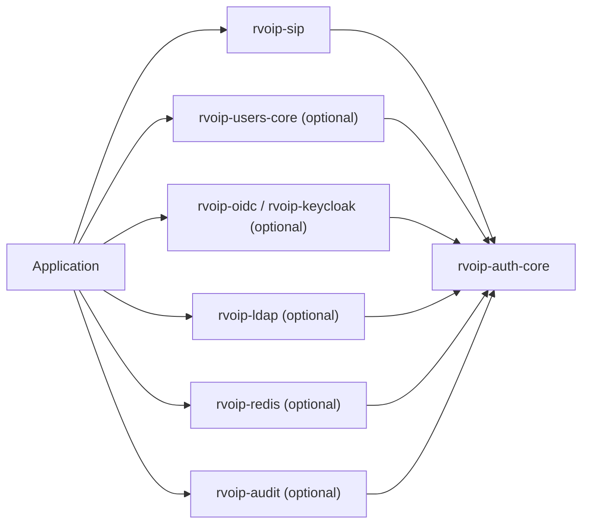
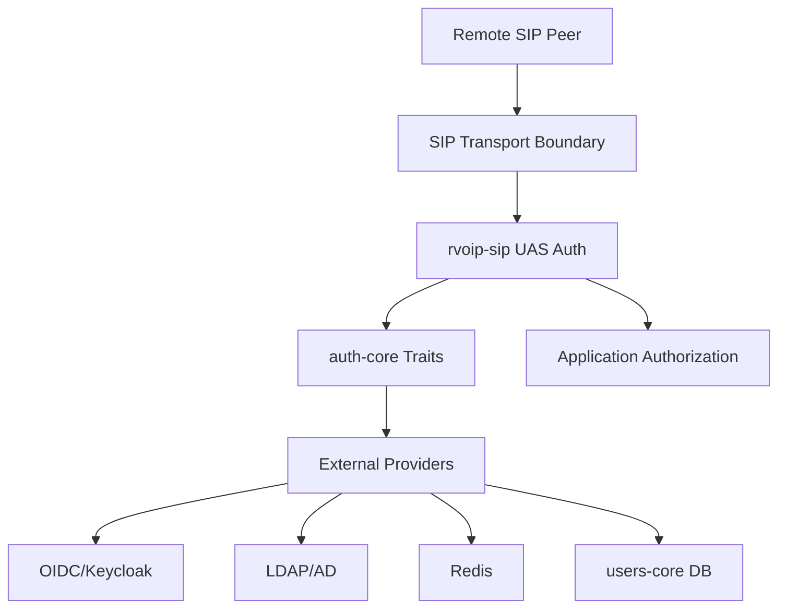

# Auth Security Architecture

## Crate Boundaries

`rvoip-sip` owns SIP authentication headers, challenge negotiation, UAC retry,
UAS challenge generation, and inbound authentication orchestration. It does not
own user databases, token issuance, LDAP, Redis, or IdP configuration.

`rvoip-auth-core` owns reusable primitives and provider traits:
`BearerValidator`, `PasswordVerifier`, `DigestSecretProvider`,
`TokenRevocationChecker`, `DigestReplayStore`, `AuthRateLimiter`, and
`AuthAuditSink`.

`rvoip-users-core` is the optional first-party user/auth service. SQLite is the
default reference store. PostgreSQL user/API-key storage is feature-gated;
full auth-service security-table support for PostgreSQL remains tracked.

Extension crates provide concrete providers without making protocol crates
depend on a specific deployment stack:

- `rvoip-redis`: Digest replay, token revocation, auth rate limiting.
- `rvoip-audit`: JSON-lines, tracing, and fanout audit sinks.
- `rvoip-oidc`: generic OIDC discovery, JWKS, introspection.
- `rvoip-keycloak`: Keycloak-specific fixture and adapter.
- `rvoip-ldap`: LDAP simple-bind password verifier.

## Trust Boundaries

Credential-bearing schemes must be protected by actual TLS/WSS transport state
or explicit cleartext opt-ins. Basic and Bearer cleartext are disabled by
default.

Provider errors that affect credential validation or rate limiting fail closed.
Audit sink errors fail open by default and can be configured fail-closed.
