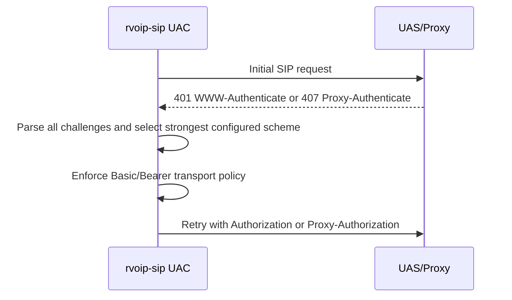
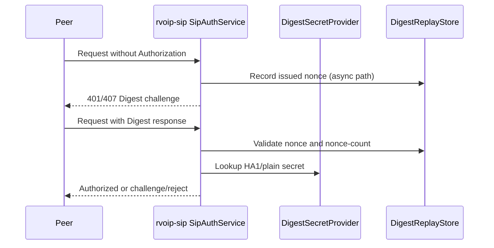
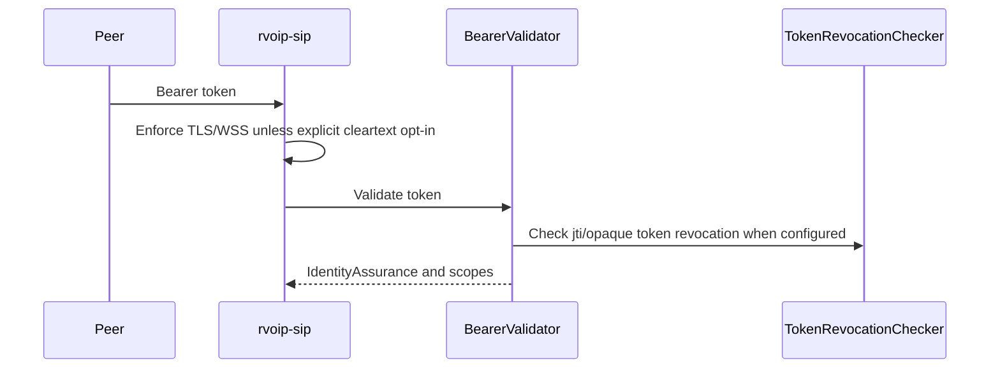
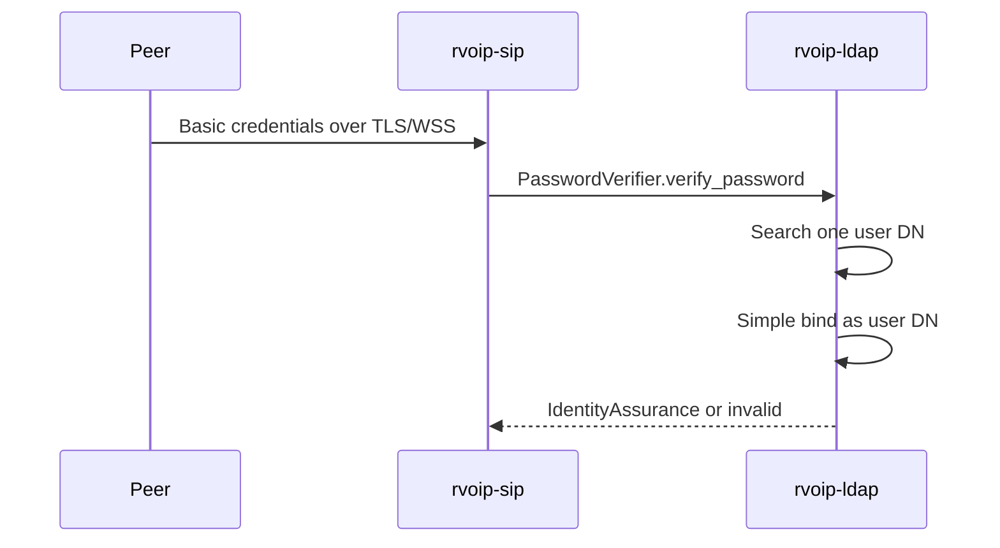
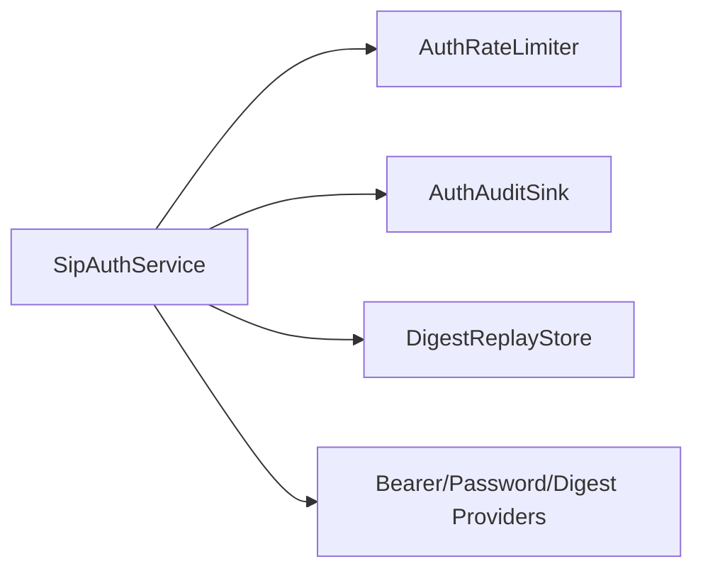

# Auth Data Flows

## UAC Challenge Retry

`401` always maps to `Authorization`. `407` always maps to
`Proxy-Authorization`. Digest nonce-count increments per `(realm, nonce)`.
Digest stale retry is allowed only for `stale=true` with a new nonce.

## UAS Digest

Clustered UAS deployments must configure a shared `DigestReplayStore`.

## UAS Bearer

Bearer validators must enforce issuer, audience/resource, expiry, algorithms,
`kid`, revocation/introspection strategy, and scopes.

## UAS Basic With LDAP

Basic is legacy compatibility. Cleartext Basic requires explicit UAC and UAS
opt-ins.

## Enterprise Hooks

Rate limit checks happen before credential validation and fail closed.
Audit events are redacted and do not contain secrets.
