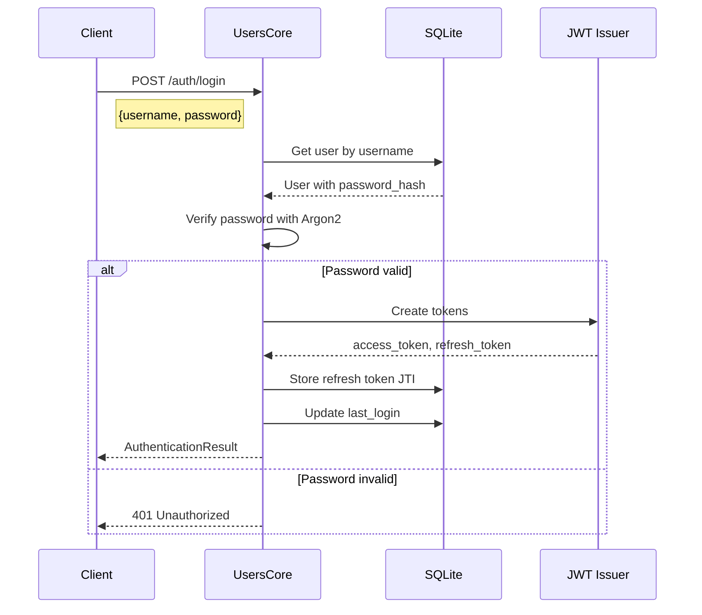
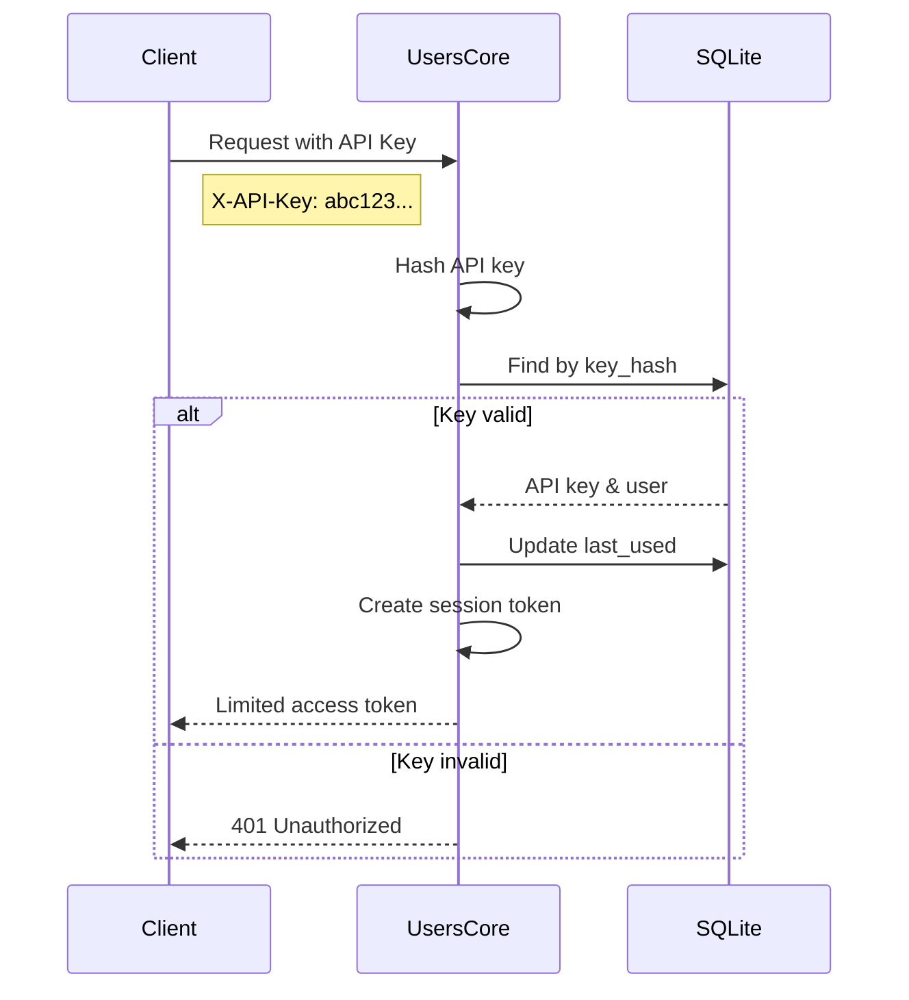
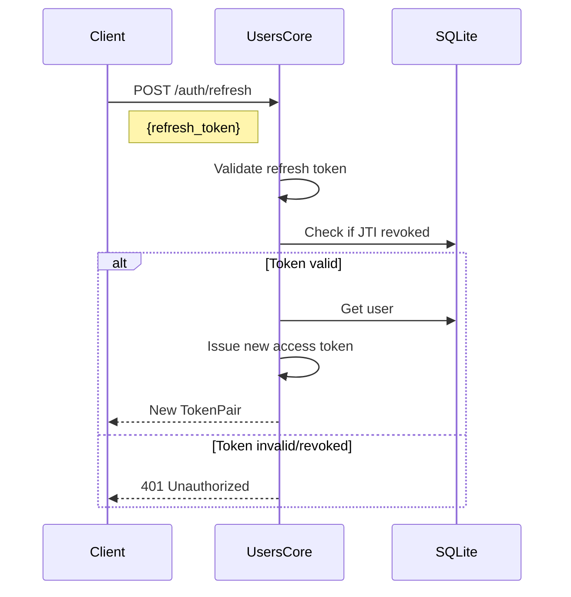
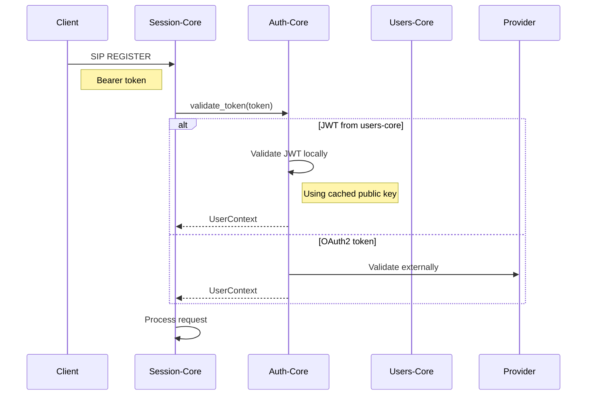

# Users-Core Implementation Plan

## Executive Summary

Users-Core provides user management, authentication, and JWT issuance capabilities for the RVoIP ecosystem. It handles user storage, password authentication, API key management, and issues JWT tokens that can be validated by auth-core. This separation allows auth-core to focus on token validation and external OAuth2 integration while users-core manages internal users.

## Architecture Overview

```
┌────────────────────────────────────────────────────────────────────┐
│                         SIP/REST Clients                            │
└──────────────────────┬──────────────────────┬──────────────────────┘
                       │                      │
                  Authenticate            Validate Token
                       │                      │
                       ▼                      ▼
              ┌───────────────┐      ┌───────────────┐
              │  Users-Core   │      │   Auth-Core   │
              │               │      │               │
              │ • User CRUD   │      │ • Validate JWT│
              │ • Password    │      │ • Validate    │
              │   Auth        │      │   OAuth2      │
              │ • Issue JWT   │      │ • Token Cache │
              │ • API Keys    │      │ • Unified API │
              └───────┬───────┘      └───────────────┘
                      │                       ▲
                      │                       │
                      │ Issues JWT tokens     │
                      └───────────────────────┘
                      
                      ▼
              ┌───────────────┐
              │    SQLite     │
              │   Database    │
              │               │
              │ • Users       │
              │ • API Keys    │
              │ • Sessions    │
              └───────────────┘
```

## Core Components

### 1. User Management

```rust
pub struct User {
    pub id: String,                    // UUID
    pub username: String,              // Unique username
    pub email: Option<String>,         // Optional email
    pub display_name: Option<String>,  // Display name
    pub password_hash: String,         // Argon2 hash
    pub roles: Vec<String>,            // User roles
    pub active: bool,                  // Account status
    pub created_at: DateTime<Utc>,
    pub updated_at: DateTime<Utc>,
    pub last_login: Option<DateTime<Utc>>,
}

pub trait UserStore {
    async fn create_user(&self, user: CreateUserRequest) -> Result<User>;
    async fn get_user(&self, id: &str) -> Result<Option<User>>;
    async fn get_user_by_username(&self, username: &str) -> Result<Option<User>>;
    async fn update_user(&self, id: &str, updates: UpdateUserRequest) -> Result<User>;
    async fn delete_user(&self, id: &str) -> Result<()>;
    async fn list_users(&self, filter: UserFilter) -> Result<Vec<User>>;
}
```

### 2. Authentication Service

```rust
pub struct AuthenticationService {
    user_store: Arc<dyn UserStore>,
    jwt_issuer: JwtIssuer,
    password_hasher: Argon2<'static>,
    api_key_store: Arc<dyn ApiKeyStore>,
}

impl AuthenticationService {
    /// Authenticate user with password
    pub async fn authenticate_password(
        &self,
        username: &str,
        password: &str,
    ) -> Result<AuthenticationResult>;
    
    /// Authenticate with API key
    pub async fn authenticate_api_key(
        &self,
        api_key: &str,
    ) -> Result<AuthenticationResult>;
    
    /// Issue new access token
    pub async fn issue_access_token(&self, user: &User) -> Result<String>;
    
    /// Issue refresh token
    pub async fn issue_refresh_token(&self, user: &User) -> Result<String>;
    
    /// Refresh access token
    pub async fn refresh_token(&self, refresh_token: &str) -> Result<TokenPair>;
    
    /// Revoke tokens
    pub async fn revoke_tokens(&self, user_id: &str) -> Result<()>;
}

pub struct AuthenticationResult {
    pub user: User,
    pub access_token: String,
    pub refresh_token: String,
    pub expires_in: Duration,
}
```

### 3. JWT Issuer

```rust
pub struct JwtIssuer {
    signing_key: Arc<EncodingKey>,
    validation_key: Arc<DecodingKey>,
    issuer: String,
    audience: Vec<String>,
    access_token_ttl: Duration,
    refresh_token_ttl: Duration,
}

impl JwtIssuer {
    /// Create access token with standard claims
    pub fn create_access_token(&self, user: &User) -> Result<String>;
    
    /// Create refresh token
    pub fn create_refresh_token(&self, user_id: &str) -> Result<String>;
    
    /// Get public key for validation (used by auth-core)
    pub fn public_key_jwk(&self) -> Jwk;
    
    /// Validate refresh token (internal use only)
    pub fn validate_refresh_token(&self, token: &str) -> Result<RefreshTokenClaims>;
}

#[derive(Serialize, Deserialize)]
pub struct UserClaims {
    // Standard JWT claims
    pub iss: String,              // Issuer (users-core)
    pub sub: String,              // Subject (user ID)
    pub aud: Vec<String>,         // Audience
    pub exp: u64,                 // Expiration
    pub iat: u64,                 // Issued at
    pub jti: String,              // JWT ID
    
    // Custom claims
    pub username: String,
    pub email: Option<String>,
    pub roles: Vec<String>,
    pub scope: String,            // OAuth2 compatible scopes
}
```

### 4. API Key Management

```rust
pub struct ApiKey {
    pub id: String,
    pub user_id: String,
    pub name: String,
    pub key_hash: String,         // Only store hash
    pub permissions: Vec<String>,  // Specific permissions
    pub expires_at: Option<DateTime<Utc>>,
    pub last_used: Option<DateTime<Utc>>,
    pub created_at: DateTime<Utc>,
}

pub trait ApiKeyStore {
    async fn create_api_key(&self, request: CreateApiKeyRequest) -> Result<(ApiKey, String)>;
    async fn validate_api_key(&self, key: &str) -> Result<Option<ApiKey>>;
    async fn revoke_api_key(&self, id: &str) -> Result<()>;
    async fn list_api_keys(&self, user_id: &str) -> Result<Vec<ApiKey>>;
}
```

### 5. Database Schema

```sql
-- Users table
CREATE TABLE users (
    id TEXT PRIMARY KEY,
    username TEXT NOT NULL UNIQUE,
    email TEXT,
    display_name TEXT,
    password_hash TEXT NOT NULL,
    roles TEXT NOT NULL DEFAULT '[]', -- JSON array
    active BOOLEAN NOT NULL DEFAULT TRUE,
    created_at TIMESTAMP NOT NULL DEFAULT CURRENT_TIMESTAMP,
    updated_at TIMESTAMP NOT NULL DEFAULT CURRENT_TIMESTAMP,
    last_login TIMESTAMP
);

-- API Keys table
CREATE TABLE api_keys (
    id TEXT PRIMARY KEY,
    user_id TEXT NOT NULL REFERENCES users(id) ON DELETE CASCADE,
    name TEXT NOT NULL,
    key_hash TEXT NOT NULL,
    permissions TEXT NOT NULL DEFAULT '[]', -- JSON array
    expires_at TIMESTAMP,
    last_used TIMESTAMP,
    created_at TIMESTAMP NOT NULL DEFAULT CURRENT_TIMESTAMP,
    UNIQUE(user_id, name)
);

-- Refresh tokens table (for revocation)
CREATE TABLE refresh_tokens (
    jti TEXT PRIMARY KEY,
    user_id TEXT NOT NULL REFERENCES users(id) ON DELETE CASCADE,
    expires_at TIMESTAMP NOT NULL,
    revoked_at TIMESTAMP,
    created_at TIMESTAMP NOT NULL DEFAULT CURRENT_TIMESTAMP
);

-- Sessions table (optional, for session management)
CREATE TABLE sessions (
    id TEXT PRIMARY KEY,
    user_id TEXT NOT NULL REFERENCES users(id) ON DELETE CASCADE,
    ip_address TEXT,
    user_agent TEXT,
    last_activity TIMESTAMP NOT NULL,
    expires_at TIMESTAMP NOT NULL,
    created_at TIMESTAMP NOT NULL DEFAULT CURRENT_TIMESTAMP
);

-- Indices for performance
CREATE INDEX idx_users_username ON users(username);
CREATE INDEX idx_users_email ON users(email);
CREATE INDEX idx_api_keys_user_id ON api_keys(user_id);
CREATE INDEX idx_refresh_tokens_user_id ON refresh_tokens(user_id);
CREATE INDEX idx_sessions_user_id ON sessions(user_id);
```

## Authentication Flows

### Flow 1: Password Authentication



### Flow 2: API Key Authentication



### Flow 3: Token Refresh



## Integration with Auth-Core

### Token Validation Flow



### Public Key Distribution

Users-Core exposes its public key via:

1. **JWKS Endpoint**: `/auth/jwks.json`
```json
{
  "keys": [{
    "kty": "RSA",
    "use": "sig",
    "kid": "users-core-2024",
    "alg": "RS256",
    "n": "...",
    "e": "AQAB"
  }]
}
```

2. **Direct Configuration**: Auth-core can be configured with users-core's public key

## REST API Endpoints

### Authentication Endpoints

```
POST   /auth/login              # Password login
POST   /auth/logout             # Logout (revoke tokens)
POST   /auth/refresh            # Refresh access token
GET    /auth/jwks.json          # Public keys for validation
```

### User Management Endpoints

```
POST   /users                   # Create user
GET    /users/{id}              # Get user
PUT    /users/{id}              # Update user
DELETE /users/{id}              # Delete user
GET    /users                   # List users
POST   /users/{id}/password     # Change password
POST   /users/{id}/roles        # Update roles
```

### API Key Management

```
POST   /users/{id}/api-keys     # Create API key
GET    /users/{id}/api-keys     # List API keys
DELETE /api-keys/{id}           # Revoke API key
```

## Security Considerations

### 1. Password Security
- Use Argon2id for password hashing
- Configurable work factors
- Password strength requirements
- Rate limiting on login attempts

### 2. Token Security
- RS256 for JWT signing (asymmetric)
- Short-lived access tokens (5-15 minutes)
- Longer refresh tokens (7-30 days)
- Token revocation support
- JTI tracking for refresh tokens

### 3. API Key Security
- Generate cryptographically secure keys
- Store only hashed versions
- Support key rotation
- Granular permissions

### 4. Database Security
- Encrypt sensitive fields at rest
- Use prepared statements
- Regular backups
- Audit logging

## Configuration

```toml
[users_core]
# Database configuration
database_url = "sqlite://users.db"
database_max_connections = 25

# JWT configuration
jwt_issuer = "https://auth.rvoip.local"
jwt_audience = ["rvoip-api", "rvoip-sip"]
jwt_access_ttl_seconds = 900        # 15 minutes
jwt_refresh_ttl_seconds = 2592000   # 30 days
jwt_algorithm = "RS256"

# Password policy
password_min_length = 8
password_require_uppercase = true
password_require_lowercase = true
password_require_numbers = true
password_require_special = false

# Argon2 parameters
argon2_memory_cost = 65536  # 64 MB
argon2_time_cost = 3
argon2_parallelism = 4

# API configuration
api_bind_address = "127.0.0.1:8081"
api_key_length = 32

# Rate limiting
login_attempts_per_minute = 10
api_requests_per_minute = 1000
```

## Implementation Phases

### Phase 1: Core Foundation (Days 1-3)
- [ ] Project setup and dependencies
- [ ] Database schema and migrations
- [ ] Basic user CRUD operations
- [ ] SQLite integration with SQLx
- [ ] Error handling framework

### Phase 2: Authentication (Days 4-6)
- [ ] Password hashing with Argon2
- [ ] JWT token generation
- [ ] Login/logout endpoints
- [ ] Token refresh mechanism
- [ ] Session management

### Phase 3: API Keys (Days 7-8)
- [ ] API key generation
- [ ] API key storage and validation
- [ ] Permission system
- [ ] Key rotation support

### Phase 4: REST API (Days 9-10)
- [ ] User management endpoints
- [ ] Authentication endpoints
- [ ] API key endpoints
- [ ] OpenAPI documentation
- [ ] Rate limiting

### Phase 5: Integration (Days 11-12)
- [ ] Auth-core integration
- [ ] JWKS endpoint
- [ ] Health checks
- [ ] Metrics collection

### Phase 6: Security & Testing (Days 13-14)
- [ ] Security hardening
- [ ] Unit tests
- [ ] Integration tests
- [ ] Performance testing
- [ ] Security audit

## Testing Strategy

### Unit Tests
- User CRUD operations
- Password hashing and validation
- JWT token generation
- API key validation

### Integration Tests
- Full authentication flows
- Database operations
- Token refresh cycles
- API endpoint testing

### Security Tests
- Password brute force protection
- Token replay attacks
- SQL injection attempts
- API key security

### Performance Tests
- Concurrent login attempts
- Database connection pooling
- Token generation throughput
- API response times

## Migration Strategy

For existing systems:

1. **Data Migration**
   - Import existing user data
   - Generate password reset tokens
   - Map existing roles/permissions

2. **Gradual Rollout**
   - Run in parallel with existing auth
   - Migrate users incrementally
   - Fallback to legacy system

3. **Token Compatibility**
   - Support legacy token formats temporarily
   - Dual validation in auth-core
   - Gradual token migration

## Monitoring & Observability

### Metrics
- Authentication success/failure rates
- Token issuance rate
- API key usage
- Database query performance
- Password reset requests

### Logging
- Authentication attempts
- Token lifecycle events
- API key usage
- User management operations
- Security events

### Alerts
- Failed login spikes
- Database connection issues
- Token signing failures
- Unusual API key activity

## Future Enhancements

### Version 2.0
- Multi-factor authentication (TOTP/SMS)
- Social login integration
- LDAP/AD integration
- Passwordless authentication
- Device management

### Version 3.0
- FIDO2/WebAuthn support
- Risk-based authentication
- Behavioral analytics
- Zero-trust architecture
- Distributed user store

## Appendix

### A. JWT Token Example

```json
{
  "header": {
    "alg": "RS256",
    "typ": "JWT",
    "kid": "users-core-2024"
  },
  "payload": {
    "iss": "https://auth.rvoip.local",
    "sub": "550e8400-e29b-41d4-a716-446655440000",
    "aud": ["rvoip-api", "rvoip-sip"],
    "exp": 1735690500,
    "iat": 1735689600,
    "jti": "f47ac10b-58cc-4372-a567-0e02b2c3d479",
    "username": "alice",
    "email": "alice@example.com",
    "roles": ["user", "admin"],
    "scope": "openid profile email sip.register"
  }
}
```

### B. API Key Format

```
rvoip_ak_live_32CharacterRandomString1234567890
```
- Prefix: `rvoip_ak_` for identification
- Environment: `live_` or `test_`
- Random: 32 character base62 string

### C. Error Response Format

```json
{
  "error": {
    "code": "INVALID_CREDENTIALS",
    "message": "Invalid username or password",
    "details": {
      "attempts_remaining": 3
    }
  }
}
```

---

This implementation plan provides a complete user management and authentication solution that integrates seamlessly with auth-core while maintaining clear separation of concerns.
