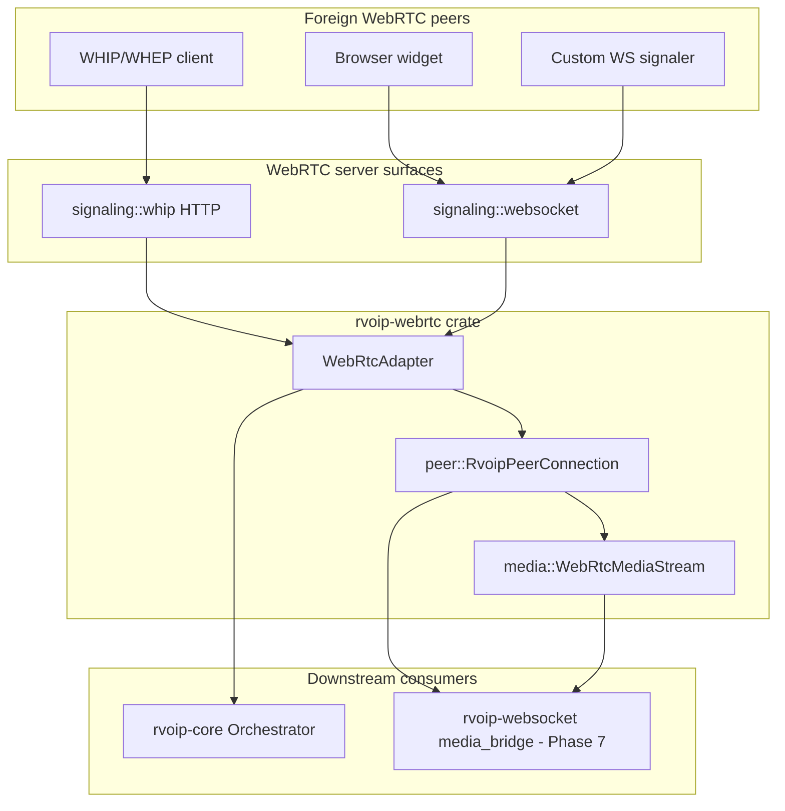

# rvoip-webrtc Implementation Plan

**Deliverable location:** [`crates/webrtc/rvoip-webrtc/docs/IMPLEMENTATION_PLAN.md`](crates/webrtc/rvoip-webrtc/docs/IMPLEMENTATION_PLAN.md)

**Scope boundary:** All source, tests, and docs live under `crates/webrtc/rvoip-webrtc/**`. No edits to `rvoip-core`, `rvoip-websocket`, `rvoip-sip`, or any other crate. The only out-of-crate change required for compilation is adding the crate to the workspace `members` list and a `rvoip-webrtc` path alias in the root [`Cargo.toml`](Cargo.toml) — not counted as "touching other crates."

**Authoritative design references (read-only):**
- [`docs/INTERFACE_DESIGN.md`](docs/INTERFACE_DESIGN.md) §2, §3.6, §6, §7, §9, §13
- [`docs/PRD.md`](docs/PRD.md) §4 "WebRTC interop"
- [`docs/CONVERSATION_PROTOCOL.md`](docs/CONVERSATION_PROTOCOL.md) §12.2 (gateway boundary)
- [`crates/uctp/rvoip-websocket/src/media_bridge.rs`](crates/uctp/rvoip-websocket/src/media_bridge.rs) (stub integration notes — do not modify; use as API checklist)

**webrtc-rs version:** `=0.20.0-alpha.1` (already pinned in root [`Cargo.toml`](Cargo.toml) line 228). Feature: `runtime-tokio` (default).

---

## 1. What rvoip-webrtc is

`rvoip-webrtc` serves **two complementary roles** in the rvoip stack. Both share the same peer, media, and SDP layers; they differ in how signaling is exposed and how the result is consumed.

| Role | Purpose | Primary API | Typical deployment |
|------|---------|-------------|-------------------|
| **Gateway / interop adapter** | Terminate foreign WebRTC at the voip-3 boundary; expose `Connection`s to the orchestrator for bridging to SIP, QUIC, etc. | `WebRtcAdapter` (`ConnectionAdapter`) | Co-located with orchestrator |
| **WebRTC server** | Accept inbound WebRTC peers over standard signaling surfaces (WHIP/WHEP, WebSocket JSON); produce/consume SDP without requiring callers to manage `PeerConnection` directly | `signaling::{whip, websocket}::serve` + `WebRtcAdapter` | Standalone HTTP/WS listener or sidecar |

It is **not** a generic SFU/MCU or a UCTP substrate. UCTP-over-WebSocket media (`websocket+webrtc`) remains in `rvoip-websocket`, but that crate **depends on** the reusable WebRTC stack here (see §13).

**Dual-role goal:** A single binary or process must be able to (a) register `WebRtcAdapter` with the orchestrator *and* (b) expose WHIP/WHEP/WS server endpoints that feed the same adapter instance — foreign peers arrive via signaling; the orchestrator sees ordinary `InboundConnection` / `Connected` events.



### 1.1 Gateway mode (interop adapter)

`WebRtcAdapter` implements `ConnectionAdapter` with `Transport::WebRtc` and `AdapterKind::Interop`. It is the mirror of [`rvoip-sip`](crates/sip/rvoip-sip/src/adapter.rs) for WebRTC — terminate ICE/DTLS-SRTP/SDP at the gateway boundary and surface voip-3 `Connection`s with channel-based `MediaStream` flows.

**Outbound:** orchestrator calls `originate` → offer SDP in route metadata → remote answer via `apply_remote_answer` → `accept` → `Connected`.

**Inbound:** remote offer via `apply_remote_offer` (or signaling server) → `InboundConnection` → `accept` → `Connected`.

### 1.2 Server mode (signaling termination)

The server role wraps the same adapter/peer stack behind HTTP or WebSocket listeners so external clients (browsers, OBS/WHIP, custom widgets) never touch rvoip-core types directly.

| Surface | Endpoint | PC role | Adapter action |
|---------|----------|---------|----------------|
| WHIP | `POST /whip/{session}` | Answerer | `apply_remote_offer` → return SDP answer → `InboundConnection` |
| WHEP | `POST /whep/{session}` | Offerer | `originate` → return SDP offer (subscriber applies answer OOB in v1.x) |
| WebSocket | `{type:"offer"}` | Answerer | `apply_remote_offer` → `{type:"answer", sdp}` |
| WebSocket | `{type:"answer"}` | Offerer | `apply_remote_answer` on routed `ConnectionId` (v1.x) |
| DELETE / `bye` | teardown | — | `adapter.end(conn, Normal)` |

Server mode **does not** replace the orchestrator — it is the front door. A typical deployment binds WHIP/WS and registers the same `Arc<WebRtcAdapter>` with the orchestrator so inbound browser calls become bridgeable voip-3 sessions.

**Not in scope for server mode:** TURN relay hosting (configure external TURN via `WebRtcConfig::ice_servers`), SFU fan-out, or serving media without an orchestrator/bridge path.

---

## 2. Crate layout

```
crates/webrtc/rvoip-webrtc/
├── docs/
│   └── IMPLEMENTATION_PLAN.md      ← this plan (first deliverable)
├── Cargo.toml
├── README.md
├── src/
│   ├── lib.rs
│   ├── errors.rs
│   ├── config.rs                   # WebRtcConfig, ICE/TURN, bind addrs
│   ├── adapter.rs                  # WebRtcAdapter : ConnectionAdapter
│   ├── peer/
│   │   ├── mod.rs
│   │   ├── session.rs              # RvoipPeerConnection (owns impl PeerConnection)
│   │   ├── builder.rs              # PeerConnectionBuilder wiring
│   │   └── handler.rs              # PeerConnectionEventHandler + event fan-in
│   ├── sdp/
│   │   ├── mod.rs
│   │   ├── session.rs              # RTCSessionDescription parse/serialize
│   │   └── capability.rs           # CapabilityDescriptor ↔ SDP m-lines
│   ├── media/
│   │   ├── mod.rs
│   │   ├── stream.rs               # WebRtcMediaStream : MediaStream
│   │   ├── pump.rs                 # tokio tasks: TrackRemote → frames_in, frames_out → TrackLocal
│   │   └── dtmf.rs                 # RFC 4733 via webrtc sender
│   ├── signaling/
│   │   ├── mod.rs
│   │   ├── whip.rs                 # WHIP/WHEP HTTP endpoints (v1)
│   │   └── websocket.rs            # JSON SDP exchange over WS (v1)
│   └── client/
│       ├── mod.rs
│       └── native.rs               # WebRtcClient, PeerConnection, Signaler (INTERFACE_DESIGN §15.3)
├── examples/
│   └── loopback_call.rs            # client feature — offer/answer via Signaler trait
└── tests/
    ├── loopback.rs                 # two PCs, Opus audio round-trip
    ├── sdp_capability.rs           # codec intersection unit tests
    ├── adapter_smoke.rs            # ConnectionAdapter method coverage
    └── whip_signaling.rs           # WHIP POST → InboundConnection (signaling-whip)
```

---

## 3. webrtc-rs 0.20.0-alpha.1 API surface to use

The alpha redesign replaces v0.17 callback hell with trait-based handlers on a Sans-I/O `rtc` core. Key types ([docs.rs/webrtc/0.20.0-alpha.1](https://docs.rs/webrtc/0.20.0-alpha.1/webrtc/)):

| Concern | webrtc-rs 0.20 API | rvoip-webrtc wrapper |
|---------|-------------------|----------------------|
| Construction | `PeerConnectionBuilder::new().with_configuration(...).with_handler(...).with_udp_addrs(...).build().await` | `peer::builder::build_peer_connection(config, handler)` |
| Events | `PeerConnectionEventHandler` (`on_connection_state_change`, `on_ice_candidate`, `on_track`, `on_data_channel`) | `peer::handler::ConnectionHandler` stores `mpsc` senders for adapter events |
| Operations | `PeerConnection` trait (`create_offer`, `set_local_description`, `add_track`, …) | `RvoipPeerConnection` holds `Arc<dyn PeerConnection>` |
| Codecs | `MediaEngine` + `Registry` interceptors | Registered once in `WebRtcConfig`; Opus + PCMU/PCMA for SIP interop |
| Local media | `media_stream::track_local::TrackLocalStaticRTP` | Outbound pump writes RTP from `MediaFrame.payload` |
| Remote media | `media_stream::track_remote::TrackRemote` | Inbound pump reads RTP → `MediaFrame` |
| DataChannel | `data_channel` module + `PeerConnectionEventHandler::on_data_channel` | `send_message` / inbound Messages |

**Alpha risk mitigation:** Pin `webrtc = "=0.20.0-alpha.1"` strictly in `rvoip-webrtc/Cargo.toml`. Isolate all webrtc-rs imports behind `peer/`, `media/`, and `signaling/` modules so an API bump is a contained rewrite. Document known alpha limitations in README.

**UCTP v0 constraint:** Full SDP in offer/answer — **no trickle ICE** ([CONVERSATION_PROTOCOL.md §10.2.2](docs/CONVERSATION_PROTOCOL.md)). Wait for `RTCIceGatheringState::Complete` before emitting local SDP.

---

## 4. Core types and contracts

### 4.1 `WebRtcAdapter` (`ConnectionAdapter`)

Mirror [`UctpQuicAdapter`](crates/uctp/rvoip-quic/src/adapter.rs) / [`SipAdapter`](crates/sip/rvoip-sip/src/adapter.rs) structure:

- `DashMap<ConnectionId, Route>` holding `Arc<RvoipPeerConnection>`, `Arc<DashMap<StreamId, Arc<dyn MediaStream>>>`, signaling session state
- `mpsc::Sender<AdapterEvent>` with `ADAPTER_EVENT_CAP = 256`
- `subscribe_events()` single-take receiver pattern
- `transport()` → `Transport::WebRtc`; `kind()` → `AdapterKind::Interop`

| `ConnectionAdapter` method | WebRTC-native action |
|---|---|
| `originate` | Build offerer PC → gather ICE → return `ConnectionHandle` with local SDP in transport metadata |
| `accept` | Apply stored remote SDP → create answer → `AdapterEvent::Connected` |
| `reject` | `pc.close()` + failed state |
| `end` | `pc.close()` |
| `hold` / `resume` | Disable/enable transceivers or `direction` renegotiation (v1: transceiver `set_direction` sendonly/recvonly) |
| `streams` | Lookup registered `WebRtcMediaStream` instances |
| `send_message` | DataChannel `send` when channel open |
| `send_dtmf` | Audio sender DTMF API |
| `renegotiate_media` | `create_offer`/`create_answer` cycle with updated `CapabilityDescriptor` |
| `verify_request_signature` | Return `IdentityAssurance::Anonymous` (per INTERFACE_DESIGN §6) |

### 4.2 `WebRtcMediaStream` (`MediaStream`)

Implements [`rvoip_core::stream::MediaStream`](crates/foundation/rvoip-core/src/stream.rs):

- Channel-based `frames_in` / `frames_out` (buffer depth: 64 audio frames per INTERFACE_DESIGN §21.5)
- `MediaFrame.payload` = raw RTP packet bytes (same convention as QUIC datagram path)
- `quality_snapshot()` from webrtc stats / RTCP interceptors (`configure_rtcp_reports`)
- `close()` aborts pump tasks and removes track

### 4.3 SDP ↔ `CapabilityDescriptor`

Per INTERFACE_DESIGN §9.2:

- **Offer path:** walk `streams_offered.codec_preferences`; map to SDP `m=` lines (Opus 48000/2, PCMU, PCMA)
- **Answer path:** pick first supported codec per stream; reject with `488` equivalent if intersection empty
- Use `MediaEngine` to register matching payload types before `create_offer`

Default codec pair for SIP bridge: **G.711 ↔ Opus** (transcoding stays in `rvoip-media-core` at bridge time; adapter negotiates codecs on the WebRTC leg only).

---

## 5. Signaling surfaces (v1)

PRD §4 requires WHIP/WHEP + custom WebSocket signaler. All live inside `signaling/` — no dependency on UCTP envelopes.

### 5.1 WHIP / WHEP (`signaling/whip.rs`)

- HTTP server (axum) on configurable bind; `serve(bind, adapter)` for production, `serve_listener(listener, adapter)` for tests
- **WHIP:** `POST /whip/{session}` → `adapter.apply_remote_offer(body)` → `201` + SDP answer + `Location: /whip/{connection_id}`
- **WHEP:** `POST /whep/{session}` → `adapter.originate(...)` → `201` + SDP offer + `Location` (subscriber answer path: Phase 8)
- **DELETE** on `/whip/{id}` or `/whep/{id}` → `adapter.end(id, Normal)`
- ICE restarts map to `renegotiate_media` (Phase 8)

**Server-mode wiring pattern:**

```rust
let config = WebRtcConfig::default();
let adapter = WebRtcAdapter::new(config);
orchestrator.register_adapter(adapter.clone()).await?;

// Gateway + server in one process:
tokio::spawn(signaling::whip::serve("0.0.0.0:8080", adapter.clone()));
tokio::spawn(signaling::websocket::serve("0.0.0.0:8081", adapter));
```

Both listeners share one `Arc<WebRtcAdapter>` so WHIP/WS inbound peers and orchestrator-originated outbound calls use the same route table and event channel.

### 5.2 WebSocket signaler (`signaling/websocket.rs`)

JSON messages: `{ "type": "offer"|"answer"|"bye", "sdp": "..." }` — enough for browser widgets and the SIP↔WebRTC demo (INTERFACE_DESIGN §16.2).

Inbound WS offer → spawn inbound `Connection` → emit `AdapterEvent::InboundConnection`.

---

## 6. Client module (`client/native.rs`)

Per INTERFACE_DESIGN §15.3 — **optional for v1 spike, required before "feature-complete":**

- `WebRtcClient::connect(signaler_uri, credential)` 
- `WebRtcClient::call(target, medium) -> SessionHandle` (thin; may stub until `rvoip-client` crate exists)
- Re-export native types: `Offer`, `Answer`, `IceCandidate` as thin newtypes over webrtc-rs types

Keep client API in `rvoip-webrtc` only; do not create `rvoip-client` in this effort.

---

## 7. Dependencies (`rvoip-webrtc/Cargo.toml`)

```toml
[dependencies]
rvoip-core = { workspace = true }
webrtc = { workspace = true, features = ["runtime-tokio"] }
tokio = { workspace = true }
async-trait = { workspace = true }
bytes = { workspace = true }
dashmap = { workspace = true }
parking_lot = { workspace = true }
serde = { workspace = true }
serde_json = { workspace = true }
tracing = { workspace = true }
thiserror = { workspace = true }
chrono = { workspace = true }
# signaling HTTP (WHIP/WHEP) — add hyper or axum; keep optional behind feature flag
```

**Explicitly not depended on in v1:** `rvoip-uctp`, `rvoip-websocket`, `rvoip-sip`, `rtp-core` (webrtc-rs owns DTLS-SRTP internally). Revisit `rtp-core` only if we need shared RTP parsing beyond what `MediaFrame.payload` carries.

**Feature flags (crate-local):**

| Feature | Enables |
|---------|---------|
| `default` | `adapter`, `peer`, `media`, `sdp` |
| `signaling-whip` | WHIP/WHEP HTTP server |
| `signaling-ws` | WebSocket JSON signaler |
| `client` | `client/native.rs` |
| `bridge-quic` | Real `rvoip-quic` cross-transport bridge demo + e2e test |

---

## 8. Implementation phases

### Phase 0 — Plan document + crate skeleton (this task)

- Create `crates/webrtc/rvoip-webrtc/docs/IMPLEMENTATION_PLAN.md` (copy of approved plan)
- Add `Cargo.toml`, `src/lib.rs`, `src/errors.rs`, module stubs with `todo!()` or documented stubs
- Add workspace `members` + `rvoip-webrtc` path in root `Cargo.toml`
- `cargo check -p rvoip-webrtc` passes (empty crate)

### Phase 1 — PeerConnection wrapper

- `peer/builder.rs`: `MediaEngine` with Opus + G.711, default interceptors (`register_default_interceptors`)
- `peer/handler.rs`: `ConnectionHandler` implements `PeerConnectionEventHandler`; forwards state/track/ICE to internal channels
- `peer/session.rs`: `RvoipPeerConnection` — offer/answer/gather/close lifecycle
- Unit test: in-process offer/answer without network (`127.0.0.1` UDP)

### Phase 2 — Media plane

- `media/stream.rs`: `WebRtcMediaStream`
- `media/pump.rs`: bidirectional RTP pumps (spawn on `on_track` + after `add_track`)
- `tests/loopback.rs`: synthetic RTP or silence frames round-trip between two PCs

### Phase 3 — SDP / capability layer

- `sdp/capability.rs`: `CapabilityDescriptor` ↔ SDP translation
- `tests/sdp_capability.rs`: intersection algorithm cases (Opus-only, G.711-only, disjoint → reject)

### Phase 4 — `WebRtcAdapter`

- Full `ConnectionAdapter` impl
- Event translation: PC state → `AdapterEvent::{InboundConnection, Connected, Ended, Failed}`
- `tests/adapter_smoke.rs`: mock orchestrator registration pattern (in-crate test helper, no rvoip-core changes)

### Phase 5 — Signaling

- WHIP/WHEP HTTP (`signaling-whip` feature)
- WebSocket JSON signaler (`signaling-ws` feature)
- Integration test: HTTP WHIP POST → `InboundConnection` event

### Phase 6 — Client API (optional v1.x) ✅

- `client/native.rs` behind `client` feature
- Example binary in `crates/webrtc/rvoip-webrtc/examples/loopback_call.rs`

---

## 8.1 Phase status (v1 spike — complete)

Phases 0–6 delivered the crate skeleton, peer/media/SDP layers, `WebRtcAdapter`, signaling surfaces, client API, and in-crate tests. See §11 for v1 success criteria.

---

## 8.2 Next phases — dual-role hardening + integration

These phases extend the crate from "compiles and unit-tests" to production gateway **and** server deployments.

### Phase 7 — `rvoip-websocket` media bridge integration

**Goal:** Replace the stub [`WebRtcMediaBridge`](crates/uctp/rvoip-websocket/src/media_bridge.rs) with real `rvoip-webrtc` peer/media types so UCTP-over-WebSocket connections negotiate co-located WebRTC media.

**Scope:** `crates/uctp/rvoip-websocket/**` only (this crate's public API is the dependency surface).

**Implementation:**

1. Add `rvoip-webrtc` as an optional dependency of `rvoip-websocket` (feature `media-webrtc`, default off until stable).
2. `WebRtcMediaBridge` holds `Arc<RvoipPeerConnection>` + `Arc<dyn MediaStream>` instead of role-only stub.
3. Map UCTP `WebRtcSubstrateSetup` ↔ SDP via `sdp::parse_sdp` / `sdp_to_string` and existing gather helpers on `RvoipPeerConnection`.
4. Wire outbound `MediaStream::frames_out` → `media::pump::spawn_outbound_pump`; wire `on_track` → `spawn_inbound_pump` → bridge `frames_in`.
5. Preserve existing UCTP signaling tests; add `rvoip-websocket/tests/media_bridge_loopback.rs`.

**Reuse from this crate (do not duplicate):**

| rvoip-websocket need | rvoip-webrtc export |
|---------------------|---------------------|
| PC lifecycle | `peer::RvoipPeerConnection`, `PeerRole` |
| SDP offer/answer + gather | `create_offer_and_gather`, `accept_offer_and_gather`, `set_remote_answer` |
| Media channels | `media::from_tracks`, `media::pump` |
| Codec defaults | `sdp::default_webrtc_capabilities` |

### Phase 8 — Server-mode completion

**Goal:** Full WHIP/WHEP + WebSocket server flows for both ingest (publish) and subscribe, with connection routing and teardown.

| Task | Detail |
|------|--------|
| WHEP answer path | `PATCH/POST` or session callback to apply subscriber SDP via `apply_remote_answer`; emit `Connected` |
| WS outbound routing | Include `connection_id` in signaling JSON; route `{type:"answer"}` to the correct originate route |
| Shared `WebRtcServer` facade | New `src/server/mod.rs`: `WebRtcServer::builder().with_whip(addr).with_ws(addr).build()` spawns listeners, returns shared `Arc<WebRtcAdapter>` |
| ICE restart | WHIP `PATCH` with new offer → `renegotiate_media` |
| Late `on_track` | Adapter attaches remote track to existing `WebRtcMediaStream` when track arrives after `accept` |
| Hold/resume | Transceiver `direction` renegotiation instead of track mute-only |

**Server deployment checklist:**

- Bind WHIP (e.g. `:8080`) and/or WS (e.g. `:8081`) on public interface
- Set `WebRtcConfig::ice_servers` to production STUN/TURN
- Register `WebRtcAdapter` with orchestrator before accepting traffic
- Subscribe to `adapter.subscribe_events()` and dispatch `InboundConnection` / `Connected` to session logic

### Phase 9 — Orchestrator end-to-end + gateway/server demo

**Goal:** Prove dual-role operation in a running process: browser/WHIP client → WebRTC server → orchestrator → SIP or QUIC leg.

- Register `WebRtcAdapter` in orchestrator builder (read orchestrator API; no rvoip-core contract changes unless gaps found)
- Demo binary or script: start WHIP + WS + orchestrator; place SIP/QUIC call bridged to inbound WHIP publish
- Workspace integration test under `crates/webrtc/rvoip-webrtc/tests/` or `scripts/` (cross-crate allowed in this phase)
- Document runbook in `crates/webrtc/rvoip-webrtc/README.md` § "Running as a WebRTC server"

### Phase 10 — v1.x hardening (non-blocking) ✅

- DTMF via audio sender RFC 4733 (`media/dtmf.rs`)
- `quality_snapshot()` from `pc.get_stats` / RTCP interceptors
- Verified inbound RTP round-trip in `tests/loopback.rs` (not just outbound no-panic)
- Transfer via renegotiation stub or documented `NotImplemented`

### Phase 11 — Real cross-transport bridge (WebRTC → QUIC)

**Goal:** Replace the synthetic `MockQuicLeg` in the Phase 9 bridge demo with a real
`rvoip-quic::UctpQuicAdapter` leg — WHIP publish → orchestrator → UCTP/QUIC datagram
media, with optional frame pass-through verification.

| Task | Detail |
|------|--------|
| `bridge-quic` feature | Optional deps: `rvoip-quic`, `rvoip-uctp`, `rvoip-auth-core`, `quinn`, `rustls` |
| Integration test | `tests/webrtc_quic_bridge_e2e.rs` — WHIP + real QUIC client + `bridge_connections` |
| Demo binary | `examples/webrtc_quic_bridge_demo.rs` + `scripts/demo-webrtc-quic-bridge.sh` |
| Shared helpers | `tests/support/quic_leg.rs` — quinn endpoint, auth + session.invite dial |
| Docs | README § bridge demo; keep mock demo as lightweight fallback |

**Stretch (deferred):** WebRTC → orchestrator → `rvoip-sip` (see
`rvoip-uctp/examples/uctp_to_sip_bridge/orchestrator_bridge.rs`).

---

## 8.3 Phase status (integration — complete through Phase 11)

| Phase | Status | Notes |
|-------|--------|-------|
| 0–6 v1 spike | ✅ | Peer, media, adapter, signaling, client |
| 7 websocket bridge | ✅ | `rvoip-websocket` `media-webrtc` feature |
| 8 server mode | ✅ | `WebRtcServer`, WHEP, ICE restart, late track |
| 9 orchestrator E2E | ✅ | WHIP → orchestrator; mock QUIC bridge demo |
| 10 hardening | ✅ | DTMF, stats, loopback RTP, transfer stub |
| 11 real QUIC bridge | ✅ | `bridge-quic` feature, `webrtc_quic_bridge_e2e`, demo binary |

## 8.4 Production-hardening phases (H1–H7) — complete

A full audit after the original phases shipped (see [HARDENING_PLAN.md](HARDENING_PLAN.md))
identified that the v1 spike was **demo-grade** rather than production-grade:
panics on benign inputs, silent event drops, missing trickle ICE, no real
client surfaces, no metrics/CORS/rate-limit, etc. H1–H7 closed every gap.

| Phase | Status | Headline deliverables |
|-------|--------|------------------------|
| H1 correctness baseline | ✅ | No panics on any externally-reachable path; bounded handler channels; race-free `on_track` attach; typed [`WebRtcTransportHandle`](../src/adapter.rs); session reaper; `clippy::unwrap_used`/`expect_used` denied outside tests |
| H2 trickle ICE + renegotiation | ✅ | WS `{type:"ice-candidate"}` JSON + WHIP `PATCH application/trickle-ice-sdpfrag` (RFC 8840); per-route local-candidate forwarder; `WebRtcConfig::trickle_ice`; `restart_ice()`; hold/resume via SDP renegotiation |
| H3 RTCP + codecs + stats | ✅ | NACK / NACK+PLI / CCM+FIR / REMB / TWCC feedback on all video codecs + Opus; H.264 (constrained-baseline `42e01f`) + VP9 (profile-id 0); typed [`WebRtcStatsSnapshot`](../src/media/pump.rs) with packets/bytes/loss/jitter/MOS estimate |
| H4 server hardening | ✅ | WHIP RFC 9725 compliance (`Content-Type` enforcement, `ETag`, `Accept-Patch`, `Link: rel=ice-server`); CORS layer; `/healthz` + `/readyz` + Prometheus `/metrics`; in-memory `WebRtcMetrics`; per-IP token-bucket rate limit (429); race-free session cap via atomic [`SessionSlotGuard`](../src/adapter.rs) (503 over cap); WS server-driven keepalive ping + bounded message size; `WebRtcServer::shutdown_with_deadline`; [`turn_rest::generate_ephemeral`](../src/turn_rest.rs) helper (HMAC-SHA256 ephemeral credentials) |
| H5 real `WebRtcClient` | ✅ | `WsSignaler::send_answer` (answerer flow with `connection_id` scoping); `WsSignaler::send_ice` (real trickle, scope helper `send_ice_for`); [`WsSignalerConfig`](../src/client/ws_signaler.rs) with exponential-backoff connect retry; `SessionHandle::close()` + best-effort `Drop` via `Arc` strong-count; [`AudioSource`/`AudioSink`](../src/client/media_source.rs) + `FixtureAudioSource` + `NullAudioSink` + `CountingAudioSink` + `run_audio` pump bridge with paced/unpaced mode |
| H6 interop + load (pragmatic slice) | ✅ | 50-session concurrent WHIP load test; recorded-Chromium SDP interop fixture; open/close lifecycle no-panic loop; static browser demo pages + [`tests/browser_interop.rs`](../tests/browser_interop.rs) headless-Chromium harness; [`tests/sip_webrtc_bridge.rs`](../tests/sip_webrtc_bridge.rs) SIP+WebRTC adapter coexistence; `WebRtcConfig::ice_transport_policy: { All, Relay }` for TURN-only mode; [`tests/soak_long.rs`](../tests/soak_long.rs) leak-detecting soak (1-hour run validated: 9 701 cycles / 48 505 peer pairs / `num_alive_tasks` stays at baseline throughout) |
| H7 identity + observability | ✅ | Prometheus text-format exporter ([`src/observability.rs`](../src/observability.rs)); `WebRtcConfig::mdns_candidate_policy: { Drop, Pass }` filter for RFC 8839 `.local` candidates; `#[instrument]` spans on every public adapter entry point; DTLS-SRTP fingerprint extraction via [`adapter.remote_dtls_fingerprint()`](../src/adapter.rs) + [`identity::DtlsFingerprint`](../src/identity.rs); in-process TLS termination via [`WebRtcServerBuilder::with_whips`/`with_wss`](../src/server.rs) (feature `tls-rustls`, `axum-server` + `tokio-rustls`) |

**Bug squashed during H6:** the comprehensive client/server tests hung after
H4 changes — root cause was [`handle_server_connection`](../src/client/comprehensive.rs)
holding a `DashMap::Ref` across multiple `.await` points. Fix: `drop(route)`
right after `let peer = route.peer.clone();`. See HARDENING_PLAN.md for the
14-hypothesis bisect trail and post-mortem.

**Test footprint after all phases:** 33 integration test files, ~90 integration
tests + 12 lib unit tests, all green; 2 documented `#[ignore]`'d tests
(DTMF wire test needs multi-codec audio transceiver; browser interop needs
Chromium binary on `PATH`).

---

## 9. Testing strategy (all in-crate)

| Test | Validates |
|------|-----------|
| `peer/session` unit | ICE gathering complete, SDP non-empty, connection reaches `Connected` |
| `tests/loopback.rs` | End-to-end audio RTP path |
| `tests/sdp_capability.rs` | Codec negotiation per UCTP §8.1 |
| `tests/adapter_smoke.rs` | Every `ConnectionAdapter` method returns `Ok` or documented `NotImplemented` |
| `signaling` integration | WHIP POST round-trip |

No changes to existing workspace integration tests (`rvoip-quic/tests`, etc.) in this effort.

---

## 10. Originally-deferred items — status after H1–H7

| Original deferral | Current status |
|---|---|
| Video (VP8) | ✅ Shipped in v1 |
| Trickle ICE | ✅ H2 — full bidirectional WS + WHIP PATCH per RFC 8840 |
| DTLS-SRTP fingerprint binding to Identity | ⚠ Partial — H7 extracts fingerprints via `adapter.remote_dtls_fingerprint()`; full `IdentityAssurance::DtlsFingerprint` variant blocked on rvoip-core (see §14) |
| Simulcast / SVC | ⛔ Still deferred — single-encoding video only |
| Multi-party / SFU | ⛔ Still deferred — 1:1 bridges only |
| vCon emission | ⛔ Out of crate scope (lives in rvoip-core) |
| Standalone TURN relay server | ⛔ Out of crate scope; H4 ships `turn_rest::generate_ephemeral` for external coturn integration |
| Generic SFU/MCU media server | ⛔ Out of crate scope |

---

## 11. Success criteria

### v1 spike (Phases 0–6) ✅

1. `cargo test -p rvoip-webrtc` passes all in-crate tests
2. `WebRtcAdapter` implements `ConnectionAdapter` completely for audio 1:1
3. Two `RvoipPeerConnection`s exchange Opus RTP in loopback test
4. WHIP endpoint accepts POST and produces valid SDP answer
5. Zero diffs outside `crates/webrtc/rvoip-webrtc/**` and root `Cargo.toml` workspace registration
6. Plan document lives at `crates/webrtc/rvoip-webrtc/docs/IMPLEMENTATION_PLAN.md`

### Dual-role + integration (Phases 7–11)

7. **Gateway:** orchestrator can originate/accept WebRTC connections and bridge media to another adapter leg ✅
8. **Server:** a single process exposes WHIP and/or WS signaling *and* registers `WebRtcAdapter` with the orchestrator; inbound WHIP publish produces `InboundConnection` → bridged session ✅
9. **`rvoip-websocket`:** `WebRtcMediaBridge` delegates to `RvoipPeerConnection` + `media::from_tracks`; UCTP substrate_setup round-trip passes loopback test ✅
10. WHEP subscribe flow completes (offer → subscriber answer → `Connected`) ✅
11. WebSocket signaler routes `{type:"answer"}` to the correct outbound `ConnectionId` ✅
12. **Real cross-transport bridge:** WHIP WebRTC leg bridged to `rvoip-quic` UCTP leg (not mock) ✅

### Production hardening (H1–H7)

13. No panic on any externally-reachable path (lint-enforced; verified by stress test) ✅
14. Trickle ICE end-to-end (WS + WHIP `PATCH application/trickle-ice-sdpfrag`) ✅
15. RTCP feedback (NACK/PLI/FIR/REMB/TWCC) advertised on all video codecs + Opus ✅
16. H.264 + VP9 codec offerings (Safari + SBC interop) ✅
17. WHIP RFC 9725 surface compliance (headers, content-type validation, error codes) ✅
18. Operational surface: `/healthz`, `/readyz`, `/metrics` (Prometheus), CORS, per-IP rate limit, atomic session cap, graceful drain, TURN REST helper ✅
19. Client surfaces: `WsSignaler` answerer flow, exponential-backoff retry, `SessionHandle::close()`+`Drop`, `AudioSource`/`AudioSink` trait surface ✅
20. Identity introspection: `WebRtcAdapter::remote_dtls_fingerprint()` extracts negotiated peer fingerprints ✅
21. In-process TLS termination via `WebRtcServerBuilder::with_whips`/`with_wss` (feature `tls-rustls`) ✅
22. 1-hour soak passes with zero task leaks (`tests/soak_long.rs`, `SOAK_SECS=3600`) ✅

---

## 12. Future integration note — `rvoip-websocket` (Phase 7)

When approved, `rvoip-websocket` replaces its stub [`WebRtcMediaBridge`](crates/uctp/rvoip-websocket/src/media_bridge.rs) with:

```rust
// rvoip-websocket/src/media_bridge.rs — Phase 7
use rvoip_webrtc::media::{from_tracks, pump};
use rvoip_webrtc::peer::{PeerRole, RvoipPeerConnection};
use rvoip_webrtc::sdp::{parse_sdp, sdp_to_string};
use rvoip_webrtc::WebRtcConfig;
```

The bridge owns one `Arc<RvoipPeerConnection>` per UCTP Connection. Signaling stays in `rvoip-websocket` (UCTP envelopes over WS text frames); ICE/DTLS-SRTP/media stays in `rvoip-webrtc`. That split preserves the dual-role design: **server surfaces** for foreign peers (WHIP/WS/interop) and **embedded peers** for UCTP substrate connections both use the same peer/media implementation.

---

## 13. Remaining work

Everything below is *either* upstream-blocked (rvoip-core API additions) or
*opt-in* user-side work. None of it blocks production deployment of the
current crate.

### 13.1 Upstream rvoip-core

| Item | Blocks | Workaround today |
|---|---|---|
| `IdentityAssurance::DtlsFingerprint` variant on the enum | `verify_request_signature` returning a real assurance instead of `Anonymous` | Call [`adapter.remote_dtls_fingerprint(conn)`](../src/adapter.rs) directly; pin/verify out of band |
| Full `Orchestrator::bridge_connections` for SIP transport | Real-media SIP↔WebRTC gateway test ([`tests/sip_webrtc_bridge.rs`](../tests/sip_webrtc_bridge.rs) is wiring-only today) | Use `rvoip-uctp/examples/uctp_to_sip_bridge` pattern; document at the orchestrator layer |

### 13.2 Optional crate-local follow-ups

| Item | Effort | Notes |
|---|---|---|
| `client-cpal` feature — microphone backend | Small | Plug `cpal::Stream` into the H5 [`AudioSource`/`AudioSink`](../src/client/media_source.rs) trait surface; mostly cross-platform glue |
| H.265 / AV1 video codecs | Small | Add to [`build_media_engine`](../src/peer/builder.rs) when webrtc-rs lands them; depacketizer support TBD |
| Multi-codec audio transceiver | Small | Register both Opus and `telephone-event` payload types on a single `add_local_audio_track` call — unblocks the `dtmf_wire::send_dtmf_emits_rfc4733_telephone_events` test |
| Headless-Chromium binary install in CI | Medium | The `interop-browser` test is wired; needs `apt install chromium` / equivalent in the CI image to drop `#[ignore]` |
| Real coturn integration test | Medium | TURN-only ICE policy ships in H6; relay-path E2E needs a `coturn` container fixture |
| Simulcast / SVC sender support | Large | Architectural change to `media::pump`; requires per-encoding rate control |
| Hosted TURN relay server | Out of scope | Use external coturn; configure via `WebRtcConfig::ice_servers` + `turn_rest::generate_ephemeral` |
| SFU/MCU semantics | Out of scope | This crate is the 1:1 gateway/server adapter, not a media server |

### 13.3 Documentation deliverables

- ✅ [`docs/IMPLEMENTATION_PLAN.md`](IMPLEMENTATION_PLAN.md) — this file
- ✅ [`docs/HARDENING_PLAN.md`](HARDENING_PLAN.md) — H1–H7 detailed status + the `drop(route)` bisect post-mortem
- ✅ [`CHANGELOG.md`](../CHANGELOG.md) — full release notes for the H1–H7 arc
- ✅ [`README.md`](../README.md) — features, examples, deployment guidance
- ✅ [`static/README.md`](../static/README.md) — browser demo pages runbook
