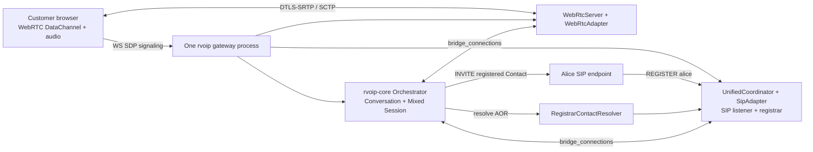

# Customer WebRTC Chat Escalates To SIP Agent Voice

This example proves a practical call-center workflow in one rvoip gateway
process:

- The gateway serves the customer web page.
- The same gateway runs WebRTC WebSocket signaling.
- The same gateway runs SIP signaling and a SIP registrar.
- The browser customer chats over a WebRTC DataChannel.
- Alice registers as a real SIP endpoint.
- The customer clicks **Call Alice**.
- The gateway resolves `sip:alice@callcenter.local` through the live registrar,
  originates a real SIP INVITE to Alice's registered Contact, and bridges
  WebRTC audio to SIP/RTP audio through `rvoip-core::Orchestrator`.

The gateway itself is written against the high-level `rvoip::app` API. The app
code declares that customers use WebRTC, employees can be reached by SIP, Alice
is the assigned employee, and messages are handled by one async callback. The
example keeps the longer proof-client code only so automated mode can verify the
real SIP/WebRTC/media path.

No fake adapters are used. The automated proof mode uses in-process clients,
but those clients use the same SIP registration, WebRTC signaling, and media
bridge paths as the human demo.

## Run The Automated Proof

```bash
cargo run --manifest-path examples/12-customer-escalation-sip-webrtc/Cargo.toml -- --auto-proof
```

Expected final line:

```text
[auto] PASS: chat, registration resolution, SIP INVITE, bridge, and media proof succeeded
```

The proof verifies:

- Alice registers through SIP REGISTER.
- The customer connects through WebRTC WS signaling.
- A browser-style `rvoip-chat` DataChannel message becomes a persisted
  `rvoip-core::Message`.
- Escalation fails unless Alice has a live registrar Contact.
- The gateway sends a real SIP INVITE to Alice's registered Contact.
- `bridge_connections(customer_webrtc, alice_sip)` creates the bridge.
- WebRTC-to-SIP and SIP-to-WebRTC tones are both received and analyzed.

## Run The Human Demo

```bash
cargo run --manifest-path examples/12-customer-escalation-sip-webrtc/Cargo.toml -- \
  --http-bind 127.0.0.1:8080 \
  --ws-bind 127.0.0.1:8081 \
  --sip-bind 127.0.0.1:5060
```

Then:

1. Register a SIP softphone as `alice`.
2. Use registrar/server `sip:127.0.0.1:5060`.
3. Use auth user `alice` and password `password123`.
4. Use AOR `sip:alice@callcenter.local` if the softphone asks for an identity.
5. Open `http://127.0.0.1:8080`.
6. Send a chat message.
7. Click **Call Alice** and answer the SIP phone.

The customer page starts as WebRTC chat only. When **Call Alice** is clicked,
the page requests microphone permission, adds the audio track, renegotiates the
same WebRTC peer connection through the WS signaler, then sends the escalation
command over the `rvoip-chat` DataChannel.

## Architecture



## Library Gaps Filled

- `rvoip` now exposes `rvoip::app`, a high-level app/gateway builder that owns
  service startup, assignment policy, message callbacks, registrar-backed SIP
  contact resolution, escalation, and bridge events.
- `rvoip-webrtc` now observes inbound DataChannels labeled `rvoip-chat` and
  emits normalized adapter messages.
- `rvoip-core::Orchestrator` persists those adapter messages as `Message`
  records and emits `Event::MessageReceived`.
- `rvoip-webrtc` can accept DataChannel-only WebRTC connections and seed audio
  later after renegotiation.
- WebRTC WS signaling accepts an `offer` with `connection_id` to renegotiate an
  existing peer connection.
- `Orchestrator::originate_connection` now binds the outbound connection to the
  requested session, so Alice's SIP leg belongs to the same conversation as the
  customer's WebRTC leg.

## Boundaries

This is intentionally a single-gateway proof with one hard-coded agent. It does
not implement queueing, multi-agent selection, hosted TURN, SFU/MCU, or
cross-process SIP/WebRTC server federation.

The new app directory can register already-authenticated employee WebRTC/UCTP
connections with `RvoipApp::register_employee_connection`, but automatic
employee identity binding from WebRTC WS auth into the app directory is still a
transport-layer follow-up. Automatic UCTP service startup is also explicit
future work; the app API rejects it with a clear unsupported-transport error
instead of silently faking that path.
