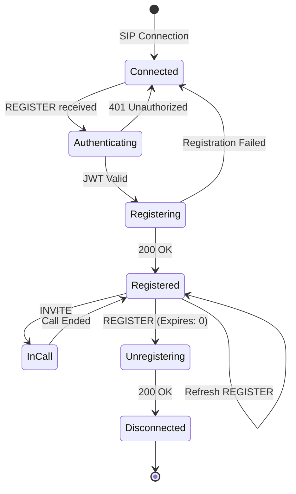

# SIP Registration Flow - Complete Sequence

This document shows the complete registration flow from client authentication to successful SIP registration.

## Complete Registration Sequence

```mermaid
sequenceDiagram
    participant Client as SIP Client
    participant Auth as users-core<br/>(REST API :8081)
    participant Server as Your SIP Server<br/>(UDP :5060)
    participant Session as session-core-v2
    participant Dialog as dialog-core
    participant Registrar as registrar-core
    
    Note over Client,Registrar: Step 1: Get Authentication Token (HTTP)
    
    Client->>Auth: POST /auth/login<br/>{"username": "alice",<br/>"password": "SecurePass123!"}
    Auth->>Auth: Validate credentials
    Auth->>Auth: Generate JWT token
    Auth-->>Client: 200 OK<br/>{"access_token": "eyJhbG...",<br/>"expires_in": 3600}
    
    Note over Client,Registrar: Step 2: SIP Registration with JWT
    
    Client->>Server: REGISTER sip:example.com<br/>Authorization: Bearer eyJhbG...
    Server->>Dialog: Process SIP REGISTER
    Dialog->>Session: DialogREGISTER event
    
    Note over Session: State: Connected → Authenticating
    
    Session->>Session: AuthAdapter.validate_sip_auth()
    Session->>Auth: GET /auth/jwks.json
    Auth-->>Session: Public key for validation
    Session->>Session: Validate JWT signature
    
    alt JWT Valid
        Note over Session: State: Authenticating → Registering
        Session->>Registrar: register_user("alice", contact_info)
        Registrar->>Registrar: Store registration
        Registrar-->>Session: Success
        
        Session->>Dialog: Send 200 OK
        Dialog->>Server: SIP Response
        Server-->>Client: 200 OK<br/>Contact: <sip:alice@192.168.1.100>;<br/>expires=3600
        
        Note over Session: State: Registering → Registered
        
        Session->>Session: Start refresh timer (90% of expires)
        
    else JWT Invalid
        Session->>Dialog: Send 401 Unauthorized
        Dialog->>Server: SIP Response  
        Server-->>Client: 401 Unauthorized<br/>WWW-Authenticate: Bearer realm="example.com"
        Note over Session: State: Authenticating → Connected
    end
```

## Key Components in the Flow

### 1. Authentication Service (users-core)
- Runs as separate REST API service
- Issues JWT tokens with user claims
- Provides JWKS endpoint for token validation

### 2. SIP Server (Your Application)
- Listens on UDP port 5060
- Routes messages through dialog-core
- Manages sessions via session-core-v2

### 3. Session Management (session-core-v2)
- Creates session on first REGISTER
- Validates JWT tokens
- Manages registration state
- Handles refresh timers

### 4. Registration Storage (registrar-core)
- Stores user locations
- Manages presence
- Handles multi-device registrations

## Session Lifecycle



## Multi-User Session Management

The server automatically manages separate sessions for each user:

```
┌─────────────────────────────────────────────────────┐
│                 session-core-v2                      │
│                                                     │
│  Sessions Map:                                      │
│  ┌─────────────────────────────────────────────┐   │
│  │ "alice@example.com" → Session {              │   │
│  │     session_id: "uuid-1234",                 │   │
│  │     state: Registered,                       │   │
│  │     auth_claims: { username: "alice", ... }, │   │
│  │     registration_expires: 2024-01-15T10:30,  │   │
│  │     contact: "sip:alice@192.168.1.100"      │   │
│  │ }                                            │   │
│  │                                              │   │
│  │ "bob@example.com" → Session {                │   │
│  │     session_id: "uuid-5678",                 │   │
│  │     state: Registered,                       │   │
│  │     auth_claims: { username: "bob", ... },   │   │
│  │     registration_expires: 2024-01-15T10:45,  │   │
│  │     contact: "sip:bob@192.168.1.200"        │   │
│  │ }                                            │   │
│  └─────────────────────────────────────────────┘   │
└─────────────────────────────────────────────────────┘
```

## Error Scenarios

### 1. No Authentication Header
```
Client → Server: REGISTER (no auth)
Server → Client: 401 Unauthorized
                 WWW-Authenticate: Bearer realm="example.com"
```

### 2. Expired Token
```
Client → Server: REGISTER (expired JWT)
Server → Client: 401 Unauthorized
                 WWW-Authenticate: Bearer realm="example.com" error="invalid_token"
```

### 3. Registration Refresh
```
Before expiry → Server: Auto-sends REGISTER refresh
Server → Registrar: Update registration
If fails → Server: Marks session as Unregistered
```

## Implementation Notes

1. **JWT in SIP**: The JWT token goes in the Authorization header as a Bearer token, which is non-standard for SIP but works well for modern implementations.

2. **Session Creation**: Sessions are created automatically when the first REGISTER arrives, indexed by the From URI.

3. **State Persistence**: The registration state is maintained in both session-core-v2 (for state machine) and registrar-core (for location service).

4. **Automatic Refresh**: session-core-v2 automatically refreshes registrations at 90% of the expire time.

5. **Multi-Device**: Same user can register from multiple devices - each gets a separate session but shares the same registration in registrar-core.
